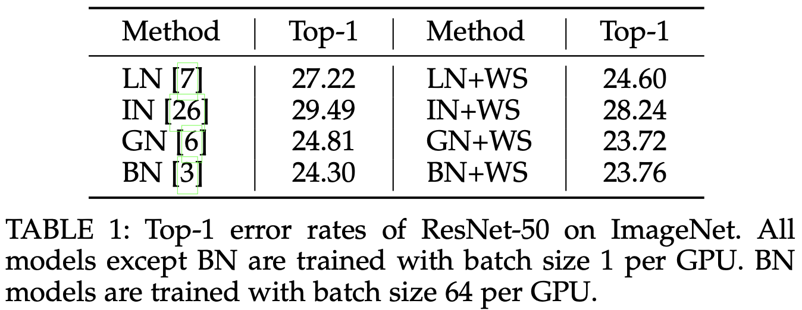

## What is the core idea?
The authors propose and study Weight Standardization (`WS`) and Batch-Channel Normalization (`BCN`) for effectively training deep conv nets on vision tasks. With many empirical results and theoretical analysis they argue the benefits of `WS` and `BCN` for training with small batches.

## Context
* Many normalization methods have been proposed for accelerating deep neural net's training. The normalization process is mostly consistent across these methods but mainly differs on the axis of normalization as shown in the figure below ([Source](https://arxiv.org/pdf/1803.08494.pdf))

* Batch Normalization (`BN`) is considered to give the best results in practice whenever large batch sizes are possible but with smaller batches (which is the case when using larger models and more detailed inputs) Batch Normalization fails to perform that well because of unreliable estimates of mean and variance required for normalization.

* Reason's for Batch norm's success, 1) it provides "**smooth optimization landscape**" 2) it "**avoides elimination singularity**"

> Bring the success factors of Batch Norm into micro-batch training without relying on large batch-sizes during training

## Weight Standardization (`WS`)
Normalize (Standardize) weights in the convolution layer along with Group Normalization

### `WS` smoothes out the optimization landscape
Authors theoretically argue that `WS` smoothes out the optimization by reducing the lipschitz constants on the loss and gradients

Empirically they show that both the operations in `WS` (i.e. making the mean 0 and making the variance 1) help in getting better performance, with the bulk of the gains coming from the former

<!-- Training ResNet-50 on Imagenet with Group Normalization (GN), Eq 11 refers to making mean 0 in WS and Eq 12 refers to making variance 1 in WS
:----------------------------:
 | -->

Training ResNet-50 on Imagenet with Group Normalization (GN), Eq 11 refers to making mean 0 in WS and Eq 12 refers to making variance 1 in WS

### `WS` avoides elimination singularities
Intuitively `WS` is able to pass similarities in input channels to output channels. Empirically shown in two steps:
  * `BN` by design enforces activation of each channels, thus `BN` should avoid singularities
  * Adding `WS` to Group Normalization brings it closer to `BN` (i.e. zero-centered mean and unit variance for each channel)
 

Closer to `BN` is far from singularity | `WS` brings channel normalization closer to `BN`
:-------------------------------------:|:---------------------------------------------:
 | 

## Batch-Channel Normalization (`BCN`)
Apply both batch and channel normalization together to activations
* For Large Batches: `BCN`(X) = `CN`(`BN`(X))
* For Micro Batches: Keep running estimates of mean and variance for `BN`

> Channel based normalizations make estimates based normalizations possible, and estimate based normalization helps channel based normalizations avoid elimination singularities

## Results

Results with `WS` | Results with `WS` + `BCN`
:-------------------------------------:|:---------------------------------------------:
 | 

## TL;DR
* Weight Standardization can give similar effects of Batch Normalization even with very small batch sizes 
* With smaller batch sizes, Batch normalization when applied with Channel normalization improves the training 
