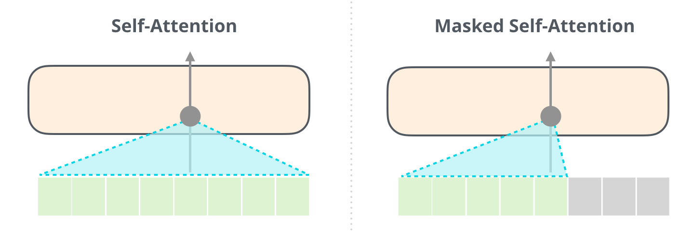

## Overview

  Radford et. al. introduce a transformer decoder based architecture that leverages unsupervised generative pre-training followed by task-specific supervised fine-tuning to reach SOTA performance (at the time) across a range of NLP tasks.

## Architecture

The transformer decoder architecture the authors used consists of 12 decoder layers each with 12 self-attention heads. Different output heads, mainly made up of linear layers and a softmax, are attached for different tasks.

The decoder block's main difference from the encoder blocks used in architectures like BERT is the use of **masked** self attention. Architectures like BERT are able to attend to tokens both to their left and right while masked self attention allows only attending to previous tokens.

## Training

### Unsupervised Pre-Training
During unsupervised pre-training, the decoder architecture is trained mainly by a language modeling objective (next word prediction task) which is modeled as such:

$$\mathrm{ L_1(U) = \sum_i log P(u_i|u_{i-k},...,u_{i-1;\Theta}) }$$

where U is the corpus of tokens, k is the context window, and theta are the network parameters.

## Supervised Fine-Tuning

Given a labeled dataset C with each example containing an input sequence x1 ,..., xm with label y, the model passes the output embedding from  xm through a linear layer and then performs a softmax leading to the objective:

$$\mathrm{ L_2(C) = \sum_{(x, y)} log P(y|x^1,...,x^m) }$$

The authors choose to continue using the language modeling objective as an auxiliary objective and formulate the final supervised fine-tuning objective as:

$$\mathrm{ L_3(C) = L_2(C) + \lambda * L_1(C) }$$

## Performance

Performance is measured across a range of NLP tasks including NLI, QA & Commonsense Reasoning, and Semantic Similarity & Classification. The proposed model is able to outperform the SOTA in most tasks. 

Breifly comparing these results with those obtained by BERT, BERT outperforms GPT across all results above. This makes sense given that a transformer encoder architecture is better in all of these tasks, while the autoregressive decoder architecture should perform better on generative tasks.

### Analysis

Beyond performance statistics, the authors also performed further experiments and ablations. They found that transfering more decoder layers between the pre-training and fine-tuning steps increases model performance. The authors measured performance ablating the auxiliary language modeling objective as well as the pre-training step all together and found that while the auxiliary objective was useful for some tasks and harmful for others, pre-training helped improve performance across the board.

## TL;DR
* Stacking transformer decoder blocks can provide a reasonable architecture for language modeling
* Generative pre-training can help improve performance of autoregressive language models
* Author's also improve performance by introuducing task-specific input transformations during fine-tuning while requiring minimal architecture modification
* Despite SOTA results at the time, GPT was quickly eclipsed by BERT in most non-generative settings
