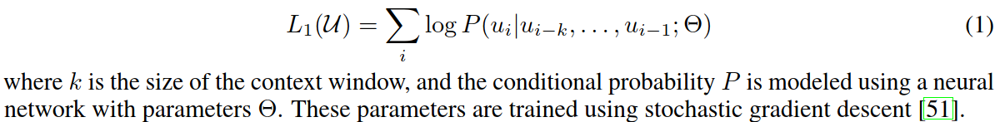
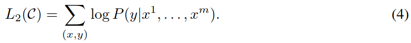
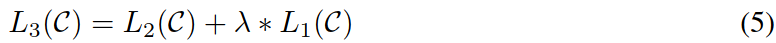
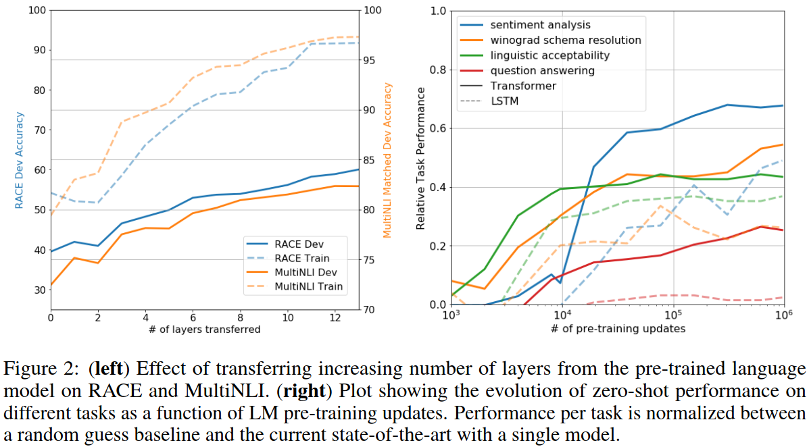
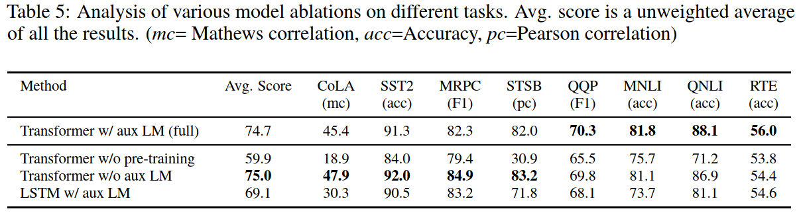

## What is the core idea?

Problem: **labeled data** for learning these specific tasks is limited

Solution: Introduced **Generative Pre-Training (GPT)** Model, a semi-supervised strategy for enhancing the performance on multiple NLP tasks.

## How is it realized (technically)?

Used architecture: Transformers

- Make longer-distance connections/dependencies in text
- Faster training

**Step #1: Unsupervised pre-training**

- Only use decoder of transformer

- Objective: maximize the likelihood

  

- Predict context words

  

**Step #2: Supervised fine-tuning**

- Use pre-trained model

- Add linear layer as the last layer

- Objective: maximize the likelihood

  

- Auxiliary objective helps to improve the performance

  

Some task requires special treatment:

- Textual entailment
- Similarity
- Question Answering and Commonsense Reasoning

## How well does the paper perform?

- Benchmark
  - SOTA in 9 out of the 12 datasets

- Analysis
  - Impact of number of layers transferred
  - Zero-shot Behaviors
  - Ablation studies

## What interesting variants are explored?

- Language Models are Unsupervised Multitask Learners, NeurIPS'20

  

## TL;DR
* Apply one pre-trained model to many tasks
* Unsupervised pre-training decoder + supervised fine-tuning
* Language model served as an effective pre-training objective which could help model generalize well
