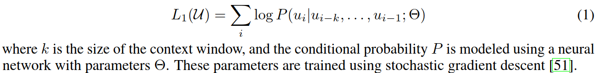
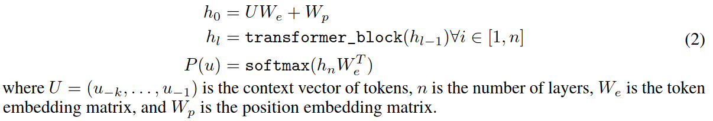
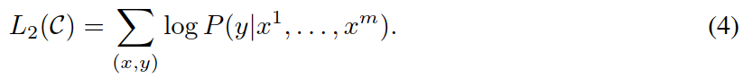
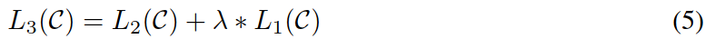
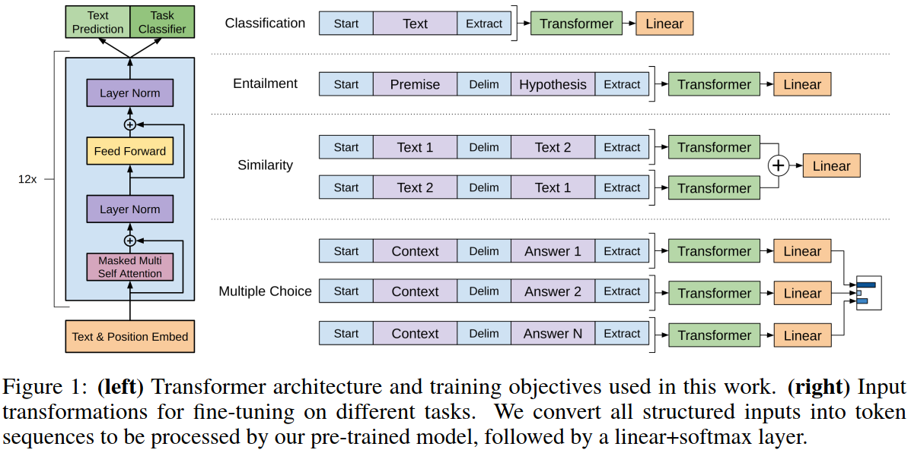
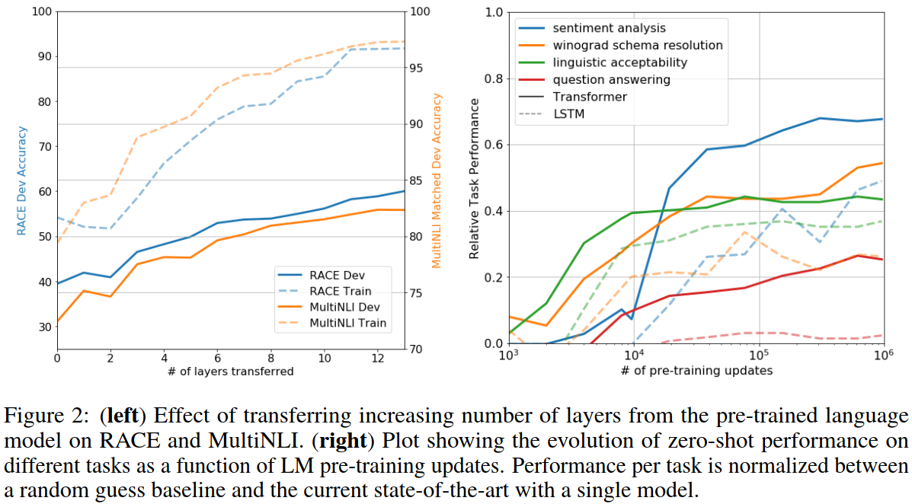
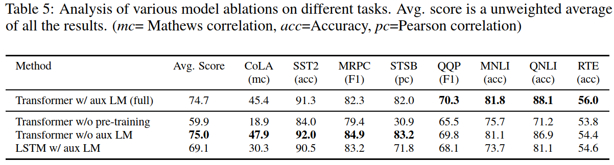

## What is the core idea?

<u>Problem</u>:

- labeled data for learning tasks is limited
- pre-training with good representation can provide a significant performance boost

<u>Challenge</u>:

- how to design training objectives?
- how to transfer to the target task?

<u>Solution</u>: introduced **Generative Pre-Training (GPT)** Model, a semi-supervised strategy for enhancing the performance on multiple NLP tasks.

- generative pre-training (unsupervised)
- discriminative fine-tuning (supervised)

## How is it realized (technically)?

<u>Model architecture</u>: **Transformer**

- better capture long-term dependencies in text

**Step #1: Unsupervised pre-training**

- Only use decoder of transformer

- Objective: maximize the likelihood

  

- Predict context words

  

**Step #2: Supervised fine-tuning**

- Use the pre-trained model

- Add linear layer as the last layer

- Objective: maximize the likelihood

  

- Auxiliary objective from step #1 helps to improve the generalization and convergence speed

  

<u>Problem</u>: some task does not have structured input

- Textual entailment (sentence pairs)
- Similarity (sentence pairs)
- Question Answering and Commonsense Reasoning (question/answer)

<u>Solution</u>: concatenation/fusion

## How well does the paper perform?

- Benchmark
  - SOTA in 9 out of the 12 datasets

- Analysis
  - Impact of number of layers transferred
  - Zero-shot Behaviors
  - Ablation studies

**Impact of number of layers transferred**

Added layers provide further benefits

→ each layer in the pre-trained model contains useful functionality for solving target task.

**Zero-shot Behaviors**

Even without fine-tuning, the generative model gains improvement along with # iteration of updates.

→ the pretraining supports the learning of a wide range of task-relevant functionality

**Ablation studies**

- Larger dataset benefits from auxiliary objective
- Transformer > LSTM (by 5.6 average score)
- Lack of pre-training result in a 14.8% drop

## What interesting variants are explored?

- Language Models are Unsupervised Multitask Learners, NeurIPS'20

  

## TL;DR
* Apply one pre-trained model to many tasks
* Unsupervised pre-training decoder + supervised fine-tuning
* Language model served as an effective pre-training objective which could help model generalize well
