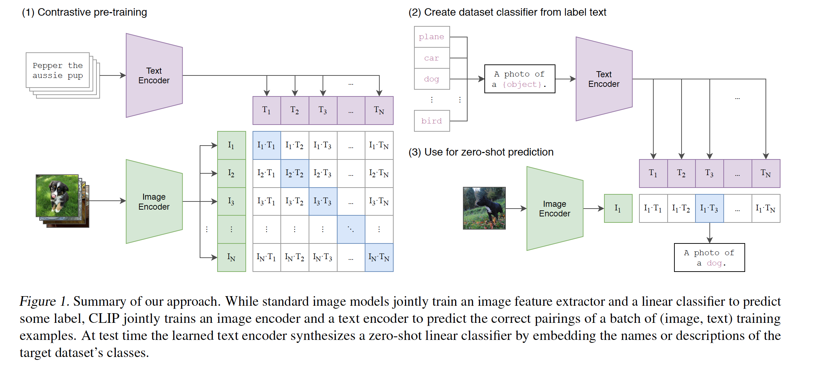
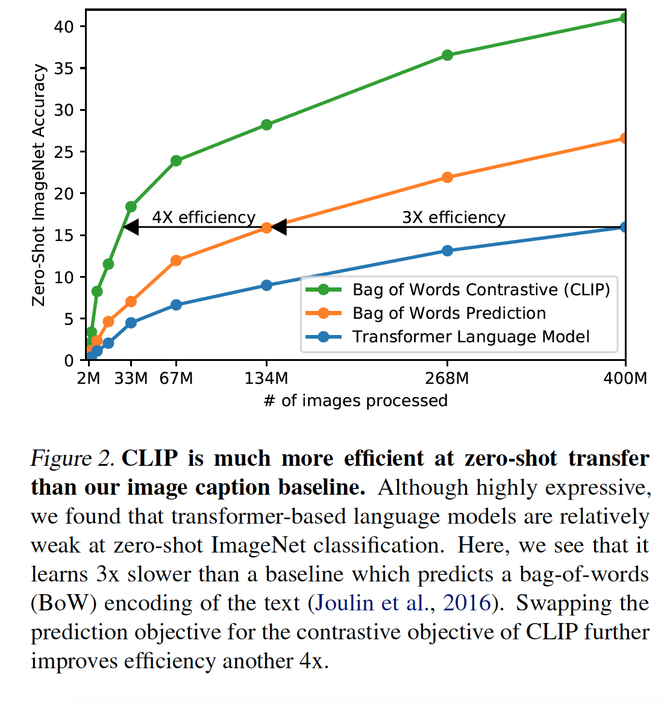
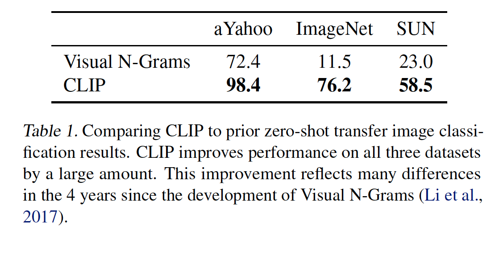
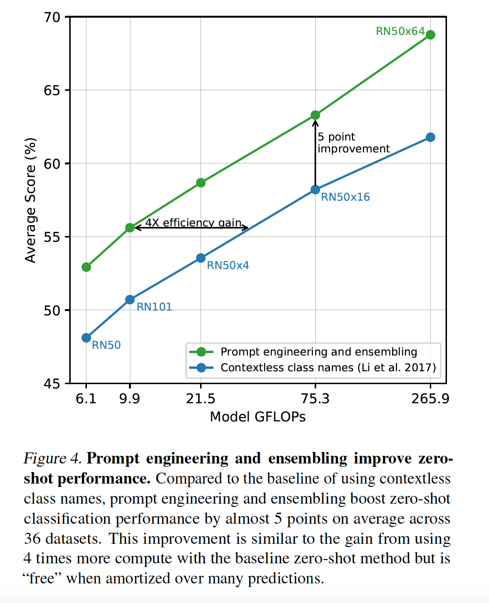
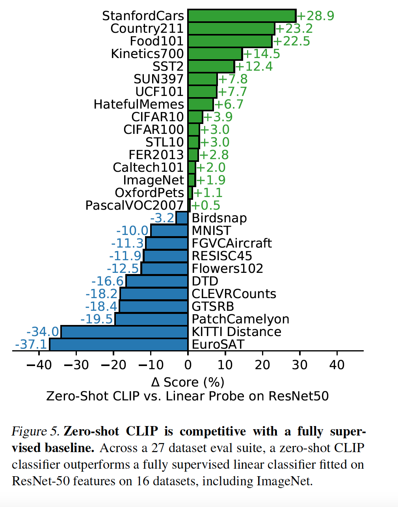
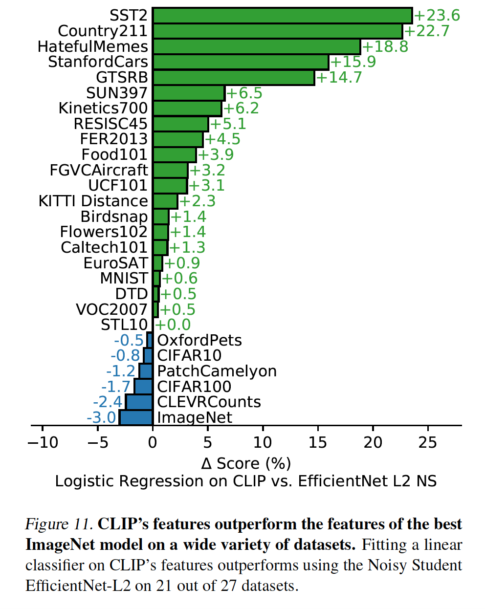

* What is the core idea?

The core idea begins with a model that is trained on image-text pairs, a computer vision task that is often restricts models to predict just a finite set of categories. This paper introduces CLIP (Contranstive Language-Image Pre-Training) which is a model that pre-trains, in natural langauge, on the text so that it predicts to "most relevant text snippet" for each image. 

Turns out that pre-training on the text actually helps learn image representations better and more efficiently than before, allowing zero-shot transfer on other datasets without worry about redefining categories.

* How is it realized (technically)?

The core technical innovation is the natual language supervision, or the idea of "learning perception from supervision contained in natual language". The supervision didn't try to predict the exact words that would go to the image. It instead was aimed to predict text "as a whole" hence the "contrastive objective". This led to 4x efficiency improvement in the rate of zero-transfer to ImageNet.

Linear projection is used to map each encoder representation to multi-modal embedding space. The image encoder is ResNet-50 with an attention pooling mechanism. The second architecture used is the Vision Transformer. The text encoder is a Transformer.

Training was doen of a series of 5 ResNets and 3 Vision Transformers. 

The idea was to study CLIP's generalization to other datasets rather than unseen object categories. To perform zero-shot transfer, CLIP's pre-training mentioned early is reused. 

* How well does the paper perform?

In of the experiments, Visual N-Grams was compared to CLIP. CLIP improved the accuracy on ImageNet from 11.5% to a whopping 76.2%. The top-5 accuracy of CLIP models were higher than top-1.

CLIP also experimented with "ensembling" such as using different context prompts such as "A photo of a big {label}". CLIP therefore constructed an ensemble over the embedding space instead of the probability space. This actually led to an improved performance with zero-shot classification on the majority of the datasets used.

Most importantly, Zero-Shot CLIP was experimented against a fully supervised classifier fitted on ResNet-50 on a multitide of datasets. Zero-Shot CLIP outperformed the baseline for 16 of the 27 datasets tested.

* What interesting variants are explored?

An interesting variant mentioned in the paper is fine-turning linear classifiers on CLIP's features. These features actually ended up outperforming features of the best ImageNet model on many datasets.

## TL;DR
* CLIP is a model that pre-trains to predict the text of an image
* CLIP is able to better learn image representations through it's pre-training
* CLIP's Zero-Shot performance is better than some trained models' performance on a variety of datasets.
