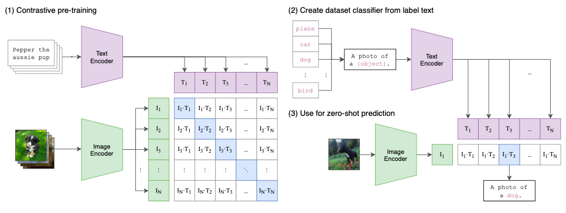
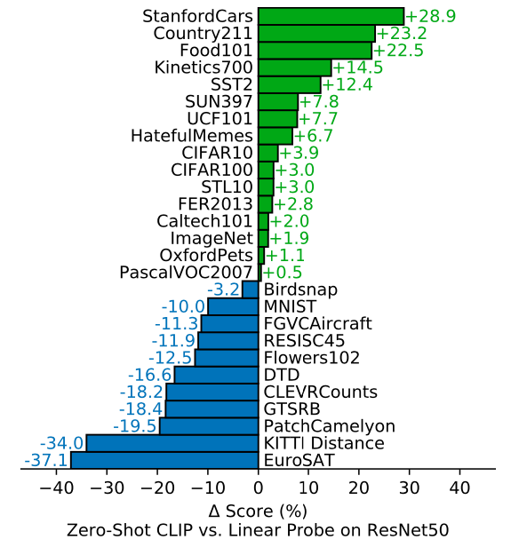
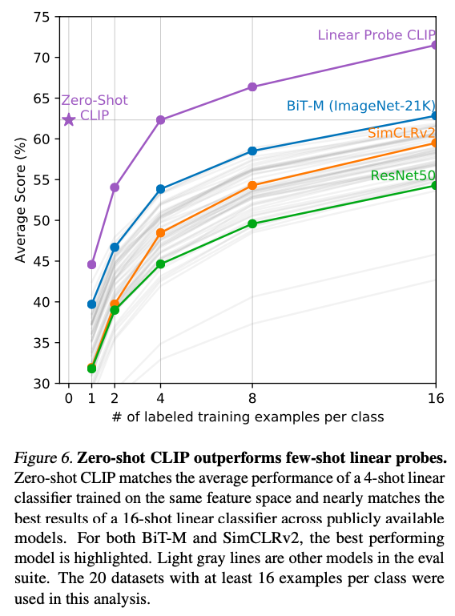
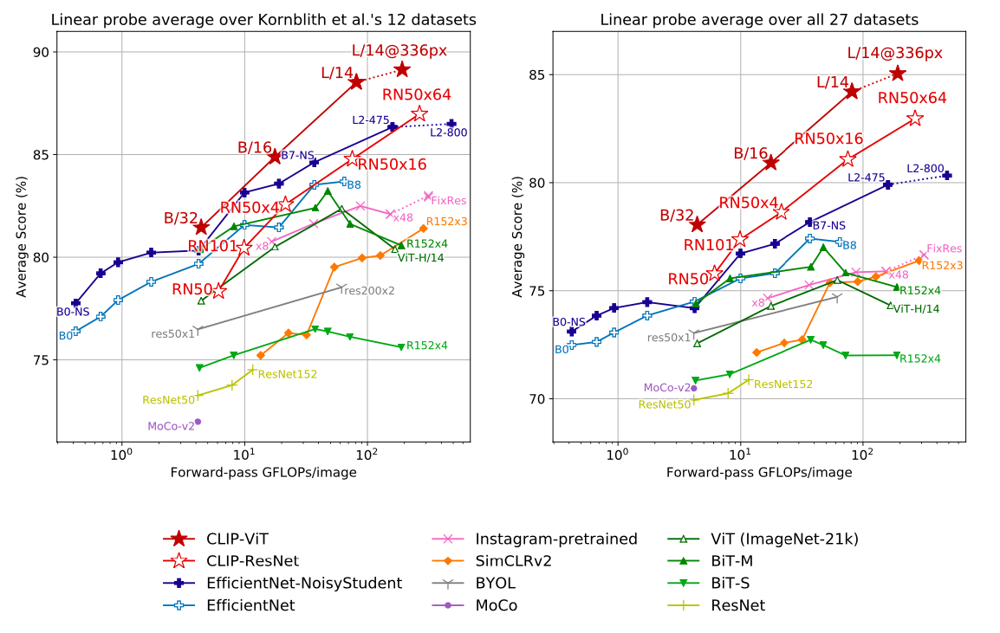
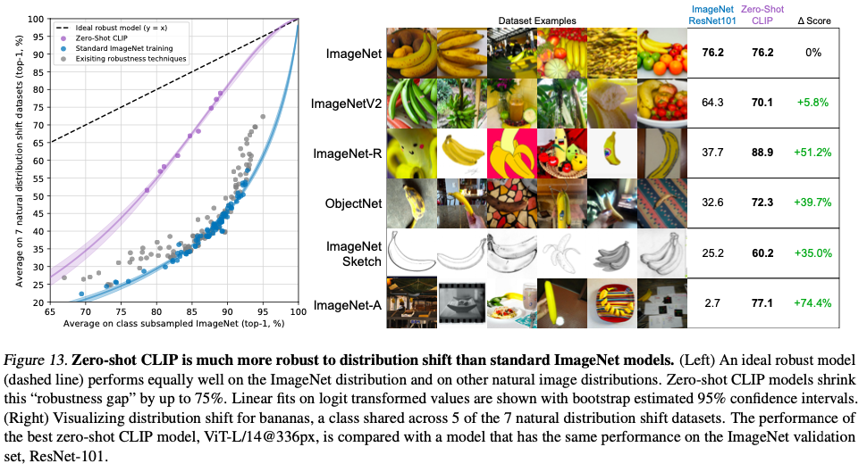

**What is the core idea?**

The paper demonstrates that basic pre-training tasks of predicting the caption which best describes the image is a scalable and efficient method to learn state of the art image representation from scratch on the WebImageText dataset (introduced in this paper) of 400 million (image, text) pairs obtained from internet. Motivated by the idea of learning perception from supervision contained within natural language, CLIP (Contrastive Language-Image Pretraining, where constrastive learning is identifying between similiar and dissimilar iamges), efficiently performs zero-shot transfer (predicting unseen tasks/datasets).

**How is it realized (technically)?**

* The image below depicts the way CLIP jointly trains an image encoder and text encoder to predict the pairing of (image, text). To do this, CLIP learns a multi-modal embedding space by jointly training an image encoder and text encoder to maximize the cosine similarity of the image and text embeddings of the N real pairs in the batch while minimizing the cosine similarity of the embeddings of the $${N^2 − N}$$ incorrect pairings. A symmetric cross entropy loss is used over these similarity scores.

* A simplified version of ConVIRT model is trained from scratch, with linear projection from each encoder to the multi-modal embedding space. Only random crop was done for data augmentation.
* Modified ResNet-50 or ViT was used for image encoder and a variation of Transormer was used for text encoder. The image encoder was scaled along width, depth, and resolution and text encoder scaled only along width.
* The best CLIP model ViT-L/14@336px is pre-trained at higher 336 pixel resolution for an additional epoch (similar to FixRes)
* At test time the text encoder synthesizes a zero-shot linear classifier by embedding the names/descriptions of the ouput classes of the datasets. 
* Using prompt template, e.g. “A photo of a {label}.”, improves performance by a few percentage, and ensembling prompts provides additional gains.

**How well does the paper perform?**

* The performance of the CLIP model is compared with 30 different existing computer vision datasets. The model transfers to most of the tasks and is often competitive with fully supervised baselines without the need for any dataset specific training. CLIP also outperforms the best publicly available ImageNet model while also being computationally efficient. 
* On evaluating on natural distribution shifts such as ImageNetV2, ImageNet Sketch, ImageNet-Vid, ObjectNet, ImageNet Adversarial, ImageNet Rendition, Zero-shot CLIP improves robustness to distribution shift, reducing the gap by up to 75%. 
* CLIP’s zero-shot performance is still weak on some specialized, complex, or abstract datasets/tasks. On training CLIP on unfiltered images and text from the internet results in the model learning many social biases.
Results over 30 datasets | Results on linear probe '
:-|-:
|  |  |
Model transfer capabilities results | Results over various datasets '
:-|-:
|  |  |

**What interesting variants are explored?**

The paper used different backbones for image encoder like Resnet-50, 101, RN50x4, RN50x16, RN50x64, ViT-B/32, ViT-B/16, ViT-L/14 and ViT-L/14@336px with the last model being the best. 

## TL;DR
* CLIP uses contrastive representation learning with jointly training VIT/Resnet image encoder and transformer text encoder to predict (image, text) pairs.  
* Large scale natural language supervision (400 million examples) is used to facilitate zero-shot transfer. 
* Zero-shot CLIP models are more robust than supervised ImageNet models of equivalent accuracy as CLIP transfers to most of the datasets/tasks. 

