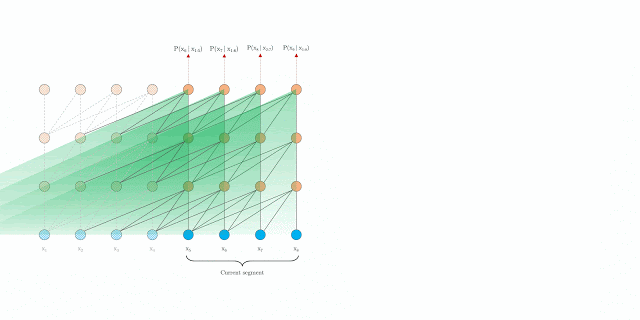
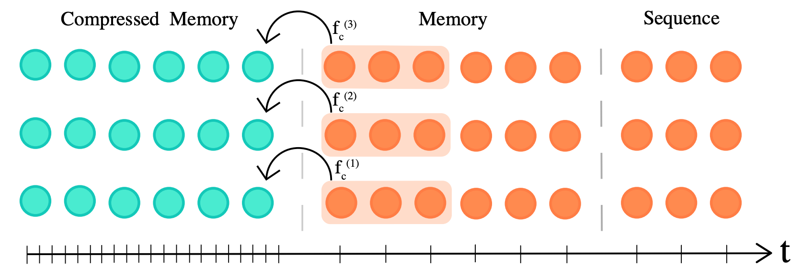

## What's the big idea

- By compressing memories, transformers are able to model long range sequences more efficiently and effectively, 
outperforming state-of-the-art benchmarks on various sequence based tasks.
  
## What's Wrong With Attention

- Attention is expensive in both computation time and memory
  
- It's also not a great model of how memory really works (most do not remember every detail of every second of their lives, yet that is the transformer model)

- Current architecture discards long-range memories due to resource constraints, this results in a fixed size window of attention

## How Can We Improve Attention

- Not all memories deserve the same amount of memory or detail (think of the resolution of short-term vs long-term memories)
  
- We can combine a subset of memories into one "compressed" representation (reducing the resolution of each individual memory) 

    - Compressed memories are now coarser and have a rough analogy to long-term memories
    - Uncompressed memories often contain detailed information and have a rough analogy to short-term memories

  
## How Does This Work (How Is It Realized)

1.) You pass a sequence $$S_i = x_t, ..., x_n$$ through the network

2.) As the model progresses to the next sequence $$S_i$$ is moved into memory of past activation (we can still attend to it)

3.) Eventually, the memory gets to large so we evict the oldest memory

4.) Instead of deleting the oldest memory, we create a mapping to compress it and store it in a stack

## How do we compress an activation aka "memory"

- The main idea is to use a mapping from uncompressed to compressed: $$f_c: R^{n_s \ x \ d} \rightarrow R^{[\frac{n_s}{c}] \ x \ d}$$
  - where $$n_s$$ are the number of memories 
  - and $$c$$ indirectly controls how many memories we combine into one 
  - $$d$$ is the size of the memory (notice the size of compressed and uncompressed do not differ)

$$\\$$

- There are tons of types of mappings (ways to combine memories), the authors explore a few methods:
  - Max/Mean Pooling
  - **1D Convolution**
  - Dilated Convolutions
  - Most Used: Take the most relevant parts of the activation
  
- For the convolutional methods you have to choose a loss, the authors compare:
  - Backpropagation Through Time (BPTT)
  - Auto-encoding (think GANS / VAEs)
  - **Attention Reconstruction**

The best method was Convolution with Attention-Reconstruction loss, essentially using convolutional networks
to reconstruct memories. 

The Convolution Nets were trained to weight the reconstruction of the memories so that the parts of the memory that 
received the most attention were persevered the best.
    
## So... did it work?

 Yes, due to the compact representation of the memories the Compressive Transformer has increased range when dealing with sequences
  - TransformerXL Temporal Range:             $$l \ x \ n$$
  - Compressive Transformer Temporal Range:   $$l \ x \ (n_m \ + \ c \ * \ n_cm)$$
  
Where
  - $$n$$ is the number of the TransformerXL memories
  - $$n_m$$ is the number of uncompressed Compressive Transformer memories
  - $$n_cm$$ is the number of compressed Compressive Transformer memories
  - $$c$$ is how many memories are mapped into one compressed memory

Essentially, you can achieve a vastly larger range of memories, for the same attention cost of the Transformer XL.
  
## What are the effects of longer temporal ranges

- Longer temporal ranges allow the model to attend to items that happened a long time ago in the sequence, think of reading a book, watching a movie, etc.

- Because we are compressing memories and saving what is relevant, the older activations get, the more salient they become

- You can train on open-vocabulary (no "UNK" tokens, the model can represent rare words)

## How does it perform? 

- Compressive Transformer outperformed TransformerXL (its closest comparison) on every benchmark, but shows the most promise on large sequence datasets

- PG-19 is a new dataset the authors released in order to show off long range tasks (holds entire books)

- Compressive Transformer reduced the Test Perplexity of PG-19 from Transformer XLs result of 36.3 to 33.6 

- Results were also compared on the Enwik8 and WikiText-103
  - Enwik8 has 100M bytes of uprocessed Wikipedia Text
  - WikiText-103 contains a large amount of Wikipedia Articles (over 100million tokens)
  

- BPC, bits-per-charcters, how many bits are needed to encode a character (lower is better)
- Testing on perplexity allows the thorough comparisons against other language models trained on byte/character/subword granularity (lower is better)
  
## Down sides?

- There are more hyperparameters to tune
  - Size of the compressive memory
  - How to compress the memory
  - Ratio between regular memories and compressed memories
  
- Really only beneficial if you are working on tasks with long sequences

## TL;DR

- Compressed Memories allow for longer temporal ranges of attention improving long range sequence tasks
- Compressed memories accumulate Salient information over time (rare words, important concepts, etc.)
- Utilizing lossy compression of sequence based data can be extended to various modalities beyond NLP