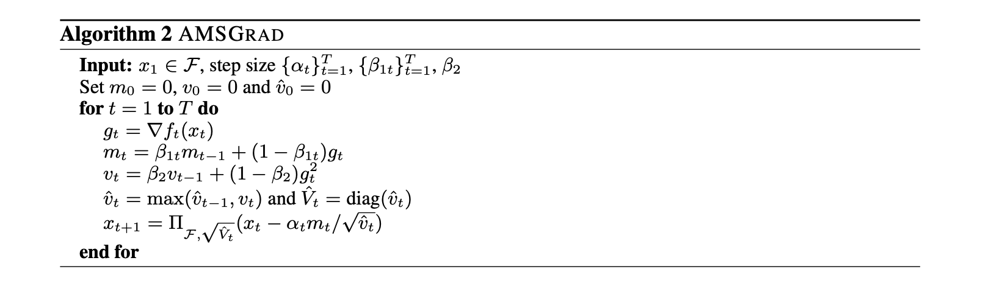
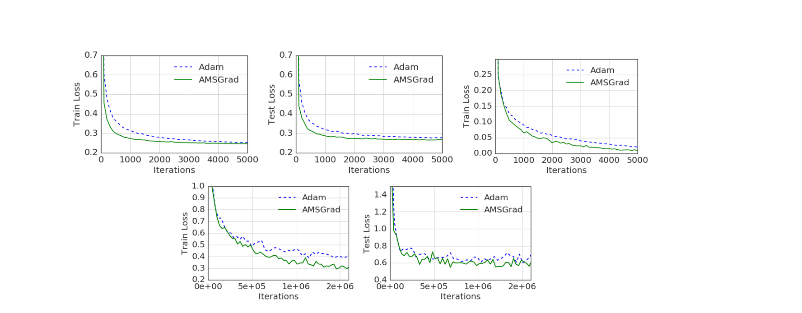
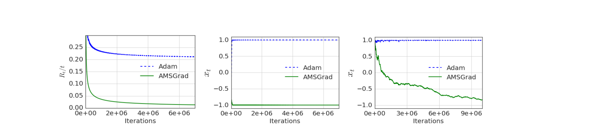

# Summary 1: ON THE CONVERGENCE OF ADAM AND BEYOND

## What is the core idea? ##

The problem is this paper tried to solve is the limitation of optimizers using exponential moving averages such as ADAM. These type algorithms was shown not do well with mini-batches with large gradients the advantages of exponential averaging dies leading to poor convergence.

### How is it realized (technically)? ###

<!-- $$
X_t_+_1 = X_t - \alpha_t m_t / 
$$ -->

<!--  -->

The modified algorithm known as AMSGrad based on adam.

### Key difference compared to ADAM

[1] Smaller learning rates

[2] Retains the max value of $v_t$ (Compute bias-corrected second raw moment estimate)

During training AMSGrad does not iteratively change the learning rate unlike ADAGRAD that slightly decrease the learning rate and ADAM that aggressively increases the learning rate. 

## How well does the paper perform? ##

Top row (left,center) - logistics regression, (right) - 1- hidden layer feed forward neural network on MINST dataset and Bottom CIFARNET

Logistic Regression :
- MNIST dataset with 10 class labels 
- step size parameter αt is set to α/ t for both ADAM and AMSGRAD. 
- Mini-batch size set to 128. We set β1 = 0.9 and β2 is chosen from the set {0.99, 0.999}
- The parameters α and β2 are chosen by grid search.

Neural Networks:
- 1-hidden fully connected layer neural network on MNIST. 
- β1 = 0.9 and β2 is chosen from {0.99, 0.999}.
- rectified linear units (ReLU) as the hidden layer
- αt = α stayed constant
 second experiment
- CIFAR-10 dataset 60,000 labeled examples of 32 × 32 image
- CIFARNET (CNN) 
   - 2 convolutional layers , 64 channels and kernel size of 6 × 6 with by 2 fully connected layers of size 384 and 192. 
   - 2 × 2 max pooling and layer response normalization between the convolutional layers. 
   - A dropout layer with keep probability of 0.5 is applied in between the fully connected layers. 
   - The mini-batch size is 128 

AMSGrad vs ADAM for logistic regression, feed forward neural network and CIFARNET.AMSGrad outperforms ADAM on all three experiments

## What interesting variants are explored? ##

AdamNC alternate approach varies the values of $\beta_1$ and $\beta_2$ (exponential decay rate for moment estimates)

<!--  -->

## TL;DR

* AMSGRAD keeps a gradient history showing performance gains in training and accuracy

* Algorithms with a fixed selections of past gradients suffer from non-convergence
