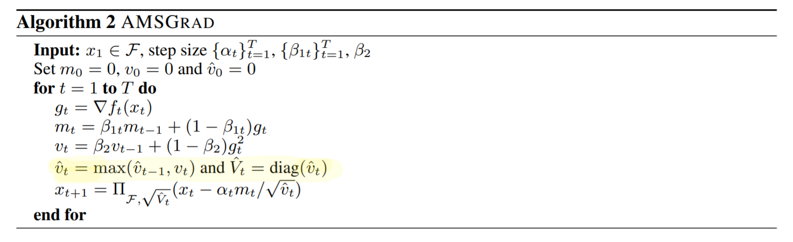

<!-- TODO: Summarize the paper:
* What is the core idea?
* How is it realized (technically)?
* How well does the paper perform?
* What interesting variants are explored? -->

This paper introduces scenarios where the ADAM optimizer fails to converge to the best solution. As a solution, the paper provides variants of the ADAM optimizer that not only succeed in fixing the specific issues pointed out by the paper, but also often improve training. 

The main issue with ADAM and similar variants is that they use exponential moving averages, which puts a major focus on the past few gradients. As a result, large gradient values with important information are quickly multiplied by a decaying factor to have very little influence. 

There are three theorems presented in this paper, with each building upon the last, that provide the structure behind the issues with ADAM not converging:

1.
There is an online convex optimization problem where ADAM has non-zero average regret 
- The details are provided by the situations provided in the following theorems
- Non-zero average regret basically means the influence of the gradient can't keep up with bad decisions, thus the the network is not converging or learning anything

2.
For any constant β1, β2 ∈ [0, 1) such that β1 < β2^(1/2), there is an online convex optimization problem where ADAM has non-zero average regret
- When these constraints are true, ADAM does not converge in certain scenarios
- There is no constant that can be put into the denominator of the ADAM update step to counteract this issue happening to some constant β1, β2

3.
For any constant β1, β2 ∈ [0, 1) such that β1 < β2^(1/2), there is a stochastic convex optimization problem where ADAM does not converge to the optimal solution
- This theorem specifies that this is a real issue for practical problems, and the only real solution to cover all scenarios would be to have a different β1 and β2 for each dimension
- However, that creates additional hyperparameters 

Solution: AMSGrad
- AMSGrad basically keeps track of the largest gradient to use as a dynamic way to normalize the gradients
- This ensures that the learning rate does not increase
- But avoids the downside of ADAGRAD, which is that the learning rate decreases too much

The key difference in AMSGrad from the generic adaptive method is seen when the maximum gradient is kept from the previous set. This recursively ensures the largest gradient is kept track of.

The training and test lost for AMSGrad clearly beats ADAM in all tests. Even if ADAM does manage to converge to the optimal solution, the issues brought to light in this paper still likely slow it down.

The paper also presents an alternative solution called ADAMNC
- The main idea is to dynamically change β1 and β2 so that the conditions for non-convergence are never met for long

## TL;DR
- There are certain situations that come up practically where ADAM slows down or entirely fails to converge 
- This paper provides a solution called AMSGrad that normalizes the average of the gradients using the largest seen gradient so that the learning rate does not increase
- AMSGrad avoids the issues present in ADAM, while also speeding up training in many situations
