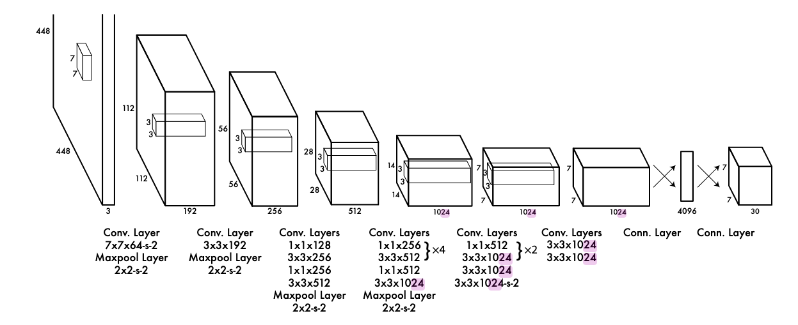
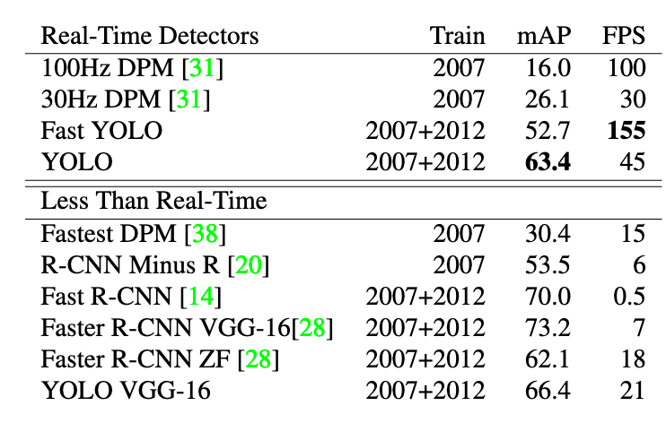
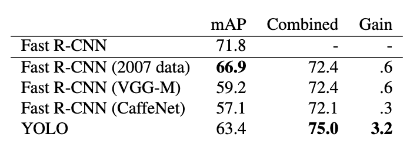

# You Only Look Once: Unified, Real-Time Object Detection

## What is the core idea?

While other object detection approaches repurpose classifiers and rely on multiple networks, YOLO uses just one CNN to look at the entire image and detect bounding boxes for objects.

Inference can be run on real-time video (45 FPS) on a Titan X GPU. A smaller version of the network can even process 155 FPS with a lower accuracy.

## How is it realized (technically)?

### Implementation

YOLO consists of 24 convolutional layers (9 for the small model) followed by 2 fully connected layers.

The inputs are images resized to a 448x448 resolution.

The output of the model is divided into SxS patches (the paper uses S=7). 

Each patch can detect B boxes (B=2 for the experiments in the paper) consisting of the x and y position of the center of the box relative to this patch, the width and height relative to the image and a confidence for the box. 

It also predicts a probability for each class (-> is the object detected by the bounding box of class x?)

### Training

To pretrain the network, only the first 20 layers followed by an average-pooling and a fully connected layer are trained on ImageNet for classification.

Then, the following layers are added and the network is trained for object detection.

The loss is specifically optimized for this task:
* a sum-squared error is used
* the loss for confidence predictions for patches not containing objects is divided by two since many cells will not contain objects and this shouldn't overpower the gradient of cells that do
* the loss for coordinate predictions is multiplied by 5 to weigh the localization higher
* only one of the B predictors is assigned to each object, depending on which prediction has the highest IOU with the ground truth to specialize the predictors on different boxes  
* since squared loss weighs errors in large and small boxes equally but the same error has a larger effect for small boxes, the square root of the sizes are used in the loss to reduce the impact of this issue

The network is trained on the PASCAL VOC 2007 dataset with a scheduled learning rate, dropout and extensive data augmentation.

## How well does the paper perform?

YOLO performs well compared to other systems at the time and is notably faster than all of them because of its simple architecture.

It struggles with 
* small objects in groups, since each patch can only predict two boxes
* objects in unseen aspect ratios/configurations
* precise localizations of small objects since errors in small and large bounding boxes are treated the same

The following table shows results on the PASCAL VOC 2007 dataset (higher is better) for both real-time and non real-time systems:

## What interesting variants are explored?

An error comparison between Fast R-CNN and YOLO reveals that YOLO makes more localization errors while Fast R-CNN struggles with background errors (recognizing the background of an image as an object).

The authors therefore combine the two methods by letting both predict objects and checking if YOLO makes a similar prediction for each detection the R-CNN makes.

If it does, the prediction is boosted based on the overlap and the confidence of the YOLO prediction.

This successsfully reduces background errors:

The speed of the system is now limited by Fast R-CNN however, since both models have to be run.

## TL;DR
* YOLO predicts bounding boxes for objects using a single CNN
* It detects object centers, widths, heights and detection confidences for 7x7 patches in the image
* Because of its simplicity is is very fast and can be used on real-time video while still being very accurate
