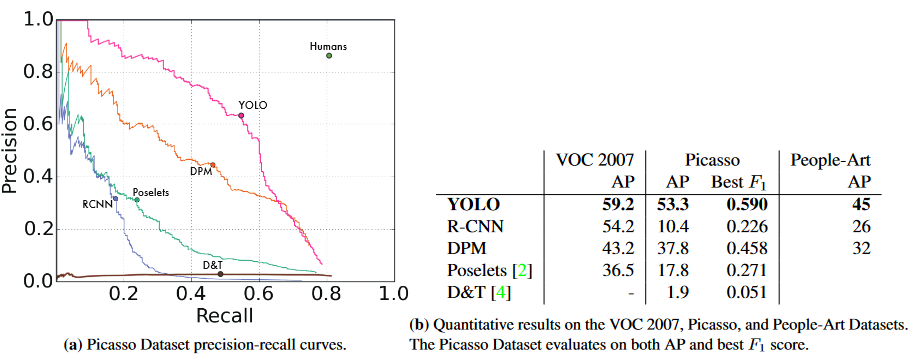

TODO: Summarize the paper:
* What is the core idea?
    * Object detection is the task of determining what objects are in an image and where they are
    * The traditional method is to repurpose classifiers for this task
        * e.g.
            * run object detection at discretized sections of the image
            * first generate potential bounding boxes, run classifier, and then refine
        * slow and complex
    * YOLO is a convolutional network that finds bounding boxes and generates class probablities simultaneously
        * very fast
            * base runs at 45 fps on Titan X GPU
            * fast version runs at 150 fps
        * rarely mistakes background for object
        * generalizes well
            * outperforms SOTA by a large margin when trained on natural images and tested on art
        * still behind SOTA for offline classification

* How is it realized (technically)?
    * Model
        
        * Input image is divided into $$S \times S$$ patches
        * $$B$$ bounding boxes with confidence values are predicted for each patch
            * bounding box consists of x and y coordinates of box center as well as width and height
        * Class probablities are predicted for each patch
            * only one set of class probs per patch
        * For the Pascal VOC dataset, $$S = 7, B = 2$$ was used
        
        * 24 convolutional layers followed by 2 FC layers
        * Faster model uses 9 conv layers and fewer filters; otherwise the same
        * Leaky ReLU activation function for most layers, no activation for last

$$
\phi(x)=
\begin{cases}
x, &\text{if } x > 0\\
0.1x,&\text{otherwise}\\
\end{cases}
$$
        * Loss is sum-squared error

            
            * geometric distance to assigned ground truth box
            * difference between square roots of widths and heights, squared
                * same difference between boxes of different sizes should result in different loss
            * confidence error squared
            * class probabilities error squared

    * Training
        * pretrain first 20 conv layers on 1000 class ImageNet for a week
            * input res of $$224 \times 224$$
        * add 4 conv layers and 2 FC layers with randomly initialized weights
            * increase input res to $$448 \times 448$$
        * batch size of 64, momentum of .9
        * dropout and data augmentation used
        * learning rate warms up then decays
            * 1e-3 to 1e-2 "for first few epochs"
            * 1e-2 for 75 epochs
            * 1e-3 for 30 epochs
            * 1e-4 for 30 epochs
    * Limitations
        * Each patch can only predict one class and two bounding boxes
            * difficult for the model to predict objects that are close together
        * Struggles to generalize to other aspect ratios
        * Loss function treats error for small bounding boxes and larger ones the same

* How well does the paper perform?
    
    * easily achieves SOTA for real-time detection
    * still a bit behind SOTA for offline, however
    
    * R-CNN often mistakes background patches for objects
    * YOLO often isn't able to localize the exact location of objects
    
    * The models are only trained on VOC data
    * R-CNN's performance drops significantly when trained on natural images and applied to art
    * YOLO is able to maintain most of its performance

* What interesting variants are explored?
    * Combining Fast R-CNN and YOLO
        
        * Fast R-CNN and YOLO make different types of errors, so combining them could yield a noticeable performance boost
        * Give boosts to Fast R-CNN predictions if YOLO makes a similar one
        * As a baseline, other versions of R-CNN are also combined with Fast R-CNN
        * YOLO gives the biggest boost
        * Speed is still bottlenecked by Fast R-CNN

## TL;DR
* Using a unified model over complex pipelines can yield great speed improvements for object detection
* YOLO is able to greatly outperform other real-time detectors, but lags behind for the offline detection task
* Because YOLO is given the entire image, it able to generalize better and make less background errors
