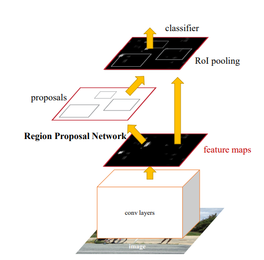
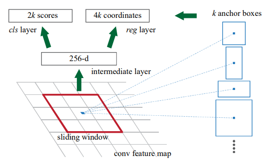
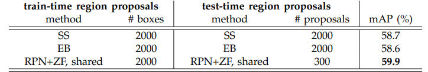
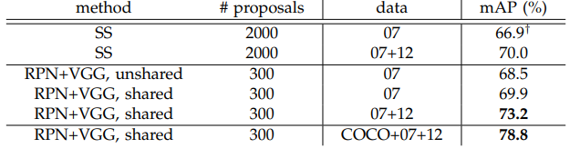
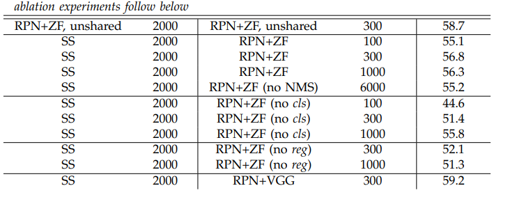

# **Summary - Faster R-CNN: Towards Real-Time Object Detection with Region Proposal Networks**

## What is the core idea?

Despite state-of-the-art results achieved by region-based CNNs such as Fast R-CNN, there is a computional bottleneck during test time when finding region proposals. This paper suggests a deep learning approach for determining region proposals called Region Proposal Networks that leads to more efficient object detection for Fast R-CNN architecture. These RPNs addresses the issue of the bottleneck because convolutional feature maps are now shared between the RPN and the object detection classifer network. On top of the efficiency of object detection, the paper suggests a new concept called anchor boxes that allows the RPN to consider bounding boxes at various scales and aspect ratios.

## How is it realized (technically)?

Region Proposal Networks (RPN) take an image as input and produce object proposal rectangles that each have some score. In this paper, the RPN used was simply a Fully Convolutional Network. During the convolution, each 3 x 3 window is mapped to a feature at a lower dimension and is then fed to two separate fully connected layers. The first is a box regression layer, which computes the coordinates of the bounding boxes. The second is a classification layer which outputs an estimated value for the probability of that specific box being an object or not. 

The paper talks about the concept of anchors which is the center of the 3 x 3 sliding window considered during convolution. Using this anchor, they come up with different anchor boxes (total of 9 for 3 x 3 window) for different scales and aspect ratios. 

An important feature of this paper is the ability to share convolution feature maps between the RPN and the Fast R-CNN object detection network. They use a 4 step training algorithm to achieve this:
1. Train the RPN using stochastic gradient descent and backpropogation. Using a pre-trained Imagenet model initialization that is fine-tuned
1. Train the Fast R-CNN detection network using proposals from previous step
1. Initialize RPN with Detection Network parameters and keep the shared convolutional layers constant
1. Fine tune layers in the RPN and Fast R-CNN object detection network that are unique to themselves

## How well does the paper peform?

The paper provides many results from the experiments that they conducted. For this summary, the results from the experiments on the PASCAL VOC data set are highlighted.

The Faster R-CNN approach was evaluated on the PASCAL VOC 2007 data set. Using the pre-trained ImageNet model for the RPN and a ZFNet for object classification, they were able to achieve a mean average precision of 59.9% despite needing less number of proposals compared to the other region proposal methods. 

In addition, using VGG as the object classifier with the shared convolutional layers approach, Faster R-CNN was able to outpeform Selective Search approach to get a best mean average precision of 78.8%:

The paper also conducts ablation studies to check the effect of the classification and box regression layers on performance for the PASCAL VOC 2007 data set. They found that not having the bounding box regression layer led to a significant drop in mean average precision. The same occurred when they removed the classification layer in the RPN which also led to a decrease in mean average precision. Overall, it appears that both of these layers are crucial for the accuracy of the RPN. 

The paper also boasts faster detection times due to the shared convolutional layers between the RPN and object detection networks. Specifically, the Selective Search method took 1-2 seconds for the end-to-end object detection, while their RPN + VCG model led to 198 ms for the entire object detection process. 

## What interesting variants are explored?

One of the main contributions of this paper is the idea of anchors that more efficiently account for different scales and aspect ratios of region proposals. The paper states that this anchor approach is translation invariant because the convolution layers of the RPN should behave the same despite the translation. Since RPN accounts for translation, the paper claims that this property reduces the number of parameters required for region proposal when compared to other approaches that are not translation invariant.

## TL;DR
* Region Proposal Networks (RPNs) address computational bottleneck in Fast R-CNN approach
* RPNs share convolutional layers with the object detection network to get Faster R-CNN
* Anchor approach allows for RPNs to produce robust region proposals that consider varying scales and aspect ratios
