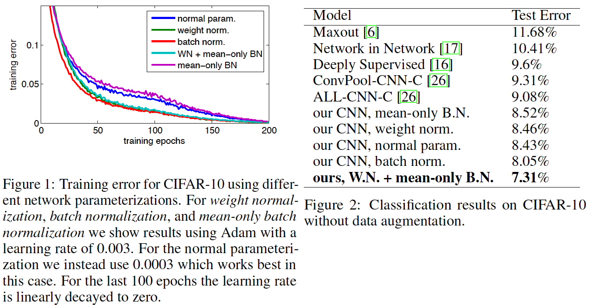
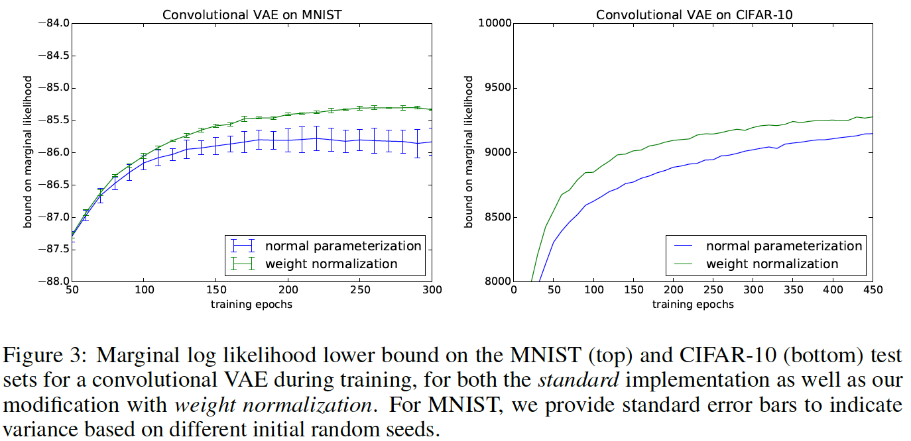
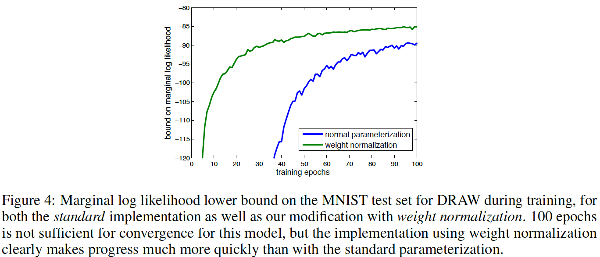
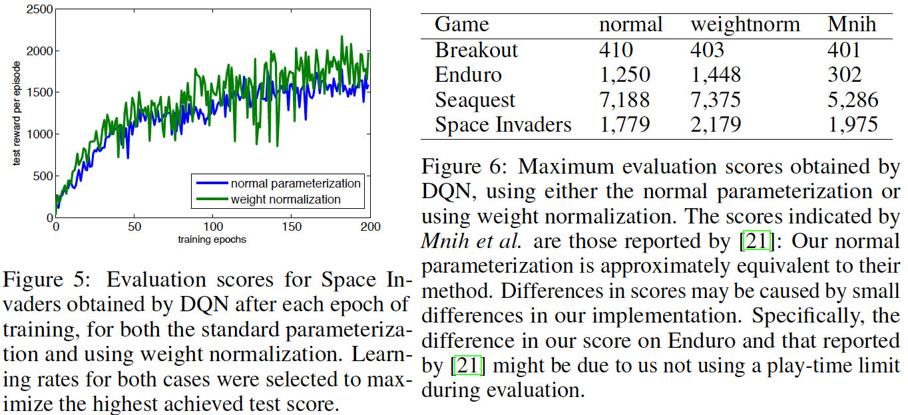

## Core Idea
 * Salimans and Kingma propose Weight Normalization, a reparameterization of neural network weight vectors which they suggest leads to faster training via improving the conditioning of the optimization problem, and speeding up convergence of stochastic gradient descent.  
 * This method is inspired by batch normalization, but unlike it, does not introduce dependencies amongst examples in a minibatch, thus they claim, leading to better performance in applications such as recurrent models, deep reinforcement learning, and generative models where batch normalization is less successful. 
 * They also claim that while weight normalization is simpler to implement than batch normalization, it realizes nearly the same speed-up, while also being computationally less expensive.
## Technical Implementation
 * The authors begin with a standard neural network, where each neuron computes a weighted sum on input features followed by an elementwise nonlinearity.  
    $$y = \phi(\textbf{w}\cdot \textbf{x} + b)$$   
    * $\textbf{w}$ is a $k$-dimensional  weight vector, $\textbf{x}$ a $k$-dimensional input vector, $b$ a scalar bias term, and $\phi$ a nonlinearity     
* They then reparameterize the weight vectors in terms of a $k$-dimensional parameter vector $\textbf{v}$, and a scalar parameter $g$. Here $\lVert\textbf{v} \rVert$ is the Euclidean norm of $\textbf{v}$, and $g =\lVert \textbf{w}\rVert$. This has the effect of separating the norm of the weight vector from the direction of the weight vector.  
$$\textbf{w} = \frac{g}{\lVert \textbf{v}\rVert}\textbf{v}$$  
* $g$ may also be defined in terms of an exponential parameterization, where $s$ is a log scale parameter learned by stochastic gradient descent. The authors claim this approach allows $g$ to span a wider range of magnitudes, although empirically this was not advantageous.   
$$g = e^s$$  
* Training of the network used SGD, but the loss function now uses the reparameterizations above. Thus, the gradients of the loss function wrt the new parameterization are:  
$$\nabla_gL =\frac{\nabla_\textbf{w}L\cdot\textbf{v}}{\lVert\textbf{v}\rVert},\qquad\nabla_\textbf{v}L =\frac{g}{\lVert\textbf{v}\rVert}\nabla_\textbf{w}L -\frac{g\nabla_gL}{\lVert\textbf{v}\rVert^2}\textbf{v}$$  
* An altervative formulation of the same gradient is:
  $$\nabla_\textbf{v}L =\frac{g}{\lVert\textbf{v}\rVert}M_\textbf{w}\nabla_\textbf{w}L,\qquad\text{with}\qquad M_\textbf{w} = \text{I} -\frac{\textbf{ww}'}{\lVert\textbf{w}\rVert^2}$$ 
  * Here, $M_\textbf{w}$ is a matrix which projects onto the complement of the $\textbf{w}$ vector.  
* The above formulations have the effect of scaling the weight gradient and projecting the gradient away from the current weight vector. The authors claim this brings the covariance matrix of the gradient closer to the identity matrix, while also benefiting optimization.
* The authors claim these formulations also allow the optimization of the network to be robust to learning rate. If the LR is too large, the norm of the unnormalized weights grows until an appropriate effective LR is reached. Once the norm of the weights has grown large wrt the norm of the updates, the effective learning rate stabilizes.
* The authors propose a data dependent initialization of the network parameters when using weight normalization.  
  * This is because unlike full batch norm , weight norm does not have the effect of fixing the scale of the features generated by each layer of the network. Thus it is not robust against parameter initializations for which the scales vary across layers.  
  * The below computations are performed at each neuron via an initial feedforward pass through the network for a single minibatch of data $\textbf{X}$. 
  
  $$t =\frac{\textbf{v}\cdot\textbf{x}}{\lVert\textbf{v}\rVert},\qquad\text{and}\qquad y= \phi\left(\frac{t-\mu[t]}{\sigma[t]}\right)$$
  * Here, $\mu[t]$ and $\sigma[t]$ are the mean and standard deviation of the pre-activation $t$ over the examples in the minibatch.
  * Therefore, each neuron's bias $b$ and scale $g$ can be initialized as:
  $$b\leftarrow\frac{-\mu[t]}{\sigma[t]}, \qquad g\leftarrow\frac{1}{\sigma[t]}$$ 
  * This ensures that all features initially have zero mean and unit variance before application of the nonlinearity for the minibatch used for initialization. 
  * A downside to this initialization scheme is that its application domains are limited to those where batch normalization performs well.      
    
## Variants   
The authors propose a tweaked version of batch normalization, which they call Mean-Only Batch Normalization. They then combine this normalization procedure with weight normalization. The neuron activations are computed using:  
$$t = \textbf{w}\cdot\textbf{x},\qquad\tilde{t}=t-\mu[t]+b,\qquad y=\phi(\tilde{t})$$
* $\textbf{w}$ is the weight vector parameterized with WN, $\mu[t]$ is the minibatch mean of the pre-activation $t$.
* The gradient of the loss wrt to $t$ then becomes:
$$\nabla_tL = \nabla_{\tilde{t}}L - \mu[\nabla_{\tilde{t}}L]$$
* The authods claim this method leads to the centering of the gradients which are back propogated, and is computationally less expensive than full batch norm.  
* This method improves model accuracy at test time. 

## Performance  
#### Supervised Classification - CIFAR-10 
* Batch normalization took ~16% longer to train than the normal parameterization, but weight normalization did not demonstrate this slow down.
* The authors hypothesize that the performance of WN + M-O BN compared to full BN is due to the distribution of the noise caused by the normalization method during training being approximately Gaussian, while the noise added by full BN has higher kurtosis.

#### Generative Modelling - MNIST \& CIFAR-10 using a deep Convolutional VAE  

#### Generative Modelling - MNIST using DRAW  

#### Reinforcement Learning - Deep-Q-Network  

## TL;DR
* Weight normalization reparameterizes neural network weight vectors, leading to faster training via improved optimization conditioning and faster SGD.
* Weight normalization is inspired by batch normalization, but is simpler to implement, computationally less expensive, and has broader applicability. 
* A hybrid method utilizing both weight normalization and a tweaked version of batch norm called nean-only batch normalization outperforms WN, BN, and M-O BN (used individually) on classification of CIFAR-10 dataset images.

