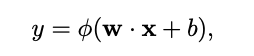
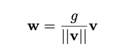
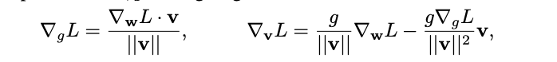
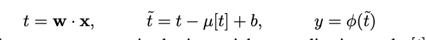
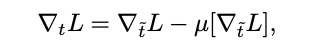
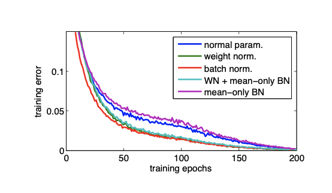
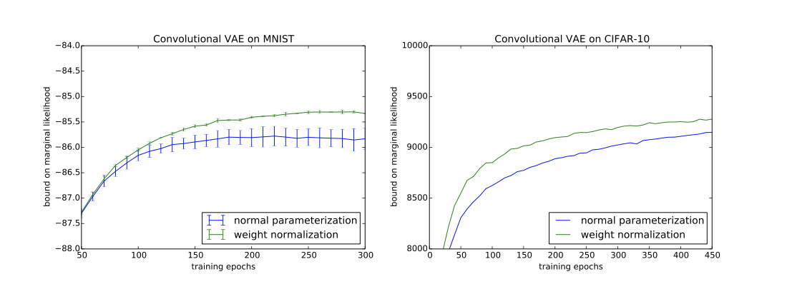
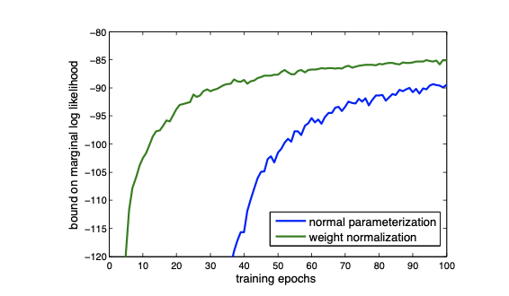
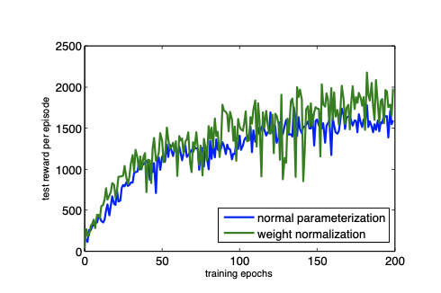

The paper introduces weight normalization, a reparameterization of the weight vectors of a neural network, to speed up convergence of stocastic gradient descent.

In standard neural networks the weighted sum computed by each neuron is as follows:

where w (weights) and x (input) are both k-dimensional vectors and b is a scalar bias term.

In weight normalization each w vector is reparameterized in terms of a parameter vector v, of dimensionality k, and a scalar parameter g: 

The gradient is taken with respect to v and g:

WN is able to scale the weight gradients by g/||v|| and project the gradient away from the current weight vector. They argue that due to projecting away from w, the norm of v grows monotonically with the number of weight updates, which helps grow the unnormalized weights until an appropriate learnng rate is reached. Additionally, the projection the covariance matrix of the gradients in v is brought closer to the identity matrix, which may speed up training.

BN fixes the scale of the features generated by each layer of neural networks, making optimization robust against parameter initializatoins for which scales vary across layers. WN lacks this so proper initialization is needed. This can be done by sampling the elements of v from a simple distribution with a fixed scale, and then before training, initialize b and g to fix the minibatch statistics of all pre-activations for a single minibatc of data. This ensures all features initially have zero mean and unit variance.

Since the mean of the neuron activations are still dependent on v, a varient of batch normalization called mean-only batch normalization, was introduced.

Similarly to to full batch normalization, the minibatch means are subtracted out, but the minibatch standard deviations are not divided by when computing neuron activations.  The activations are computed as follows:

The gradient of the loss with respect to preactivation t is:

To prove the usefulness of their model the authors conducted experiments using 4 different models.

 Supervied Classification: CIFAR-10
* Model based off of the ConvPool-CNN-C architecture, with the modifications of replacing the first drop out layer with a layer that adds Gaussian noise, expanding the last hidden layer from 10 to 192 units and using a 2X2 max-pooling layer instead of a 3X3.
* Batch normalization preformed 16% slower than the baseline, while weight normalization was not noticeably slower
* Mean-only batch normalization with weight normalization performed the best (7.31% error). The authors hypothesised that the mean-only BN may have introduced noise that was useful for regularizing the network while weight normalization. Mean-only BN introduced noise that is approximately Gaussian, while full BN adds noise that has a much higher kurtosis.

Generative Modelling: Convolutional VAE: 
* Similar to the CVAE architecture, the modification of encoder and decoder blocks were parameterized with ResNet blocks and the diagonal posterior is replaced with auto-regressive variational inference.
* Weight normalization had lower variance and converges to a better optimum

Generative Modelling: Draw
* use DRAW model
* Unclear how batch normalization would be applied to the model due to the LSTMs, WN is trivially applied to the weight vectors of each LSTM unit
* WN presents a signification speed up on convergence.

Reinforcment Learning: DQN
* Deep Q-Network
* Not suited for BN, WN was easily applied.
* WN was able to improve preformace.

The authors were able to show that weight normalization can help improve convergance speed in several different models, as well as several were batch normalization was not implementable. 

They also clearly explained how to implement WN and proposed a varient of batch normalization to go along with it.

## TL;DR
* Weight normalization was proposed to increase convergence rate when using SGD
* Models, such as LSTMs, where batch normalization is not easily applied benifit from WN
*  mean-only batch normalization was proposed
