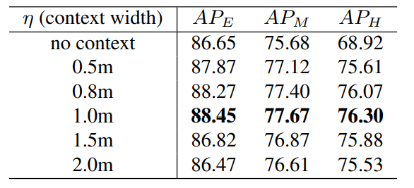

* What is the core idea?

SoTA 3D object detection methods usually leveraged mature 2D detection frameworks by projecting the point clouds into bird's view, to the frontal view, or to the regular 3D voxels, but these methods usually suffers from information loss during quantization. On the other hand, PointNet can directly learn 3D representations from point cloud data for point cloud classification and segmentation, which does not need any quantization. The authors proposed to leverage this advantage by using PointNet in a 2-stage detection framework similar to Faster R-CNN, where the first stage proposes bounding boxes, and the second stage refines some selected bounding boxes.

* How is it realized (technically)?

The model is structured as a 2-stage detector, which consists of the bottom-up 3D proposal generation stage and the canonical bounding box refinement stage.

    

**Stage 1: Bottom-Up 3D Proposal Generation via Point Cloud Segmentation**

First, use a point-cloud backbone network (e.g. PointNet++) to encode point-wise features. Then, simultaneously do the following predictions on the feature vectors:

1. **Segmentation Head**: Segment the points of an object (foreground points) in the point-cloud according to the 3D ground-truth boxes. This relies on that _objects in 3D scenes are naturally separated without overlapping each other_. The author used a focal loss here because the number of foreground points is much smaller than that of the background points for a large-scale outdoor scene. The loss is defined as:

    

2. **Box Regression Head**: Use features of the foreground points (from segmentation) to do bounding box regression. The receptive field of the point network allows the foreground points features to have information about the background points. In order to constrain the generated 3D box proposals, the authors proposed to use a bin-based regression instead of a direct bounding box regression:

    

        
    

    a. Split the surrounding area of each foreground point into a series of discrete, uniformly-distanced bins along the $$X$$ and $$Z$$ axes. Note that $$Y$$ axis is not needed here since most objects' $$y$$ values are within a very small range of the foreground points.
    b. Classification: Find which bin the center of the object belongs to.
    c. Regression: Further regress from that bin to the center of the object by removing some residual distance.

    Altogether, this is formulated as:

    

        
    

    Where $$x^{(p)}, y^{(p)}, z^{(p)}$$ is a foreground point of interest, $$x^p, y^p, z^p$$ is the center coordinates of the object, $$\text{bin}$$ are the ground-truth bins, and $$\text{res}$$ are the residuals.

    The authors also divided the orientation ($$2\pi$$) prediction of the bounding box into bins, and calculated the same bin classification target and residual target as the $$X$$ and $$Z$$ axes. The object size is regressed from adding residuals $$(\text{res}_h^{(p)}, \text{res}_w^{(p)}, \text{res}_l^{(p)})$$ to the average object size of each class in the entire training set.

    This required a cross-entropy classification loss for bin classification and a smooth _L_1 regression loss:

    

        
    

    $$N_{\text{pos}}$$ is the number of foreground points.

    For inference on bin-based parameters $$(x, z, \theta)$$, the model first chose the bin center with the highest predicted confidence, and then added the predicted residuals to obtain the refined parameters. For inference on directly regressed parameters $$(y, h, w, l)$$, the model just add the predicted residuals.

    To remove redundant proposals, the authors used non-maximum suppression (NMS) with some IoU threshold. The authors also kept the top 300 proposals for training the 2nd stage, and kept the top 100 proposals for inference on the 2nd stage.

**Stage 2: Point Cloud RoI Pooling and Canonical 3D Bounding Box Refinement**

The bounding boxes collected from stage 1 will be slightly enlarged. All points within the bounding box will be used for the bounding box refinement later. In addition, the points within the bounding box will go through a canonical transformation so that 1) the center of the bounding box is at the origin, 2) the $$X'$$ axis is pointing towards the head direction of the proposal with the $$Z'$$ axis perpendicular to it, and 3) the $$Y'$$ axis remains the same as that of the LIDAR coordinate system:

    

For each point, the 3D point coordinates, the laser reflection intensity, predicted segmentation mask, and a distance of how far the point is from the origin will be concatenated together to form local features. The distance feature is used to compensate for the lost depth information for far-away objects, which generally have much fewer points in LIDAR sensors than nearby objects. The local features will then be transformed through an MLP to get the same dimension as the semantic point features (from the point network). These are concatenated and fed to another network to obtain a confidence classification and box refinement.

A ground-truth box is matched with a proposal if their IoU is above 0.55. The ground-truth box also goes through the canonical transformation. To do refinement, the proposal's formulation is the same as in stage 1, but with smaller bins for proposal center and orientation. The refinement loss is defined as:

    

Where $$\mathcal{B}$$ is the set of 3D proposals from stage-1 and $$\mathcal{B}_{pos}$$ are the positive (>0.55 IoU) proposals for regression. $$\text{prob}_{i}$$ denotes the estimated confidence of the bounding box. Eventually, another NMS is applied to remove overlapping bounding boxes with an IoU threshold of 0.01.

* What interesting variants are explored?

**Implementation Variations**: The authors subsampled 16,384 points from each scene as inputs. If there are less than 16,384 points, points will be randomly repeated to reach 16,384 points. For the box proposal refinement sub-network, 512 points are randomly sampled from the pooled region of each proposal.

The stage-1 sub-network are trained independently of the stage-2 sub-network with different hyperparameter settings.

**Augmentations**: For training the stage-2 sub-network, the authors randomly augmented the 3D proposals with small variations to increase the diversity of proposals. Data augmentations include random flip, scaling, and rotation around the vertical $$Y$$ axis.

**GT-AUG**: To simulate objects with various environments, the authors copied several ground-truth boxes and their inside points from some scenes to same locations of other scenes. This slightly improved mAP on the validation set.

* How well does the paper perform?

PointRCNN is evaluated on the test and validation 3D object detection benchmark of KITTI dataset ([Geiger et al., 2012](http://www.cvlibs.net/datasets/kitti/)). The method outperforms previous SoTAs on car and cyclist detections, but comparable to SoTAs on pedestrian detections. The authors claims that this is due to other methods having multiple sensors for small objects like pedestrians, but PointRCNN only used point clouds, which had sparse points for pedestrians.

    

PointRCNN also achieved good results on the validation set (on the left). Note that PointRCNN achieved 96% recall with only 50 proposals, which is quite high (on the right).

    

**Ablations**

Ablations on removing canonical transformation (CT) and semantic features (RPN features):

    

Not enlarging stage-1 proposal boxes decreased performance on hard objects:

    

Full bin-based loss (BB-loss) outperformed residual-based loss and other losses in convergence:

    

**Qualitative Results of PointRCNN on the KITTI Test Split**

    

## TL;DR
* The first stage of PointRCNN proposes bounding boxes via point cloud segmentation.
* The second stage of PointRCNN refines selected bounding boxes of stage 1.
* PointRCNN achieved very high recalls with smaller number of RoIs than previous SoTAs.
