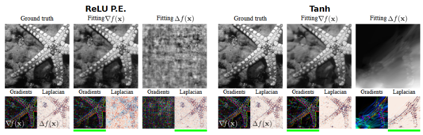

TODO: Summarize the paper:
* Background
    * Implicit functions take the form $$F(x, \Phi, \nabla_x\Phi, \nabla_x^2\Phi, \dots) = 0$$
        * $$\Phi$$ maps $$x$$ to some quantity of interest
        * e.g. the equation for the unit circle is $$x^2 + \Phi^2 - 1 = 0$$
    * Traditional methods for modeling such functions involve discretizing the domain into sections, then numerically solving at each section
    * NNs can be used for continuous model
        * agnostic to grid resolution
        * model memory only scales with complexity of the function, rather than spatial resolution
        * common activation functions such as ReLU achieve poor performance
* What is the core idea?
    * Two main contributions
        * demonstrate that the sine activation functions works very well for creating implicit neural representations
        * create a new initialization technique, which is essential for the performance that they achieve with their network
* How is it realized (technically)?

    

    * Implicit equations relate an input, a function, and the function's derivatives to 0
        * $$C_m(x, \Phi(x), \nabla\Phi(x),\dots) = 0$$
        * a simple loss function is just the absolute value of the left hand side
        * dynamically sample some set of points $$x_i \in \Omega$$ at which to evaluate the expression
        * $$L = \sum_i^{\Omega}\sum_m ||C_m(x_i, \Phi(x_i), \nabla\Phi(x_i),\dots)||$$
    * Sinusoidal representation network (SIREN)
        * MLP with sine as the activation function
        * derivative of a SIREN is also a SIREN, since the derivative of sine is just a phase shifted sine
        * during initialization, weights are drawn from $$U(-\sqrt{\frac{6}{n}},\sqrt{\frac{6}{n}})$$
            * $$n$$ is input dimension
    * For all experiments, they use a 5-layer MLP and optimize it using ADAM with a learning rate of 1e-4

* How well does the paper perform?

    

    

    * Poisson image reconstruction
        * SIREN is used to solve the Poisson equation
        * goal is to reconstruct an image
        * the gradient or Laplacian of the ground truth image is used for supervision
        * SIREN does well with both types of supervision
        * Both ReLU and Tanh completely fail the reconstruction when supervised with Laplacian
    * Poisson image editing
        * SIREN is used to create an image from the linear interpolation of the gradients of two images

    

    * Representing shapes with signed distance functions
        * Inspired by recent work, they decide to use SDFs to fit the network to point clouds
        * SDF outputs the distance to the boundary of the shape
        * the SDF values are negative when outside the shape and positive when inside the shape
        * gradient is $$1$$ almost everywhere
            * $$|||\nabla_x(\Phi(x))| - 1||$$ for all points
        * distance values on the shape should be close to 0
            * $$||\Phi(x)||$$ for all points on the shape
        * distance values off the shape should not be close to 0
            * $$\exp(-\alpha \cdot |\Phi(x)|)$$ for all points off the shape
        * for calculating loss, sum up these values
            * sample random points in the domain, half on the shape half off it

    

    * Helmholtz equation
        * Supervise with loss function based on helmholtz equation, which relates the Laplacian of a function with itself
        * Network outputs two values to account for complex solutions

    
    

    * Learning a space of implicit functions
        * convolutional encoder maps partial observations of an image to latent code vectors
        * ReLU hypernetwork maps the latent code vectors to SIREN network parameters
        * the resulting SIREN can fill in the rest of the image
        * works comparably to other methods

## TL;DR
* Sine activation functions are effective at describing complex signals and their derivatives
* Requires careful initialization
* Demonstrated to achieve much better performance on a variety of tasks
