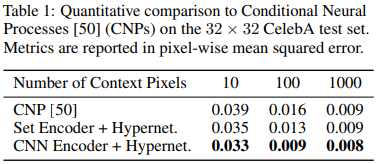

## Overview
The authors introduce sinusoidal representation networks (SIRENS) as an improvement over current network architectures (namely ReLU MLPs) for implicit neural representations of signals. They perform experiments on a range of signals (image, video, sound) as well as on a number of equations rooted in physics applications. The main benefit of SIRENS is the ability to more easily compute their derivatives, as well as any higher order derivatives required.

## Background
Implicit neural representations serve as a method for continuous encoding of signals via neural networks. These representations provide benefits over traditional discrete representations since they can be more memory efficient and are differentiable.

### ReLU MLPs
The authors note that most recent work in implicit neural representations have utilized the ReLU MLP architecture. This architecture is limited in the fact that it lacks the capacity to model details well and its incapable of modeling information in higher-order derivatives (since its second derivative is 0).

## SIREN
The authors propose SIREN as a simple architecture that utilizes sine as a periodic activation function. It is formulated as shown below:

where each phi term represents a layer of the network. SIRENs are shown to converge faster than baseline architectures and have some interesting properties; for example the derivative of a SIREN is also a SIREN (given that the derivative of sine is cosine, which in itself is a phase-shifted sine).

### Basic Image Usecase
The authors provide an example of trying to parameterize a discrete image. 
In this case each image defines a dataset D = {(xi, f(xi))}i where xi is the pixel coordinate (xi, yi) and f(xi)) is the associated RGB color. Network phi (trying to predict f(xi)) is fit using an L2 loss function and trained over the dataset.

Running this approach over a short video shows that SIREN has an average peak signal-to-noise ratio around 5 dB higher than a ReLU baseline, showing higher average image fidelity.

Here are some further results comparing SIREN versus a number of other activation functions.

## Experiments
The authors conduct several experiments, I've listed a few notable ones below.

### Poisson Image Reconstruction
Images can be reconstructed by solving the Poisson equation using their derivatives. The authors supervise implicit neural representations using either just gradients or laplacians to reconstruct the original image.

### Representing Shapes with Signed Distance Functions

## TL;DR
* Using sine as a periodic activation function over ReLU in implicit neural representations can improve representation performance and converge faster
* SIREN is better suited to represent complex natural signals and their derivatives than ReLU networks
