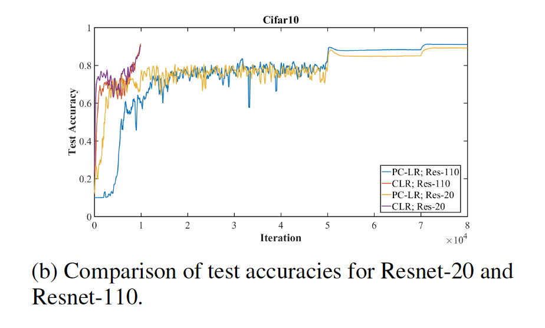

* What is the core idea?

This paper examines "super-convergence", the idea that neural networks can be trained faster and achieve higher accuracy rates using higher learning rates, less regularization in other areas, and less training data. The paper also explores methods of computing optimal learning rates using Hessian-free optimization and finally, the effects of different learning rate cycles.

* How is it realized (technically)?

The background and following parts of the paper discuss estimating learning rates, which lays a foundation for "super-convergence". Circular learning rates (CLR) and the learning rate range test (LR range test) are used and find important pieces of information for "super-convergence". The learning rate range test (LR range test) can be used to see if "super-convergence" is possible for a certain model. In the test, training starts with a very low learning rate which then linearly increases. A graph of the accuracy compared to the learning rate of the training shows which learning rate provided the maximum accuracy and between what other learning rates the training improved. According to the paper, indication that a high learning rate achieves very high accuracy during this test is a sign a model is capabale of "super-convergence".

Circular learning rates (CLR) is another way of finding a min and maximum learning rate. It relates slightly to Hessian-free optimization, which is another process of estimating the "optimal" learning rate. As in gradient descent uses the first derivative to move in the direction of "greatest negative gradient", Hessian-free optimization utilizes the second derivative where the only the curvature in the direction of the steepest descent is relevant from the Hessian matrix values. Large learning rates are causes by small values in the Hessian approximations.

With everything put together, learning rates can be estimated using Hessian-free optimization and CLR.

* How well does the paper perform?

"Super-convergence" was demonstrated in results where training data was limited, and the gap between "super-convergence" results and standard training results widen the less training data there was. Experiments were run with Resnets and Cifar-10.

In addition, accuracy from super-convergence was greater for shallower architectures and while using larger batch sizes.

Super-convergence was also achieved using wider Resnets, and on the MNIST and imagenet datasets, accuracy increases dramatically sooner using the "1cycle" learning rate schedule which had a min learning rate of 0.1 and a max of 1.0.

* What interesting variants are explored?

Variants to the "1cycle" and changes to amount of regularizaion also produced positive super-convergence results. When training on the Imagenet dataset, reducing the regularization from weight decay allowed for higher learning rates and thus produced faster convergence and higher test accuracy. Paired with a cycle between 0.05 to 1.0, then down to 0.0005, weight decay values needed to be reduced as well.

## TL;DR
* Super-convergence can occur with large learning rates, more limited training data, and larger batch sizes
* Learning rates can be estimated and optimized using different methods
* Super-convergence is possible on a variety of different datasets when regularization in other forms is reduced.
