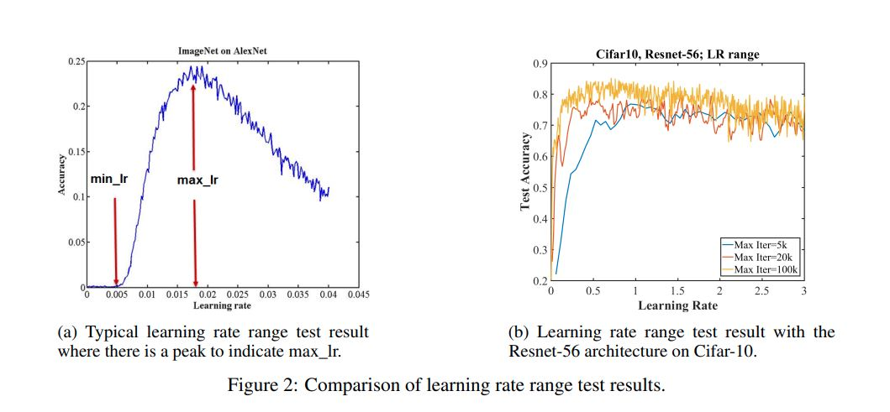
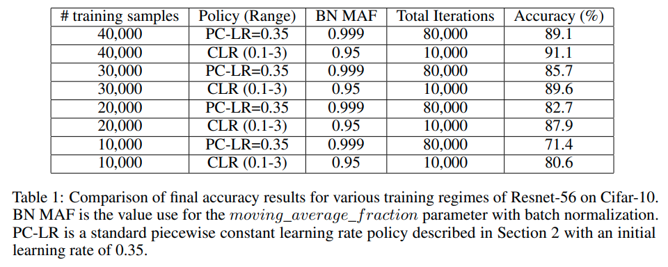

#### What is the core idea? ####
The phenomenom of superconvergence is observed, where model-training time can decrease by a factor of an order of magnitude, by implementing cyclical learning rates (CLRs).
The authors use cyclical learning rates (CLRs) to train networks, which provide a lot of benefits. For example, they allow a model to escape plateaus or saddles, whereas small, set learning rates may not create enough gradient to escape these. The larger learning rates used in CLRs also provide one of the most efficient methods of regularization (through large leaps). To determine the range, they performed an LR range test. 

Regularization can be done throughout many different methods like large learning rates, small batch sizes, weight decay, and dropout. The authors propose, and show, that reducing other forms of regularization and relying mostly on large learning rates results in more efficient training.

For superconvergence, it is more effective to use larger batch sizes than smaller batch sizes.
Also, superconvergence seems to work better as the amount of available training data decreases.

#### How is it realized (technically)? #### 
The LR range test:
Figure 2a shows an example curve, max is peak, and min is max divided by 3 or 4.
Figure 2b shows that an LR range test for Cifar-10 on a 56 layer residual network, even for large LR such as 3, the network performs unexpectedly well.

#### How well does the paper perform? #### 
Table 1 shows the comparison of final accuracy results for the two kinds of networks: piecewise constant learning rate, set as 0.35, and cyclical learning rate, with a range of 0.1-3.0.
This shows that better accuracy results were obtained with CLR, and using only 1/8 of the total iterations (10,000 v. 80,000).

#### What interesting variants are explored? #### 
The authors perform the same test of CLR vs. PC-LR on different datasets - Cifar-10, MNIST, Cifar-100, Imagenet, etc. and different architechtures, such as resnet-50, wide resnet, densenet, LeNet, resnet-56.
They all present the superconvergence phenomenom (driven by CLR).
Authors also test under different batch sizes, and conclude that superconvergence works best as available training data decreases.

## TL;DR
* Cyclical Learning Rates (CLRs) are used in networks, and lead to the superconvergence phenomenom - reach final accuracy levels faster than a fixed learning rate by a factor of one order of magnitude.
* CLRs ranges can go up to unexpectedly high learning rate values. Large learning rates proved to be a very effective method for regularization.
* Superconvergence works notably better when the amount of available training becomes more limited.
