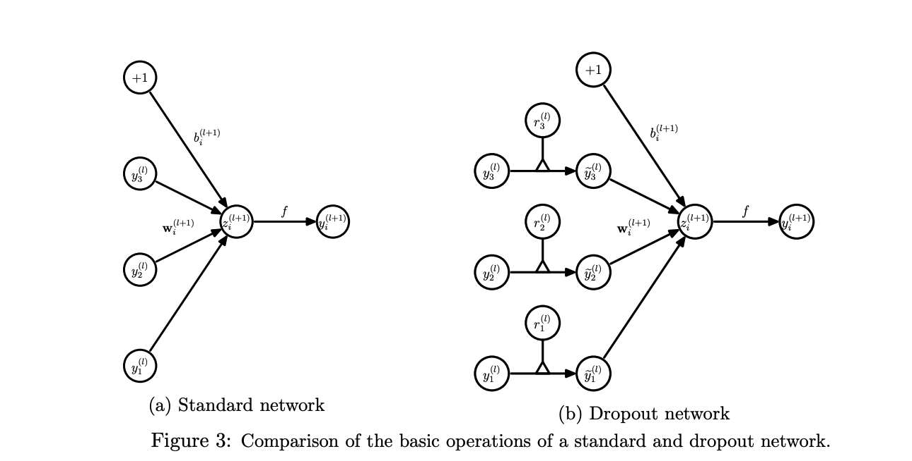

# Main Idea

This paper looks to solve the problem of overfitting for large networks. It introduces dropout, a technique that randomly drops units and their connections from a neural network during training. 

Current deep learning networks contain many layers, allowing them to learn complicated relationships from data. However, due to limitations in training data and the depth and complexity of modern data, some of the relationships are learned from overfitting and will not be seen in actual test data. By using dropout, we can simulate an ensemble method by training on different architectures. 

Dropout is a technique of randomly removing several nodes and their incoming and outgoing edges from the network. The removal probability of each node is independent from each other. We call the network post-removal as the "thinned" network. For each a training example, a new "thinned" network is trained, as the dropout is performed differently for every example. 

One of the main motivations in the paper is adapting a network so that each unit can be trained to work with a random set of previous units as any unit can be randomly dropped. 

# Technical Implementation

During testing and validation, we are unable to explicitly average the predictions from all thinned models. Instead, we use a single neural network without performing dropout, but scale the weights down with the dropout rate for each node. 

In terms of seeing a description of the model, we can see the following:

Here, we can treat $$y$$ as the output of a unit, $$z$$ as the input of a layer, $$f$$ as the activation function, $$w$$ as the weights, and $$b$$ as the biases. These values can be calculated using the following equations: 

In the second equation, we can treat $$r$$ as a vector of independent Bernoulli random variables which have a probability $$p$$ of being 1. This is multiplied across the outputs of the layer to thin the outputs, which are used as input into the next layer. 

## Training Dropout Nets

Training a dropout network using SGD is similar to a standard neural network. The main difference is that when performing forward and backpropagation, the gradients for each parameter are averaged over the cases in each batch. 

# Performance

The paper was tested on the following datasets:
* MNIST: A set of handwritten digits for image classification
* TIMIT: A speech benchmark for clean speech recongition
* CIFAR-10 and CIFAR-100: Image classification sets
* SVHN: Images of house numbers for classification to identify the digits
* ImageNet: A collection of natural images for classification
* Reuters-RCV1: A collection of Reuters articles
* Alternative Splicing data set: RNA features for prediciting alternative gene splicing

These sets were chosen to show that dropout is a general technique and can be used across multiple domains and tasks. 

First, the paper examines the performance of dropout across the image data sets: MNIST, SVHN, CIFAR-10, CIFAR-100, and ImageNet. Across of the sets, state-of-the-art results were achieved. I will present the performance of one task in each domain. 

## MNIST: 

Here we can see using dropout decreases the error rate in every case. There are variations using dropout, such as using ReLU, changing the number of layers and units, etc. Using different variations shows how robust dropout is as a technique. 

## TIMIT

TIMIT is a speech recognition task. For a 6 layer network, adding dropout decreased error rate by almost 2%. 

## Reuters-RCV1

The best neural net without a dropout had an accuracy rate of 31.05%. Adding dropout reduced the error to 29.62%. The researchers found that this improvement was smaller than that of vision and speech datasets. 

## Observations

Some notable observations were made on the performance. To start, it appears that applying dropout to all layers beat applying droupout at only convolutional layers. In modern practice, the method of dropout varies. In some cases, no dropout is performed if the model is hyptertuned to a specific task and dataset, but it is common practice to include dropout on a minimum of the convolutional layers. Next, using dropout on the Reuters task led to less improvement than on the vision and speech tasks. This may be due to vision tasks have a larger feature representation, making it easier to overfit to the presented data. 

# Variations

* Dropout does not only need to be used on feed-forward neural networks. It can also be used on Boltzmann Machines. 

* Using dropout along with max-norm regularization, large decaying learning rates, and high momentum provides significant improvements. 

* The researchers explore the effect of changing the dropout rate. When keeping the number of hidden units the same, the probability of keeping a unit (opposite of dropout rate) is optimal in between .4 and .8. Above and beyond this range, the error rate goes up. It was also noted that for a very large network but small dataset, including dropout may not provide much improvement. As the size of the dataset increases, dropout has a larger role to play. 

## TL;DR
* Dropout improves neural networks by reducing overfitting
* Dropout improves performance on a wide variety of tasks and datasets
* Dropout works by thinning a network through a process of randomly and independently removing nodes as well as their incoming and outgoing connections 

