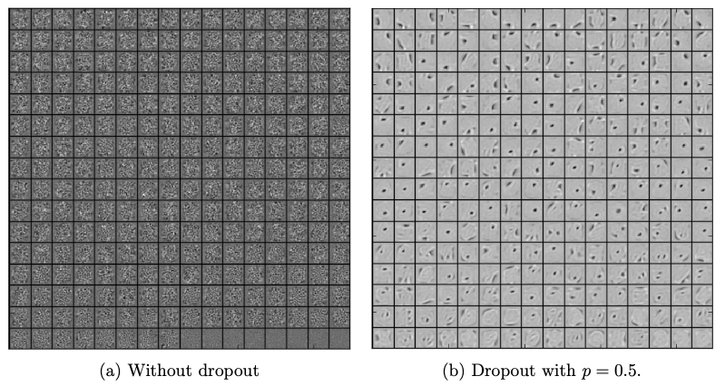

**What is the core idea?**

The paper introduces a new way to regularize models namely dropout. Dropout is a technique to randomly drop units and their connection with a probability (_p_) leading to “_thinned_” models. For testing, a single “_unthinned_” model with smaller weight (_pw_) is used which is an approximation of averaging the predictions of all the different “_thinned_” architectures. 

Dropout has the following features:
1. It prevents overfitting by using different “_thinned_” architectures.
2. It approximates to combining various different architectures by sampling from an exponential set of architectures. 
3. It adds noise that allows the optimization process to explore different regions of weight space.
4. It reduces co-adaptations by making other hidden units unreliable. Therefore, any unit should become self robust in different contexts and does not rely on          particular units to rectify their mistakes. This can be seen in the following figure.
5. The Activation of hidden units become sparse. 

**How is it realized (technically)?**

The dropout is realised by the following feed forward equations (* denotes element wise product) :

In case of Stochastic Gradient Descent(SGD), in a mini-batch each parameter's gradient are averaged over the training cases.
During test, the weight are scaled as : 

$$
{W_{test}}^{l} = pW^{l}
$$

**How well does the paper perform?**

The paper rigorously tests dropout on various architectures and diverse datasets ranging from different domains like vision, speech and text. There is significant improvement in generalization and accuracy with dropout in all these cases with state of art in SVHN, ImageNet, CIFAR-100 and MNIST. Even with pre-training, dropout improves generalization with a small learning rate. For scare datasets, dropout outperforms all other models apart from the bayesian model. Dropout restricted boltzmann machine(RBM) also performs better than standard RBM. 

The performance of dropout was compared with various regularization methods with the conclusion that dropout combined with max-norm regularization gives the lowest generalization error. For almost all the models, the default value of _p_ is 0.5 for hidden layers and 0.8 for input layer.

**What interesting variants are explored?**

The paper discusses the gaussian dropout method which is a variation of Bernoulli dropout where each hidden layer is multiplied by a random variable drawn from   $$\\N(1,\sigma ^{2})$$ instead of multiplying it by _p_. 

One disadvantage of dropout, it slows training by a factor of 2x to 3x as each training is trying to train a different architecture. Hence, the tradeoff of accuracy to training time should be taken into consideration. 

## TL;DR
* Dropout is an effective regularization technique to reduce overfitting. 
* It reduces co-adaptations making the presence of any hidden unit unreliable. 
* Models with dropout performs better in a variety of domains. 

