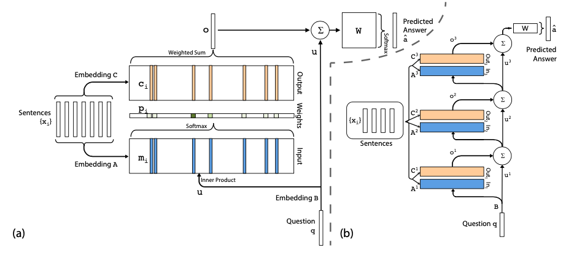

**What is the core idea?**

The paper introduces a novel recurrent neural network with an explicit large memory and a recurrent attention mechanism. The model reads recurrently from memory multiple times before giving the results. This model is trained end-to-end and therefore requires comparitively less supervision during training. Hence, it can also be applied to realistic settings. The paper also shows experimentally that multiple hops over the long-term memory leads to good performance of the model. 

**How is it realized (technically)?**

The Model takes as input $$x_{1},...,x_{i}$$ (to store in memory), query _q_ and outputs answer _a_. The model writes all _x_ to the memory up to a fixed buffer size and creates continuous representation of _x_ and _q_. 

*Single layer:*

1) The input set{$$x_{i}$$} is embedded with matrix _A_ ( _d_ x _V_) to give memory vectors {$$m_{i}$$}. 
2) The query _q_ is also embedded with matrix _B_ (_d_ x _V_) to give an internal state u.
3) On computing match between each memory {$$m_{i}$$} and _u_ by taking softmax of their inner product which results into the probability vector p over the inputs i.e. $$p_{i} = Softmax(u^{T}m_{i})$$
4) Each $$x_{i}$$ has a corresponding mapping to an ouput vector $$c_{i}$$ (using another embedding matrix _C_).
5) The final output is the sum of the weighted probabilities {$$p_{i}$$}  over the transformed input $$c_{i}$$ i.e. $$o = \sum_{i}^{}p_{i}c_{i}$$
6) The output vector _o_ and embedding vector _u_ is added and multiplied by the final weight matrix _W_ which is then passed on to the softmax to predict the output i.e. $$\hat{a} = Softmax(W(o + u))$$
7) As the input to output function is smooth, the gradient an be easily computed of this continuous function. All three embedding matrices _A_, _B_, _C_ and weight matrix _W_ are learnt by minimizing cross entrophy loss. 

*Multiple layer:*

1) For layers above the first layer, the input is the sum of the output $$o^{k}$$ and the input $$u^{k}$$ i.e. $$u^{k+1} =u^{k}+o^{k}$$
2) Each layer has it's own embedding matrices _A_ and _C_ but have constraints to ease training and reduce hyperparameters. 
3) At final layer, the output is $$\hat{a} = Softmax(W u^{K+1}) = Softmax(W (o^{K} + u^{K} ))$$

*Constraints on embedding vectors*

Adjacent:
1) The output embedding for one layer is input embedding for another i.e. $$A^{k+1} = C^{k}$$.
2) The answer prediction matrix is equal to output matrix i.e. $$W^{T} = C^{k}$$. 
3) The question embedding matches the input embedding of the first layer i.e. $$B = A^{1}$$.

Layer-wise (RNN-like):
1) Same input and output embeddings across different layers i.e. $$A^{1} =A^{2} =...=A^{k}$$ and $$C^{1} =C^{2} =...=C^{k}$$.
2) Add a linear mapping _H_ (amother learnable parameter) to update _u_ between hops i.e. $$u^{k+1} = Hu^{k} + o^{k}$$.
3) This model resembles Memory Network model with the exception that the hard max operations is replaced with a continuous weighing from the softmax.  

Model details:
1) The question and input sentences are embedded as bag of words like $$m_{i} = \sum_{j}^{}Ax_{ij}$$ and $$u = \sum_{j}^{}Bq_{j}$$
2) To capture the position of words within a sentence/questions, position encoding is used i.e. $$m_{j} = \sum_{j}^{}l_{j}.Ax_{ij}$$ where $$l_{kj} =(1-(j/J))-(k/d)(1-2j/J)$$
3) Some of the QA tasks requires temporal context, hence the memory vector is modified as: $$m_{i} = \sum_{j}^{} Ax_{ij} + T_{A}(i)$$. The ouput embedding is modified in the same way. Both $$T_{A}$$ and $$T_{C}$$ are learning parameters. 
4) Dummy memories are added to regularize $$T_{A}$$ which is referred as random noise. 
5) Another variation is not using softmax layer until the validation loss starts decreasing which is referred as linear start training. 
6) The default value for number of layers for these models is 3.

**How well does the paper perform?**
* The model was tried on various variants described above with joint training on all tasks and per tasks trainings. These models were compared with MeMNN, MemNN-WSH, LSTM.
* All variants of the model beats the weakly supervised baseline models. 
* The position encoding representation performs better than bag of words representation especially on tasks where word ordering is important. 
* Linear Start helps to avoid local minima. 
* Jittering the time index with random empty noises gives small but consistent boost in performance. 
* Joint training performs better in all the models.

**What interesting variants are explored?**

The model (operating on a word level) was applied on a language modeling task with the following changes:
1) The previous _N_ words and current word in the input sentences are embedded into memory separately.
2) _q_ is a fixed constant vector (without embeddings) as there is no input query.
3) ReLU is applied to half of the layer. Layer wise RNN weight sharing is used. 
4) The model closely resembles RNN with the difference that the sequence over which network is recurrent is not in text but in memory hops. 
5) One interesting obeservation was some hops concentrate on recent words while other hops have more broad attention span over all memory locations.

Though performing decently well when compared to baselines, the end to end network memory model still lags behind memory networks trained with strong supervision. 

## TL;DR
* End to end memory network is a recurrent neural network on a large external memory.
* The model is trained end to end making it more applicable for general settings. 
* The model requires less supervision and hyperparameters and still performs better than most of the baseline model. 
