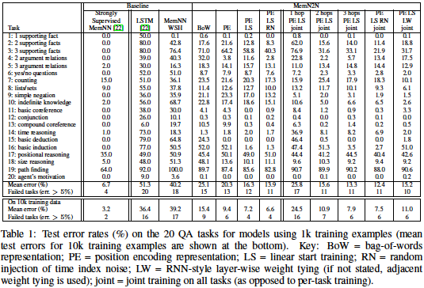
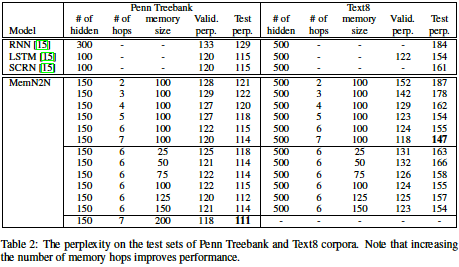

## Core Idea
* End-To-End Memory Networks are a type of Memory Network with recurrent attention, and a possibly large external memory which are trained end-to-end.
* End-to-end training requires less supervision, thus improving applicability in real world settings.  
* End-To-End Memory Networks can be applied to synthetic question answering and language modeling tasks.  

## Technical Implementation
* The model accepts a discrete set of inputs (a story) along with a query, and outputs an answer.  
    * These inputs are formed from a vocabulary $$V$$.
  
#### Model Architecture
 
* The inputs $$x_i$$ and query $$q$$ are transformed using input embedding matrices $$\textbf{A}$$ and $$\textbf{B}$$, respectively. The embedded inputs are 'memories' in the embedding space. 
$$m_i = \text{Embed}_A(x_i)\qquad u = \text{Embed}_B(q)$$
* The relevance of an embedded memory is calculated by taking the inner product of each memory with the embedded query followed by a softmax operation, thus producing a probability vector.  
$$p_i = \text{softmax}(u^{\text{T}}m_i)$$  
* The unembedded inputs (story) are then embedded once again using an output embedding matrix $$\textbf{C}$$.  
$$c_i = \text{Embed}_C(x_i)$$  
* The response vector is then calculated by summing the embedded inputs $$c_i$$ and weighting each with the probability vector from the previous step.  
$$o = \sum_ip_ic_i$$  
* The final predicton, or answer to the question, is then calculated by summing the response vector with the initially embedded query, passing it through a weight matrix, and then applying a softmax operation.  
    * The answer is also a word in the vocabulary $$V$$.    
$$\hat{a} = \text{softmax}(W(o + u))$$  
* During training, utilizing stochastic gradient descent, the matrices $$\textbf{A, B, C}$$, and $$\textbf{W}$$ are learned by minimizing the standard cross-entropy loss between the predicted answer, and the correct answer.  

## Variants 
* Along with the baseline model, the authors experimented with deepening the architecture by adding additional memory layers, which they term 'hops'.  
	* Each hop is comprised of embedding matrices A and C, and outputs an answer, which is passed to the next memory layer as the query.    
* Two schemes are proposed for defining the input embedding $$\textbf{A}$$ and output embedding $$\textbf{C}$$:  
$$\text{Adjacent: } A^{k+1} = C^k\qquad W^T=C^K\qquad B=A^1$$  
$$\text{Layer-wise: } A^1=A^2=...=A^k\qquad C^1=C^2=...=C^k$$ 
* Two sentence representations were explored: Bag of Words (BoW) which is agnostic to the position of words in a sentence, and a method they call Positional Encoding, which is sensitive to word position.  
* The authors also explored a technique they termed Linear Start, where the softmax layer in the memory layers were removed, only leaving the softmax in the final prediction layer. Once the validation loss stopped decreasing, the softmax layers were reinserted.  
* Given that some stories and questions depend upon the sequence of events which took place, a Temporal Encoding scheme is presented where the embedded memories $$m_i$$ and the output embeddings $$c_i$$ are supplemented with a special matrices $$\textbf{T}_A, \textbf{T}_C$$ which encode temporal information.  
	* Random noise, in the form of empty memories, can be injected into $$\textbf{T}_A$$ to help with regularization during training.  
    $$m_i = \sum_j Ax_{ij} + T_A(i)\qquad c_i = \sum_jCx_{ij} + T_C(i)$$  
* Language modeling experiments were also performed where the model predicted the next word in a given sequence.  
    * In these experiments, the query $$q$$ is not used, and was thus set as a constant unembedded vector.  
    * The words of the input sequence, and the predicted word are all part of a vocabulary $$V$$. 

## Results  
#### QA Tasks
  
#### Language Modeling Tasks  
  

## TL;DR
* End-to-End Memory Networks utilize explicit memory, recurrent attention, and multiple hops to achieve good performance on question answering and language modeling tasks.
* Compared to baseline Memory Networks, the End-to-End approach requires less supervision during training.
* While E2E networks do not outperform Strongly Supervised Memory Networks in the paper, the experiments demonstrate they do outperform tuned RNNs and LSTMs of similar complexity.
