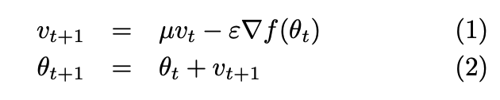
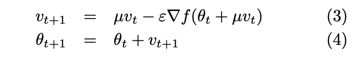
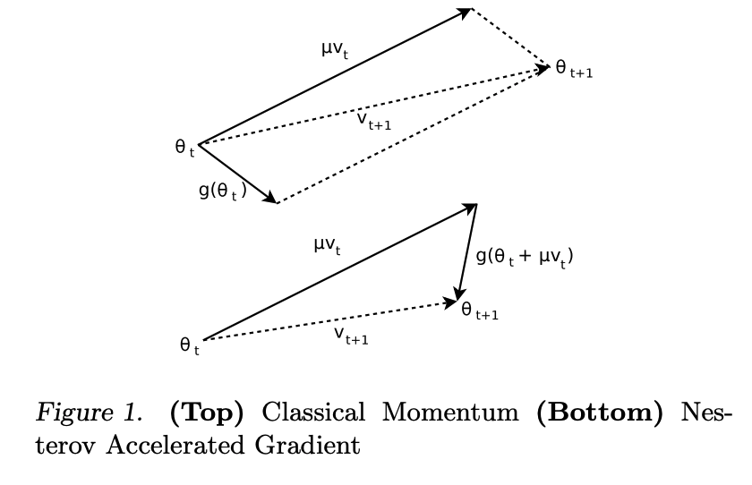

# Core idea
SGD with momentum and careful initialization can train DNN's, RNN's in practice

# Context
- Hinton 2006: **DNN's, RNN's are expressive but hard to train using first-order methods like SGD** without some pre-training tricks
- Martens (2010, 2011) shows that **a type of second-order method called Hessian-free Optimization (HF) can train DNN's, RNN's well** without such tricks
- Some work (2010-2012) shows that **SGD can still work reasonably well with certain random initializations, though not as good as HF** from Martens (2010)

# Main contributions
- Empirically shows that the **SGD can work as well as HF with momentum methods and good initializations**
- Theoretically shows connections between classical momentum, Nesterov's accelerated gradient, and HF

# Momentum methods: Classical Momentum (CM), Polyak 1964 and Nesterov's Accelerated Gradient (NAG), Nesterov 1983
- Intuition for both: maintain a velocity vector of progress in each direction. Encourage progress along flat gradients (low velocity); dampen progress along steep gradients (high velocity) with respect to a momentum constant.
- Classical momentum: 
- NAG: 
- Graphical depiction of the difference:

NAG is "more stable", making it more tolerant to larger momentum constants.
- Theoretical relationship: (1) when the learning rate is sufficiently small, CM and NAG are equivalent; (2) when the learning rate is relatively large; NAG has a smaller effective momentum size for high-curvature eigen-directions, preventing oscillations/divergence.

# Experiments on Deep Autoencoders
- Task: train 3 autoencoders from Hinton & Salakhutdinov (2006)
- Models: DNN's of 7-11 layers, sigmoid non-linearity, sparse random initializations (SI), and scheduled momentum update from Nesterov (1983).
- Effect of momentum: NAG usually outperforms CM, especially with higher momentum, and is competitive with contemporaneous HF results.
- Effect of initializations: Super sensitive to SI scale factor; values of <1 or >3 did not produce sensible results.

# Experiments on RNNs
- They use an RNN called an Echo-State Network: the hidden-to-output matrix is learned from data, while the remaining parameters are initialized from a distribution then fixed
- Hidden dimension of 100 with tanh non-linearity
- Effect of momentum: Good results with NAG with large initual momentum, small learning rate; though not as good as results with HF.
- Effect of initializations: Different layers of the network needed to be initialized from normal distributions with different standard deviations and spectral radii, depending on the task/layer.

## TL;DR
* SGD with momentum methods + carefully chosen initialiations is competitive with 2nd order optimization methods for DNN's, RNN's
* Classical momentum and Nesterov's accelerated gradient are theoretically related with NAG being more tolerant of higher momentum
* ^This insight is supported empirically
