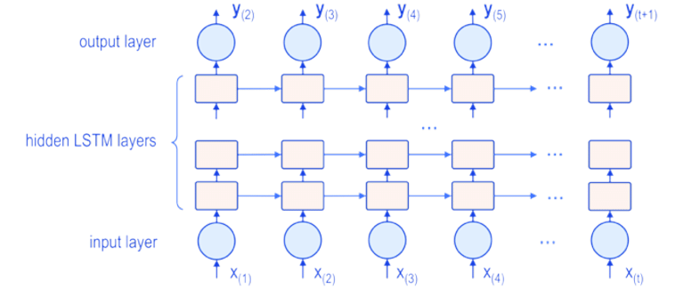

# **Summary - Sequence to Sequence Learning with Neural Networks, Sutskever, Vinyals, Le; 2014**

## What is the core idea?

Deep Neural Networks are being used today for all kinds of difficult tasks such as image detection and speech recognition. However, DNNs are not suitable for sequence to sequence tasks because the dimensionality of input and output sequences can be arbitrary. This paper suggests a Deep Learning approach that is able to apply DNNs for a sequence to sequence task by bypassing its limitation of requiring fixed dimensionality input and output.

## How is it realized (technically)?
 
The model in the paper uses two LSTMs: one for the input and output sequences respectively. These LSTMs were relatively deep with four stacked layers and a final softmax layer over the LSTMs output. 

The paper's training algorithm performed Maximum Likelihood Estimation (MLE) to maximize the following to obtain the most likely translation: 

The most likely transalations during training were found using a left-to-right beam search algorithm. The paper also took the 1000 most likely translations from the baseline (SMT) and rescored them using the log probabilities of each translation hypothesis with their model. The model was trained using Stochastic Gradient Descent without momentum with a batch size of 128 random sentences. 

## How well does the paper perform?

The model was used on the WMT'14 English to French Machine Translation task. The paper trained the model on a subset of 12 million sentences with vocabulary size of 348 million and 304 million words for French and English respectively.

They assessed the success of their approach using a BLUE score - typically computed by comparing a translated sentence with some reference translation checking for some overlap. The higher the score, the closer the model's output translations were to the reference translations. With 5 reversed LSTMs and a beam size of 12 they were able to achieve a BLEU score of 34.81, which was larger than what was achieved by the SMT baseline. The paper claims this was the first time that such results ever occurred for a neural translation model. The specific results of their experiment are shown below:

The paper also found that rescoring the baseline's 1000 best lists with their own 5 reversed LSTMs lead to a BLEU score of 36.5 which is very close to the best WMT'14 result of 37.0. Overall, this paper states this was the first neural approach that achieved significant results on a sequence to sequence task. 

## What interesting variants are explored?

I found it interesting that the paper implemented reversed LSTMs. Typical LSTMs read sentences from beginning to end, but this paper reverses the senetences and reads input backwards. Apparently, this significantly helped their model's performance by increasing BLEU score by about 4 - 5. They theorize that because source words are closed to the target words in the decoder, there is fewer "minimal time lag". Since the source and target words are initially closer to each other, it is easier for the model to draw connections between the input and output sentences which led to improvement.

## TL;DR
* Deep Learning Networks are unfit for sequence to sequence tasks beacuse they require a fixed dimensionality of input and output sequences
* LSTMs can be used to represent an iunput sequence as a large fixed dimensionality vector that can be used when to translate into output sequence
* First example of neural approach outperforming baseline statistical machine translation and performance relatively near best approach
