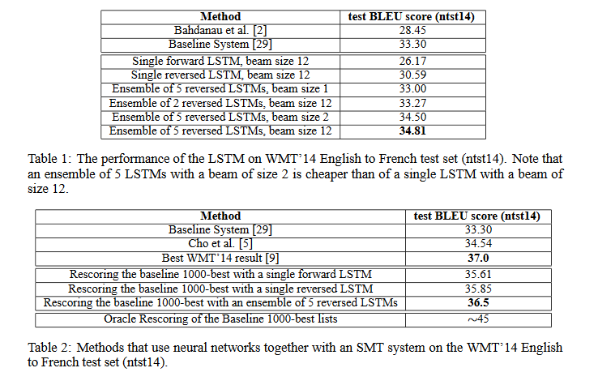

### What is the core idea?

DNN are models that perform very well on a variety of different tasks. However,
these models struggle with sequence-to-sequence problems, tasks where the inputs
and outputs are not fixed. We can use two different LSTMs, a type of DNN, to
increase performance on these tasks. One LSTM will be used to encode the sequence
of inputs into a vector representation and the other to decode this vector into
an output sequence.

###  How is it realized (technically)?

Recurrent Neural Networks (RNNs) compute a sequence of outputs from a sequence
of inputs via the following equations

$$
h_t =   sigm(W^{hx}x_t + W^{hh}h_{t-1})
$$

$$
y_t = W^{yh}h_t
$$

Long Short-Term Memory (LSTM) models are a variant of RNNs that allow the model
to learn long-term dependencies.The goal of the LSTMs is to approximate

$$
p(y_1,...,y_{T'}|x_1,...,x_{T}) = \Pi_{t=1}^{T'}p(y_t|v,y_1,...,y_{t-1})
$$

where the probability distribution is created over all words in the LSTMs
vocabulary. 

When outputting the translation after reading tin the input, the authors used a
left-to-right beam search decoder. At each step of the LSTM, the model
maintained $$B$$ hypotheses on the most likely outputs of the LSTM. The next
step would then find the $$B$$ most-likely outputs after outputting another word
onto these $$B$$ hypotheses. By limiting the number of hypotheses to the $$B$$
most likely, the authors could increase the model's speed with little penalty to
overall performance.

###  How well does the paper perform?

The authors performed their experiments on the WMT English to French Machine
Translation task. They used the 160 thousand most common words as the vocabulary
for the input LSTM and the 80 thousand most common words for the output LSTM.
All models were trained with SGD without momentum over 7.5 epochs with a batch
size of 128. They also reversed the order of the input but not the output as it
was found that doing so improved performance.

The authors used the BLEU score, a measure of how well a machine translation
matches the human reference implementation, to evaluate their models. Using an
ensemble of LSTMs, the authors were able to beat the baseline model by 1.5
points (Note that I was unable to follow the reference link to find out what the
baseline model was). Furthermore, they were able to get within 0.5 points of the
best WMT result during 2014 together with a Statistical Machine Translation
(SMT) system. The authors also found that the LSTM performed well on long
sentences.

### What interesting variants are explored?

The authors tried several different models when testing. Notably, the employed
ensembles of LSTMs with varying sizes. They also reversed the inputs to the LSTM
without changing the order of the outputs to improve performance.

## TL;DR
* RNNs perform well with variable input and output sequences
* LSTMs are RNN variants that allow for better performance
* Beam search increases training speed for a slight performance decrease
