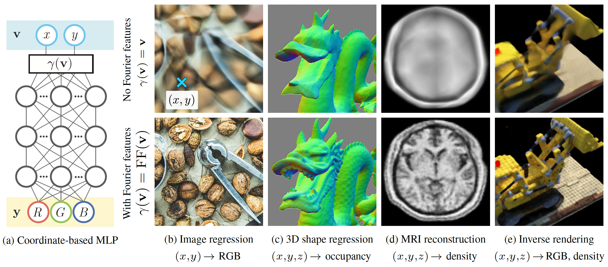
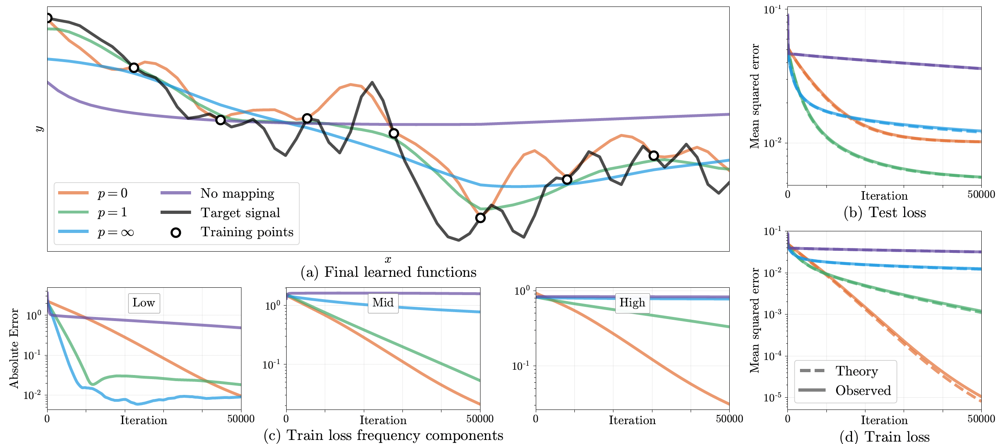
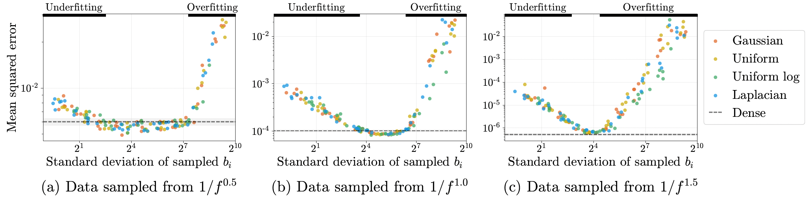
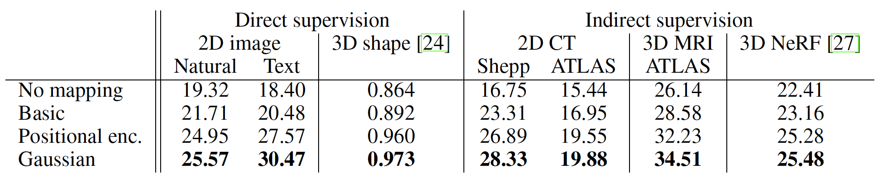

## The core idea

The paper proposes that using a Fourier feature mapping of the inputs allows a coordinate-based MLP to learn **high frequency functions** in low dimension problems such as images and 3D objects. The Fourier features are a more general case of the sinusoidal position encoding. It shows using kernel regression (with a Neural Tangent Kernel (NTK)) that standard MLPs without fourier features are not well suited for coordinate-based tasks such as shape representation, texture synthesis, shape inference, novel view synthesis because of their **spectral bias** towards low frequency functions.

Leveraging literature that approximates deep networks with kernel regression, the paper theoretically explains the reason for this spectral bias and then shows how the Fourier features help in overcoming the problem. Specifically, it proves that the Fourier features transform the NTK into a stationary kernel with tunable frequency components -- thus allowing the network to learn high frequency functions. It also proves the above claims empirically through a few simple experiments.

## How is it realised?

### Proof of spectral bias using kernel regression

Kernel regression is a nonlinear regression technique that estimates the function $$y_i=f(\textbf{x}_i)$$ from training samples $$(\textbf{X}, \textbf{y}) = \{(\textbf{x}_i, y_i)\}_{i=1}^{n}$$ as:

$$\hat{f}(\textbf{x}) = \sum_{i=1}^{n} (\textbf{K}^{-1}\textbf{y})_i k(\textbf{x}_i \textbf{x})$$

where $$\textbf{K}$$ is the $$n\times n$$ kernel matrix of $$\textbf{K}_{ij}=k(\textbf{x}_i\textbf{x}_j)$$ elements. The kernel function $$k$$ is symmetric and positive semi-definite (PSD) which is a measure of the 2 input vectors. 

Some prior literature shows that the function $$f(\textbf{x}, \theta)$$ of a fully-connected deep network with parameters $$\theta$$ after any training iteration converges to the kernel regression solution using NTK in the limit of near infinite layer width and near zero learning rate. Further, the network's predictions after $$t$$ iterations of training can be approximated as:

$$\hat{\textbf{y}}^{(t)} \approx (\textbf{I}-e^{-\eta\textbf{K}t})\textbf{y}$$

where $$\eta$$ is the learning rate and $$\textbf{K}$$ is the kernel matrix with NTK kernel function $$k_{ntk}(\textbf{x}_i,\textbf{x}_j) = h_{ntk}(\textbf{x}_i^T\textbf{x}_j)$$ for a scalar function $$h_{ntk}: \mathbb{R} \rightarrow \mathbb{R}$$.

Using the above framework and the eigendecomposition of the PSD matrix $$\textbf{K} = \textbf{Q}\Lambda \textbf{Q}^T$$, the paper shows that the training error

$$\textbf{Q}^T(\hat{\textbf{y}}^{(t)}-\textbf{y}) \approx \textbf{Q}^T((\texbf{I}-e^{-\eta \texbf{K}t}\textbf{y}-\textbf{y})) = -e^{-\eta \Lambda t}\textbf{Q}^T\textbf{y}$$

since $$e^{-\eta \textbf{K}t} = \textbf{Q}e^{-\eta \Lambda t}\textbf{Q}^T$$. In the eigenbasis of the NTK, therefore, the $$i^{th}$$ component of the training loss decays exponentially at the rate $$\eta\lambda_i$$ with each iteration. 
From here, the paper makes the argument that the high frequency components of the target function corresponding to the smaller eigenvalues of the NTK will converge very slowly because the eigenvalues of NTK decay very rapidly. 

### Fourier feature mapping for a tunable stationary NTK

In low-dimensional regression tasks with dense coordinates as inputs, a Fourier feature mapping $\gamma$ of the inputs before passing them through the coordinate-based MLP makes the NTK stationary and tunable. The function $$\gamma$$ maps input points $$\textbf{v}\in \[0,1)^d$$ to a higher dimensional space using sinusoids as:

$$\gamma(\textbf{v}) = \[a_1 cos(2\pi \textbf{b}_1^T\textbf{v}), a_1 sin(2\pi \textbf{b}_1^T\textbf{v}), \dots, a_m cos(2\pi \textbf{b}_m^T\textbf{v}), a_m sin(2\pi \textbf{b}_m^T\textbf{v})\]^T$$

The corresponding kernel function, using the property $$cos(\alpha)cos(\beta)+sin(\alpha)sin(\beta)=cos(\alpha -\beta)$$, then simplifies to:

$$k_{\gamma}(\textbf{v}_1, \textbf{v}_2) = \gamma(\textbf{v}_1)^T \gamma(\textbf{v}_2) = \sum_{j=1}^{m}a_j^2 cos(2\pi \textbf{b}_j^T(\textbf{v}_1-\textbf{v}_2)) = h_{\gamma}(\textbf{v}_1-\textbf{v}_2)$$

$$\text{where} h_{\gamma}(\textbf{v}_{\Delta}) \triangleq \sum_{j=1}^{m}a_j^2 cos(2\pi \textbf{b}_j^T \textbf{v}_{\Delta})$$.

Note that the kernel above is stationary, i.e. it only depends on the difference of the inputs. This is a Fourier approximation of the kernel function with $$a_j^2$$ and $$\textbf{b}_j$$ as the Fourier series coefficients and Fourier basis frequencies respectively. The spectrum of the kernel can therefore be controlled using the same parameters. 

Using these input embeddings to train a network is equivalent to kernel regression with the stationary NTK function. Thus, the training dynamics of the network, specifically the rate of convergence and the generalizability of the model can be tuned using the $$a_j$$ and $$\textbf{b}_j$$ parameters of the kernel to control the bandwidth of NTK as shown in figure below.

The magnitude of the higher frequency components reduces with the parameter $$p$$ in the figure. $$p=0$$ corresponds to equal magnitude of all frequencies and $$p=\infty$$ corresponds to just 1 frequency. Figures (b) and (d) show that $$p=\infty$$ leads to underfitting and $$p=0$$ leads to overfitting. Therefore, $$p=1$$ has adequate power across frequencies to still learn higher frequency functions rapidly but not overfit to them. Figure (c) shows the convergence of the different frequency components of the training error. 

### Application of Fourier feature mapping

In real-world problems of higher dimensions, it is not possible to densely sample the Fourier basis frequencies for the feature mapping because of scalability issues. Therefore, the paper proposes to sample a smaller set of random Fourier features from a parametric distribution which matches the performance of the dense set of Fourier features. It further finds that the performance does not depend so much on the family of the distribution (distribution shape) but on its scale (standard deviation). Proved empirically in the figure below. The three subfigures are experiments with three different synthetic datasets.

## Performance

The paper evaluates the proposed method with the Fourier features sampled from an isotropic Gaussian distribution and compares against 3 baselines -- no Fourier feature mapping, basic with just 1 frequency and sinusoidal position encoding. The proposed mapping clearly performs the best in terms of _PSNR_ for a variety of tasks (_Intersection-over-Union_ for 3D shape) using coordinate-based MLP with ReLU.

## TL;DR
* Theoretically prove that standard coordinate-based MLP is not well suited for learning high frequency functions in low-dimensional problems.
* Theoretically and empirically show that using a Fourier feature mapping of the input coordinates before MLP allows to tune the frequency components in the estimated target function.
* Provides a strategy to sample a sparse set of Fourier features in practice from any distribution with suitable scale.

