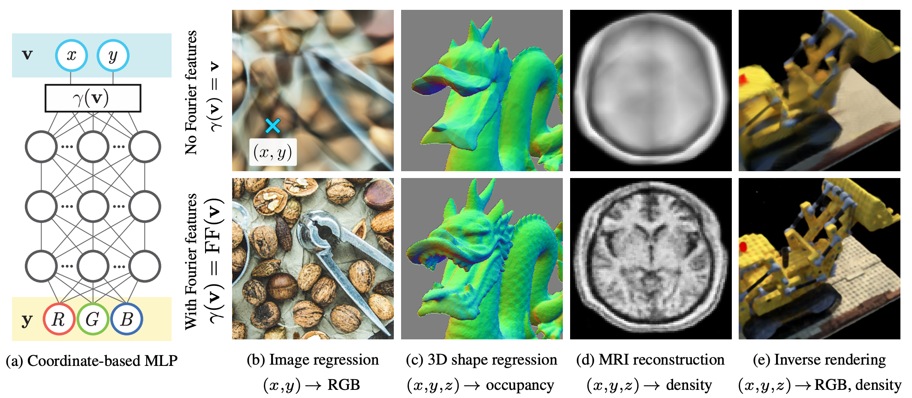
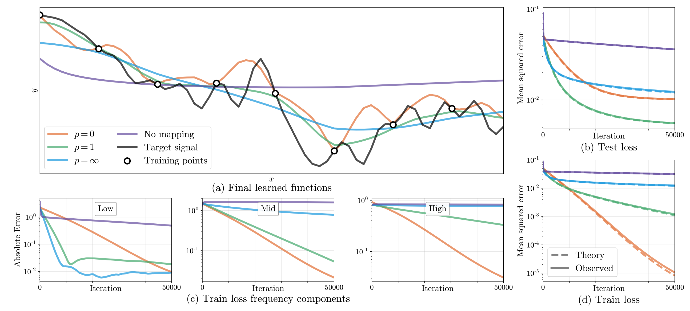
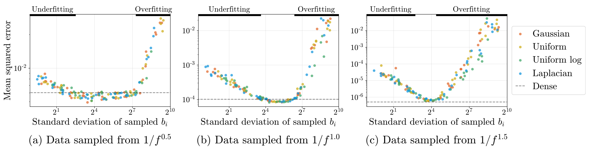
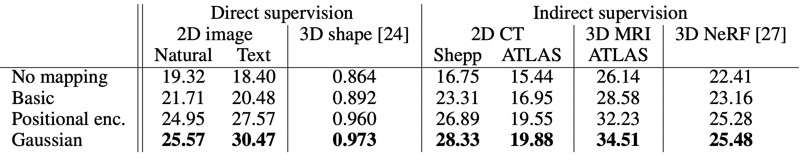

## Core idea

The core idea of the paper is to leverage Fourier features as data pre-processing to allow MLPs that directly act on image coordinates.
The authors show that doing so enables the MLP to learn a high-frequency function, thus significantly improving the quality of the output image, particularly in the minute details.
In addition, they also provide a theoretical explanation for this phenomenon through the lens of Neural Tangent Kernel (NTK).

At a high level, this paper is in the line of research that focuses on the use of coordinate-wise MLPs in computer vision, e.g. NeRF [1] and Siren [2].
One novelty of this paper is its use of NTK as a tool to explain the success of Fourier features.
Specifically, they note the **spectral bias** of a regular MLP that leads to poor reconstruction quality for the high-frequency components, and provide experimental evidence of this.

 
<b>Figure 1: Image quality improvements from using Fourier features on several different tasks.</b>

 

## How is it realized?

The concrete application of this idea consists of a few steps.

### Fourier featurization

As described above, the key idea of this work lies in the way input coordinates are **featurized** before being fed into the MLP.
Concretely, a $$d$$-dimensional input point $$\mathbf{v} \in [0, 1)^d$$ is mapped to the surface of a higher-dimensional hypersphere via the following:

$$
\gamma(\mathbf{v}) = \left[ a_1 \cos(2\pi\mathbf{b}_1^\top \mathbf{v}), a_1 \sin(2\pi\mathbf{b}_1^\top \mathbf{v}), \ldots, a_m \cos(2\pi\mathbf{b}_m^\top \mathbf{v}), a_m \sin(2\pi\mathbf{b}_m^\top \mathbf{v}) \right]^\top
$$

with the associated kernel:

$$
k_\gamma (\mathbf{v}_1, \mathbf{v}_2) = h_\gamma(\mathbf{v}_1 - \mathbf{v}_2)
$$

where $$h_\gamma(\mathbf{v}_\Delta) = \sum\limits_{j=1}^{m} a_j^2 \cos(2\pi\mathbf{b}_j^\top \mathbf{v}_\Delta)$$.

A key observation is that this kernel is **stationary** (i.e. only depends on the difference of the two input points).
Thus, the proposed Fourier features naturally act as a convolution kernel over the input domain.
In other words, we get **shift invariance** for free.

### Transformation through MLP

Next, the Fourier features are fed into the MLP, and we obtain $$f(\gamma(\mathbf{v}); \theta)$$, where $$\theta$$ denotes the parameters of the MLP $$f$$.
Following the NTK literature, we approximate $$f$$ as a kernel regression using the NTK kernel: $$h_{\text{NTK}}(\mathbf{x}_i^\top\mathbf{x}_j)$$.
As a composition of two kernels, the overall output is thus approximated as:

$$
h_{\text{NTK}}(\mathbf{x}_i^\top\mathbf{x}_j) = h_{\text{NTK}}(\gamma(\mathbf{v}_i)^\top\gamma(\mathbf{v}_j)) = h_{\text{NTK}}(h_\gamma(\mathbf{v}_i - \mathbf{v}_j)) 
$$

From this, we conclude that training the MLP on Fourier features corresponds to performing kernel regression with the above stationary, composed function.

### The role of parameters $$a_i$$ and $$\mathbf{b}_j$$.

Since the parameters $$a_i$$ and $$\mathbf{b}_j$$ are free variables, they can be tuned and have a huge influence on the training / convergence of the MLP.
To investigate this, the authors run a toy experiment on a 1-D functional regression task.

 
<b>Figure 2: Effect of the free parameters on the training dynamics of the MLP.</b>

 

In summary, the authors discovered that choosing the right values for these parameters is critical to the training performance of the MLP,
More importantly, the authors provide some guidance to the task of tuning these parameters in practice.
For large datasets, we are forced to sample random Fourier features as was proposed by [3], due to the exponential number of samples required with respect to the number of examples.
Interestingly, the family of the distribution mattered little. 
The authors experimentally verify that the **variance** of the distribution is what matters.

 
<b>Figure 3: Regardless of the distribution type, the standard deviation of b_i is ultimately what mattered in terms of the resulting distortion.</b>

 

## How well does the paper perform?

The authors test the effectiveness of Fourier features on two main axes: type of Fourier feature itself, and the tasks.

Regarding the type of features, they consider three different ones: a "basic" one that simply wraps around the unit circle, a generalized version of positional encoding used in Transformers, and a random Gaussian mapping.

Regarding the type of tasks, they consider tasks of modeling 2-D images, 3-D shapes, 2-D CT volume density, 3-D MRI responses, and 3-D inverse rendering for view synthesis.

 
<b>Table 1: Main comparison results, measured in terms of PSNR.</b>

 

As shown in the table above, Gaussian Fourier features outperformed all others in all tasks.
Moreover, all three Fourier feature types exhibit improved distortion compared to the direct modeling without Fourier features.

## TL;DR
* Random Fourier features allow standard MLPs to better represent high-frequency functions.
* Neural Tangent Kernel provides an explanation for the shift-invarance of the Fourier features over the input domain.
* Careful tuning of the variance of the sampling distribution is important in practice.

## References

[1] Ben Mildenhall, Pratul P Srinivasan, Matthew Tancik, Jonathan T. Barron, Ravi Ramamoorthi, and Ren Ng. NeRF: Representing scenes as neural radiance fields for view synthesis. arXiv preprint arXiv:2003.08934, 2020. \\
[2] Vincent Sitzmann, Michael Zollhoefer, and Gordon Wetzstein. Scene representation networks: Continuous 3D-structure-aware neural scene representations. NeurIPS, 2019. \\
[3] Ali Rahimi and Benjamin Recht. Random features for large-scale kernel machines. NeurIPS, 2007.

