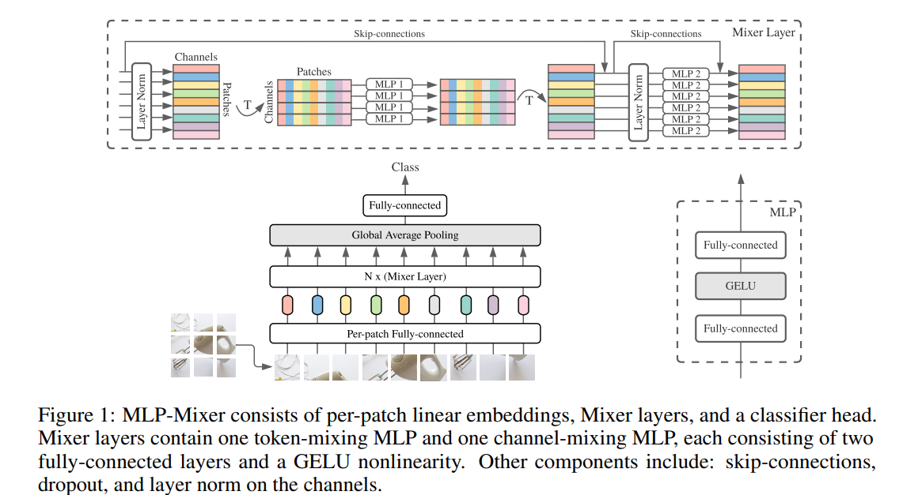
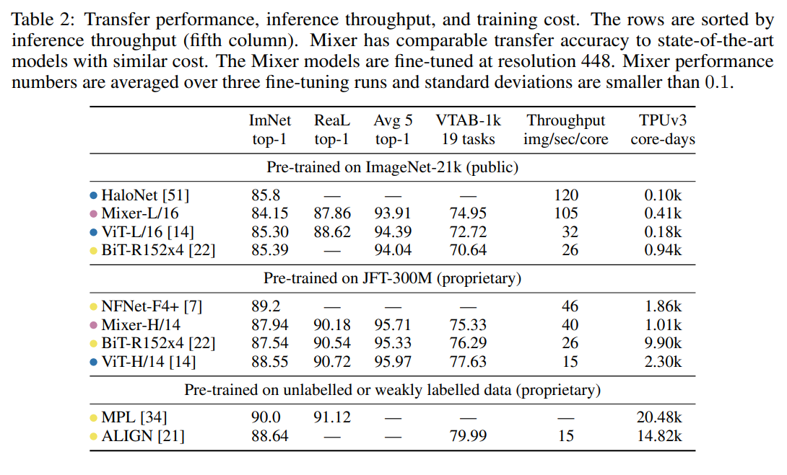
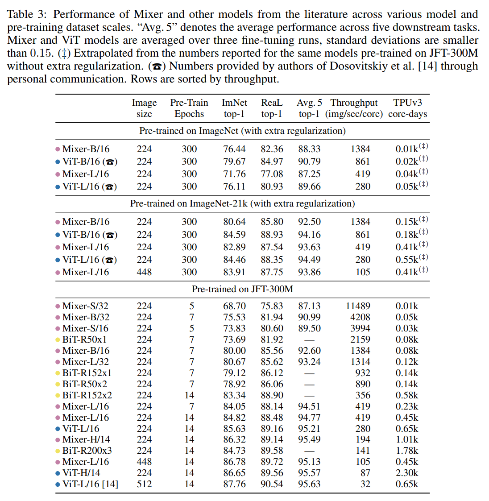
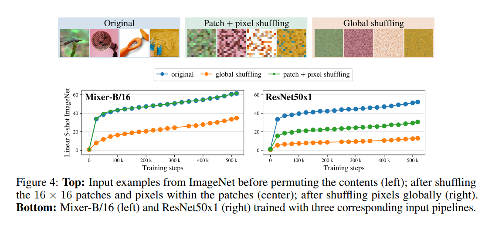

## Core Idea

Most competitive computer vision models use Convolutional Layers or Attention.  However, the authors of this paper developed a network that uses neither but rather a series of Multi-Layer Perceptron Layers.  This network is called MLP-Mixer.

## Network Architecture

Mixer first uses a fully-connected layer for each patch of the input image.  The next layer consists of the Mixer Layer.  The Mixer Layer as seen below, consists of token-mixing (cross-location) MLP that runs over all channels, and a channel-mixing (per-location) MLP that runs over all patches.  Each MLP consists of two fully-connected layers with a GELU activation function in between them.  Finally the mixer layers feed into a Global Average Pooling layer before feeding into a last fully-connected layer that gives a classification label.

In comparison to CNNs, Mixer's channel mixing layers can be seen as a 1x1 convolution.  The token mixing layers can also be seen as a single-channel depth wise convolution with parameter sharing and receptive fields.  However, convolutions are still more complex than the simple matrix multiplications in Mixer MLPs.

Tying parameteres across channels differentiates Mixer from CNNS, but it also provides a memory perfomance boost to Mixer because it prevents the network from growing too fast when chaning the hidden dimension or sequence length.  This will tie in to the high efficiency of Mixer analyzed later in the paper.

Finally, all layer inputs in Mixer are of the same dimension, meaning it is isotropic similar to Transformers while CNNS tend to decrease dimensions as it gets deeper into the network.  Mixer also utilizes skip connections and layer normalization.

## Experiments and Results

The authors tested three metrics
* Classification Accuracy
* Cost of pre-training
* Test-time throughput

ImageNet, CIFAR-10/100, and other datasets were used for image classification testing.  Pre-training for the model was also done on ImageNet, ImageNet-21k, and JFT-300M.

A variety of Mixer architectures were used with varying sizes and patch resolutions.  Training was done using SGD with momentum, gradient clipping, and cosine learning rate (no weight decay).

From the below table we can see that while not matching the accuracy of Transformers or CNNS, Mixer is able to compete in terms of the accuracy-compute trade-off.

Further experimentation showed that Mixer benefited more from larger datasets than Transformers, as the difference in accuracy decreases as the dataset grows in size (see below).  The authors guess this is because of a difference in inductive biases that cause Transformers to learn properties that do not represent the real distrubution of data.

Finally, Mixer was found to have stronger resistance to input permutations compared to CNN networks like ResNet.  This is again attributed to Mixer having less inductive bias than CNNs.

## TL;DR
* Mixer uses MLPs for image classification instead of Convolutions or Transformers
* Mixer competes in terms of accuracy-compute tradeoff
* Mixer does even better with larger datasets and protects against input permutations
