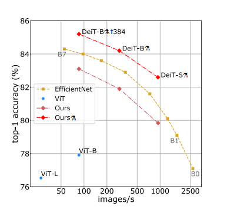
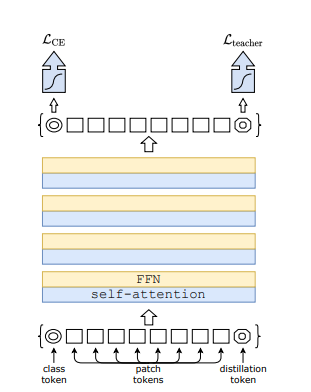
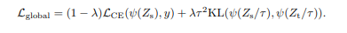

TODO: Summarize the paper:
* What is the core idea? 

Vision Transformer can achieved excellent results on image classification, but it requires large training datasets and computationally expensive. The authors of this paper came up with a data-efficient image transformer (DeiT) that use ImageNet as training datasets, which has same architecture as Vision Transformer, but by using different training methods and distillation, DeiT has better performance even than EfficientNet (see the following graph). In addition, DeiT is significantly less computationally expensive than Vision Transformer as well. 

* How is it realized (technically)?

First, the distillation method requires one image classification model to be a teacher, and simply add one distillation token so that it can interact with class token and patch tokens in self-attention layers. As shown in the following graph

There are actually two type of distillation methods -- soft distillation and hard distillation. The main difference between them is they use different objective functions.
  In general, denote $$Z_s$$ is logits of student model, $$Z_t$$ is logits of teacher model, $$KL$$ is Kullback-Leibler divergence loss, $$L_{CE}$$ is cross-entropy. $$\phi$$ is softmax function, and $$y_{t} = argmax_{c} Z_{t} (c)$$ 

  **For soft distillation methods, the objective function is:**

  

  **For hard distillation methods, the objective function is:**

  
  
In other words, the soft distillation makes the student model try to mimic all the teacher model's classifications, while the hard distillation makes the student only mimic teacher models correct classifications. 
  
Second, during the training process, the authors use truncated normal distribution to initialize weights to avoid divergence. The authors also use several data-argumentation methods, and it seems all data augmentation methods help with performance.   
  
* How well does the paper perform?
  1. Choosing CNNs as teacher model, the trained DeiT perform better than choosing Transformer as teacher model.
  2. using hard distillation method helps DeiT achieve better performance
  3. On other datasets, DeiT achieved state-of-the-art results or close to state-of-the-art results
  4. data augmentation helps improve performance
  5. AdamW optimizer with same learning as used in Vision Transformer helps DeiT achieved the best result. In general, DieT is sensitive for hyperparameters of optimizer.
  6. higher fine-tuning resolution helps DeiT achieved better performance
  
  
* What interesting variants are explored?
  In the ablation section, the authors mention how different training strategies affect how DeiT perform.

## TL;DR
1. We spend significantly shorter time to train DeiT
2. We can train DeiT on significant smaller and open-sourced datasets
3. Distillation method introduced
