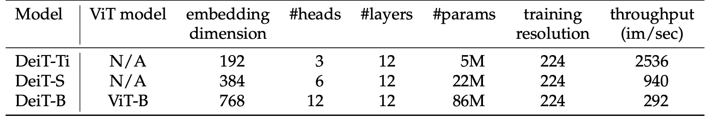
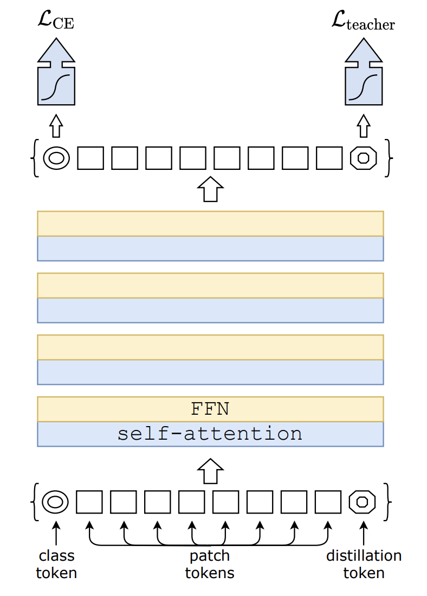
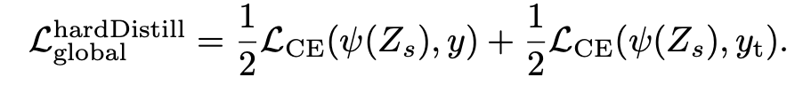
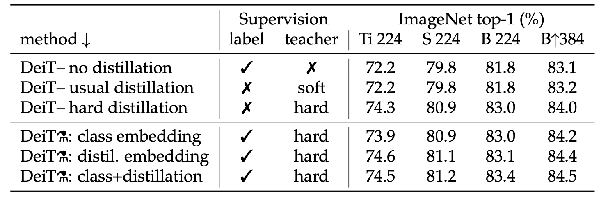
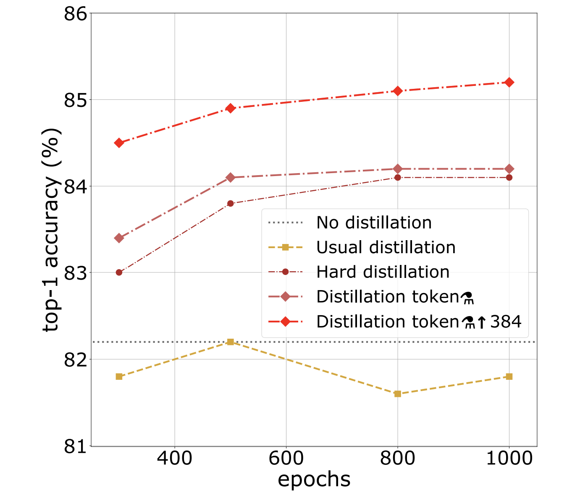
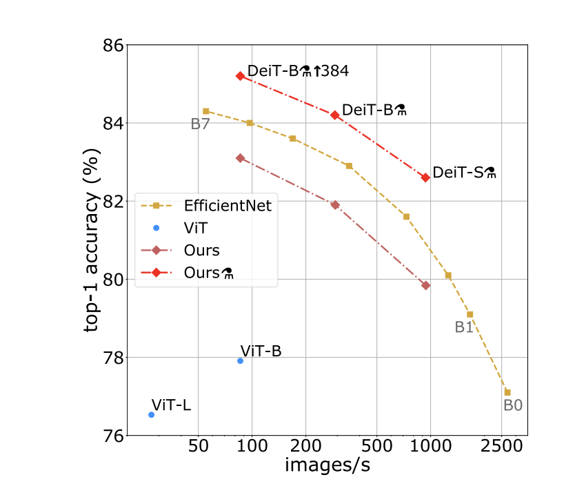
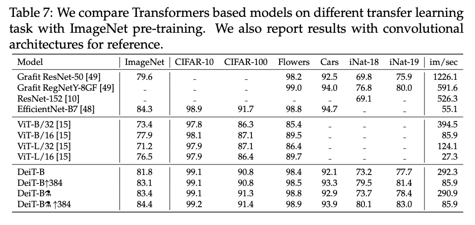
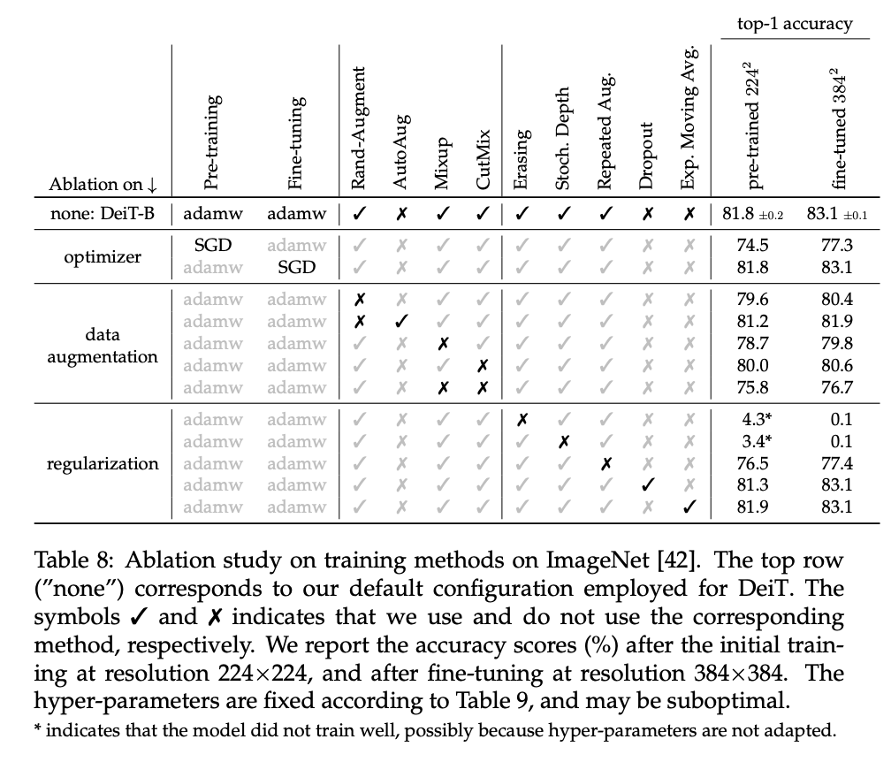

# Main contributions
- They efficiently train a vision transformer on only Imagenet1k (trains in a few days on one machine) by distilling with a convnet teacher model
- They introduce a new distillation procedure and show that it works better than the usual methods

# Their model: Data-efficient image Transformers (DeiT)
- Architecture is identical to Dosovitskiy et al 2015; differences is the distillation strategy
- Larger model is the same as ViT-Base; smaller ones have fewer params and faster throughput

- Training procedure: train on Imagenet1k, finetune on same images at larger resolution

# New distillation method: "Hard-Label Distillation"
- They add a trainable "distillation" token to the end of the input sequence of image patches
- On output, this token is used to predict the hard label (argmax) predicted by the teacher

- The training loss is the simple average of the cross-entropy losses of (1) the true-label prediction from the class token output and (2) the teacher-label prediction using the distillation token output
- They also use both targets during the fine-tuning stage on higher-resolution images, using the targets from a same-resolution teacher

## Teacher models
- They find that convnet teachers work better than transformer teachers; posit that this is due to a different inductive bias based on architecture
- Default teacher for following results: RegNetY-16GF (84M parameters)

## Results

- Hard distillation outperforms soft distillation for transformers, even w/o the added distillation token
- Predicting from a classifier on the class and distillation tokens works slightly better than only predicting from either alone
- Distillation benefits more from longer training than no distillation:

- Authors verify that the class and distillation tokens learn different representations

# Efficiency vs. accuracy for their model
- DeiT slightly below EfficientNet (SoTA convnet)
- DeiT has +6.3% top-1 accuracy over ViT models trained on Imagenet1k only

# Transfer learning
- DeiT on par with convnet models

# Variants explored
Table 8 below shows the results of their ablation study on DeiT:

## TL;DR
* Show that you can train a competitive vision transformer with limited data using knowledge distillation
* Introduce distillation technique for vision transformers: add distillation token to input sequence and predict from both class and distillation tokens
