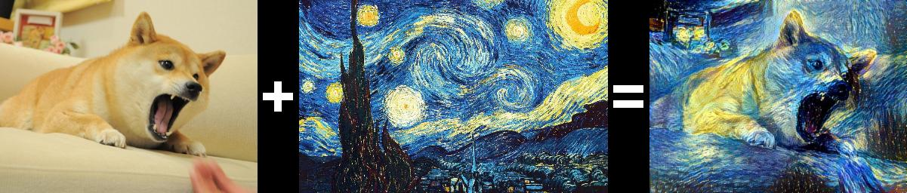
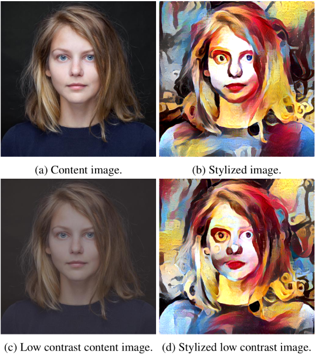
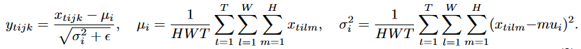
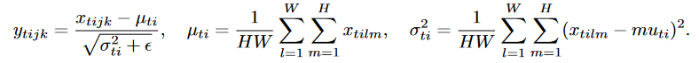
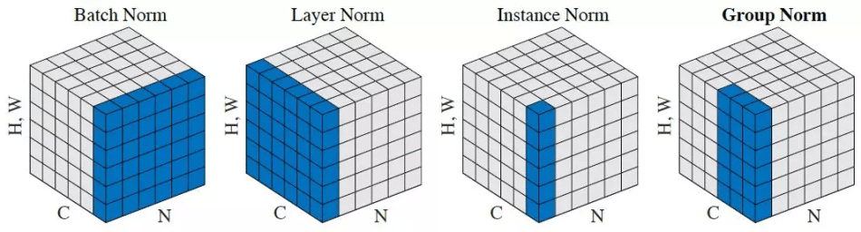
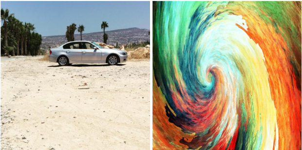
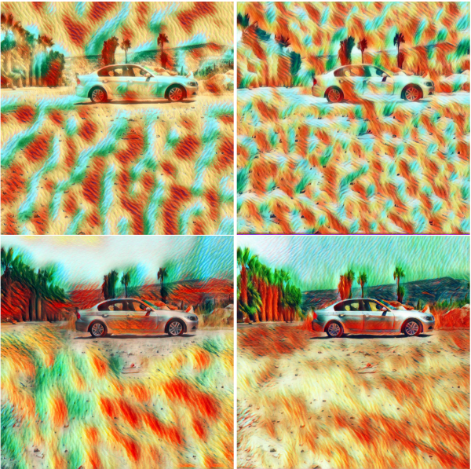

TODO: Summarize the paper:
* Core Idea

    Instance normalization can help simplify the task of stylizing images.

* Context
    * Gatys et al. (2016) showed promising results for using CNNs for the task of image stylization

    * The authors (2016) previously showed that the same task can be achieved hundreds of times faster at a cost to the quality of the images generated

    * In this paper they show that changing the normalization from batch to instance can improve the quality

* Implementation

    

    * Network:
        * CNN that takes as input a random seed and a content image
        * fixed style image to apply to the content image
        * output is a stylized image

    

    * Authors theorized that the stylization problem is too difficult for this architecture
    * Aimed to simplify the problem
        * end result is independent of the contrast of the content image
        * instead of having the network learn this, add contrast normalization layer

    * Architecture already had Batch Normalization layer, which is defined as 

        

        where $$j$$ and $$k$$ are image dimensions, $$t$$ is the batch dimension, and $$i$$ is the channel dimension.

    * Would be changed to Instance Normalization, which is defined as

        

    * Main difference is that Batch Normalization applies over a batch of images

        

* Results

    The authors test this modification on both their previous network as well as a similar one from another paper.

    Here are the content and style images.

    

    Here are the stylized images. The top row is with batch normalization. The bottom row is with instance normalization.

    

## TL;DR
* Image generation is a difficult problem
* Adding a layer that normalizes over the image can help simplify it
* Instance normalization has been shown to improve performance on the task of stylizing images
