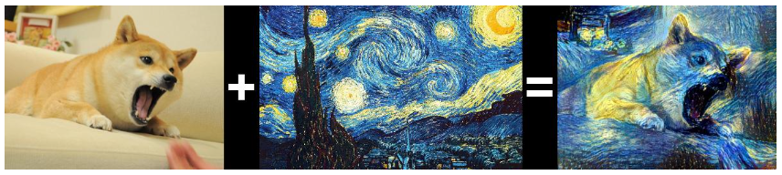
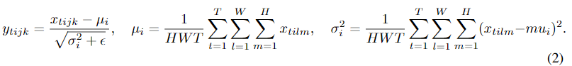
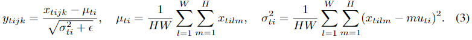
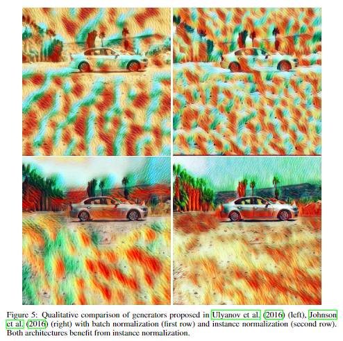

TODO: Summarize the paper:
* What is the core idea?
  
Ulyanov et. al. revist the task of image stylization. Previous works like Gatys et. al. (2016) have introduced methods for style transfer with good results but high computational cost.  Ulyanov et. al. (2016) introduced equivalent feed-forward generator networks, however these networks did not achieve results as good as those propsed in Gatys et. al. In this paper Ulyanov improves his generator architecture through the replacement of batch normalization layers with instance normalization layers and keep them at test time. 

* How is it realized (technically)?

The authors noted that the contrast of the input image should not be a factor in stylization and that contrast of the stylized image should be similar to the contrast of the original style image. As a result, the authors conclude that the network should discard contrast information from the content image. 

$$\mathrm{y_{tijk}=\frac{x_{tijk}}{\sum_{l=1}^{W}\sum_{m=1}^{H}x_{tilk}}}$$
This equation represents a simple version of contrast normalization where each image pixel is divided by the sum of other pixels in its channel.

The generator network in Ulyanov et. al. (2016) actually implements batch normalization using:

These equations apply normalization across an entire batch of images rather than to just a single image.

To combine instance-specific normalization and batch normalization, the authors propose instance normalization as follows:

The main difference between the two being that instance normalization performs per image normalization.

* How well does the paper perform?

The authors performed some qualitative analysis on the substitution of batch normalization for instance normalization in both the Ulyanov et. al. (2016) and Johnson et. al. (2016) architectures, citing significant improvements over batch normalization.

* What interesting variants are explored?
  
The only variant the authors considered was using the Johnson et. al. (2016) model which used a residual architecture that the authors found more efficient.

## TL;DR
* We can achieve similar performance between efficient feed-forward generator networks and slower iterative optimization methods
* Instance normalization can outperform batch normalization (for certain deep networks on image generation)
