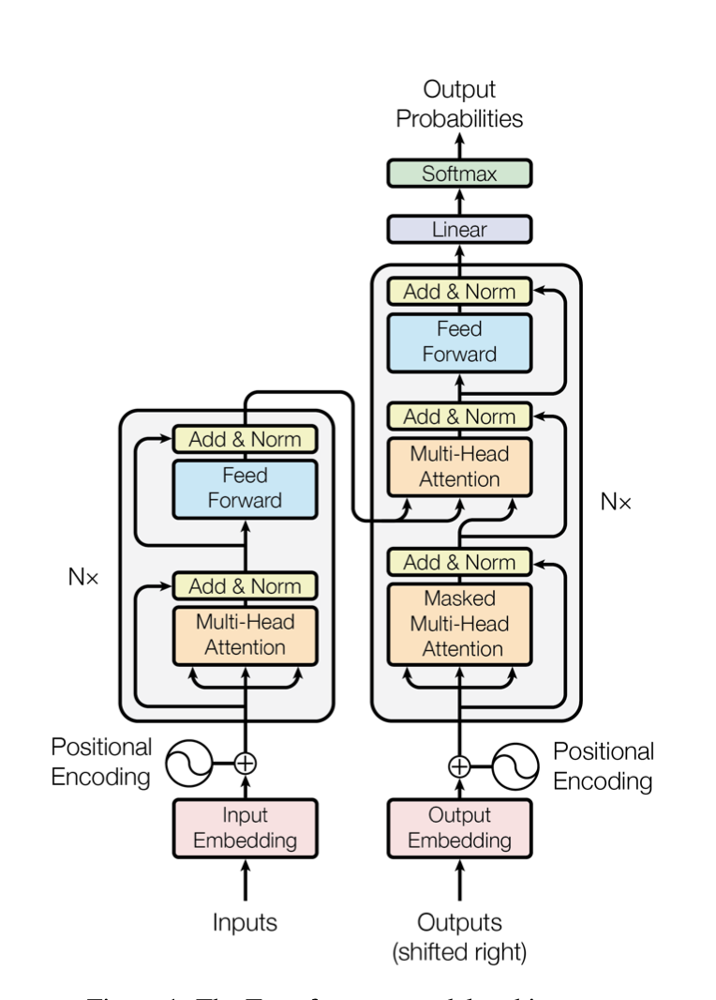
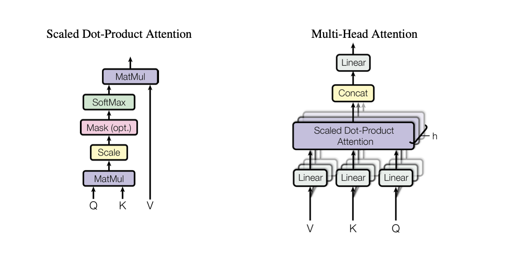
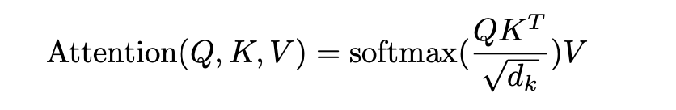
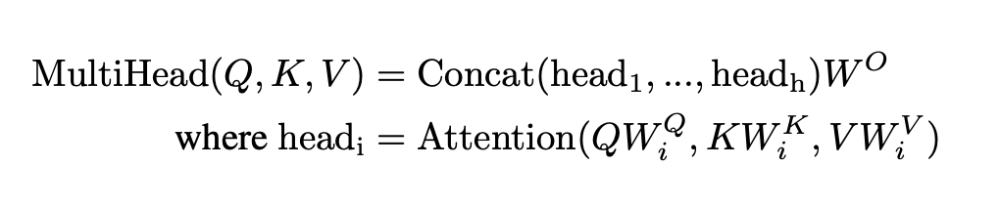
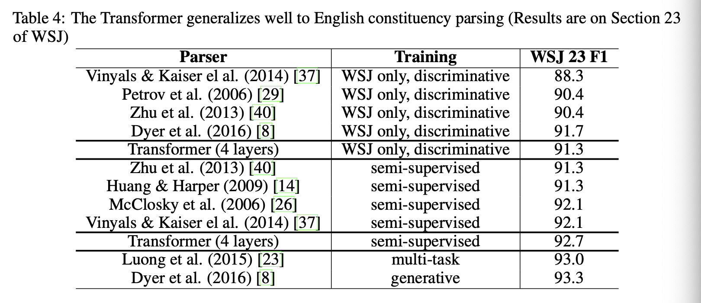

The paper introduced an architecture Transformers, an architecture solely based on attention.
This architecture is meant to challenge more dominant models that rely on sequence aligned RNNs or convolutions.
Unlike the aforenoted models the Transformer allows for significantly more parallelization, meaning faster training, while still producing state of the art results in translation tasks.

## Architecture

The Transformer uses stacked self-attention and point-wise fully connected layers for both the encoder and decoder.

The Encoder is made up of a stack (N=6) of identical layers, each made up of two sub-layers.
The first sub-layer is a multi-head self attention mechanism, and the second is a position wise fully connected FFN.
A residual connection is employed around each sub-layer and followed by layer normalization.
To facilitate the residual connections all sub-layers and embedding layers produce a fixed output (d_{model}=512).

The Decoder is composed of a stack (N=6) of identical layers, made up of three sub-layers, two of which are the same as the encoder.
The third sublayer, inserted before the self-attention layer, performs multi-head attention over the output of the encoder stack.
All sub-layers have residual connections and normalization, like the sub-layers in the encoder.
The self-attention layer has added masking to prevent positions from attending to subsequent positions, which helps ensure that predictions for position i can depend only on known outputs for positions before it.

The Transformer uses two different types of attention: Scaled Dot-Product Attention and Multi-Head Attention.

Scaled Dot-Product Attention
* Takes as input queries and keys of dimension dk and values of dimension dv.
 

* Identical to Dot-product attention except for the scaling factor
* Dot-product attention is much faster and more space-efficient then additive attention.
* Scaling was added to counteract the effect of the dot products of large values of dk growing large in magnitude, causing the softmax function to produce extreamely small gradients.

Multi-Head Attention
* Linearly projects the queries, keys, and values h times with different learned linear projections to dk, dk, and dv dimensions.
* Attention is performed on each projected version in parallel, which are then concatenated and once again projected.
* Allows the model to jointly attend to information from different representations subspaces at different positions.

* The authors imployed h = 8 parallel attention layers.

The encoder-decoder layers use multi-head attention, where the queries come from the previous decoder layer and the keys and values from the output of the encoder.
The encoder uses self-attention, where all inputs come from the previous encoder layer.
The decoder uses self-attention to allow each position in the decoder to attend to all positions in the decoder up to and including that position.

The feed-forward layers in the encoder and decoder, are seperate and consist of two linear transformations with ReLU activation in between.

Learned embeddings are used to convert the input tokens and output tokens to vectors of dimension dmodel.
Learned linear transformation and softmax function are used to convert the decoder output to predicted next-token probabilities.

Since the Transformer has no recurrence or convolution information about the relative or absolute position of the tokens in the sequence must be injected.
This is done by adding positional encodings to the input embeddings at the bottoms of the encoder and decoder stacks.
The authors chose to use a sinusoidal positional encoding because it preformed nearly identical to learned positional embeddings but allows the model to extrapolate to sequences lengths longer than the ones encountered during training.

## Results

To demonstrate the performance of the Transformer architecture, the authors trained their model on the WMT 2014 English-German dataset and the WMT 2014 English-French dataset.
The model used Adam optimization and employed regularization by applying dropout to the output of each sub-layer, applying dropout to the sums of the embeddings and the positional encodings for both the encoder and decoder stacks, and by employing label smoothing.
The label smoothing hurt perplexity, making the model more unsure, but improved accuracy and BLEU score.

The Transformer model produced a new state-of-the-art BLEU score for both datasets.
The big model, which achieved the state-of-the-art results trained at a fraction of the cost of the next best models.
By evaluating different varied versions of the base model, they found that changing the number of heads in the attention caused the biggest difference in BLEU score. They did not that while single-head attention preformed the worst, to many heads also cause the quality to drop off.

The authors also evaluated the model on English constituency parsing, using the Wall Street Journal portion of the Penn Treebank. 
The Transformer performed surprisingly well with limited task-specific tuning, outperforming the Berkeley Parser.

## TL;DR
* Introduced the architecture of a Transformer
* Proposed a variant of Dot-product attention, to help prevent extremely small gradients
* Set state-of-the-art BLEU scores for English-German and English-French translation.
