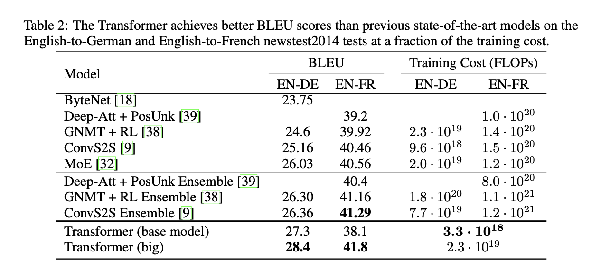

TODO: Summarize the paper:
* What is the core idea?

The paper introduced an architecture based solely on attention mechanisms, which they call a Transformer, to replace the dominant forms of sequence transduction models, which use recurrence and convolutions.

* How is it realized (technically)?

##Encoder

##Decoder

##Attention

##Feedforward

##Embeddings and Softmax

##Positional Encoding

* How well does the paper perform?

##Explination of Hyperparameters in test

##results

* What interesting variants are explored?

## TL;DR
* Introduced the architecture of a Transformer
* The Transformer model was able to get state of the art BLEU scores
* To highlight the core concepts
