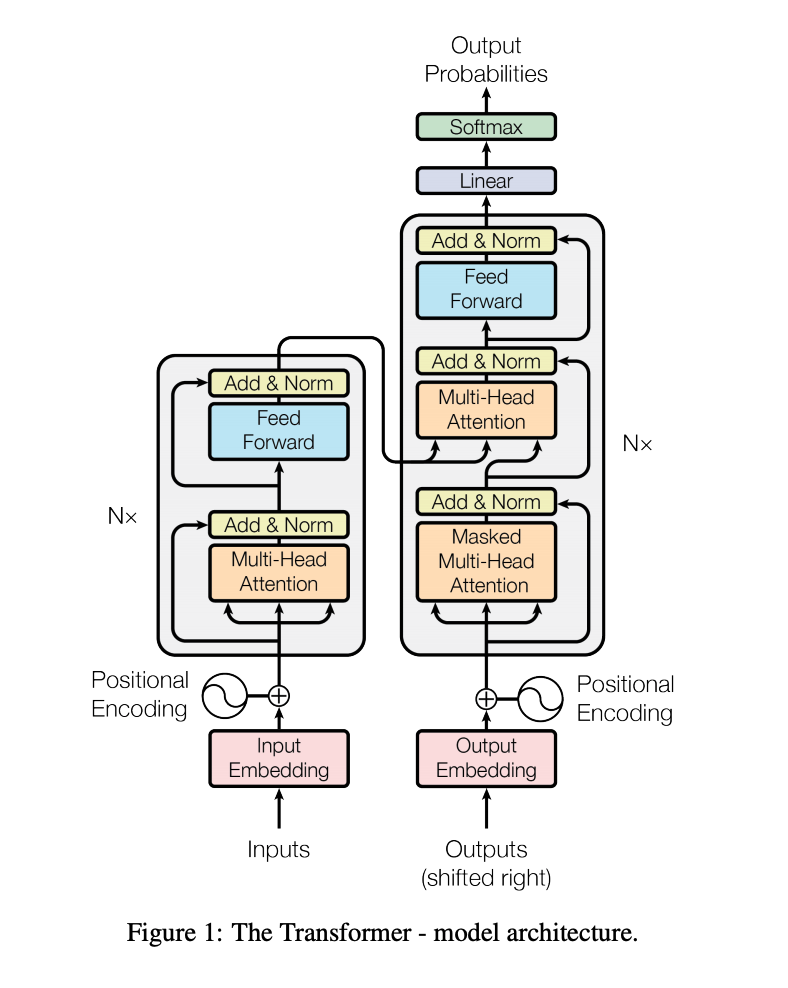
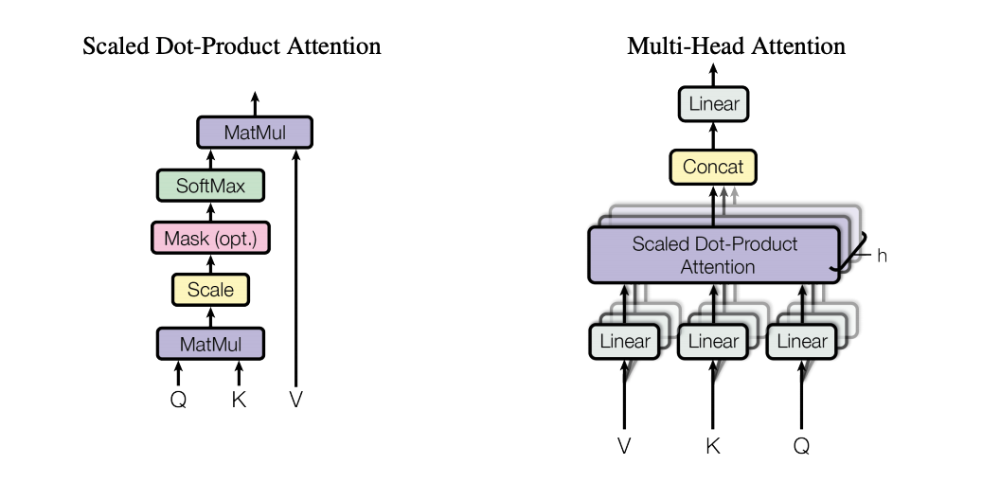
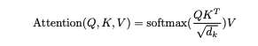
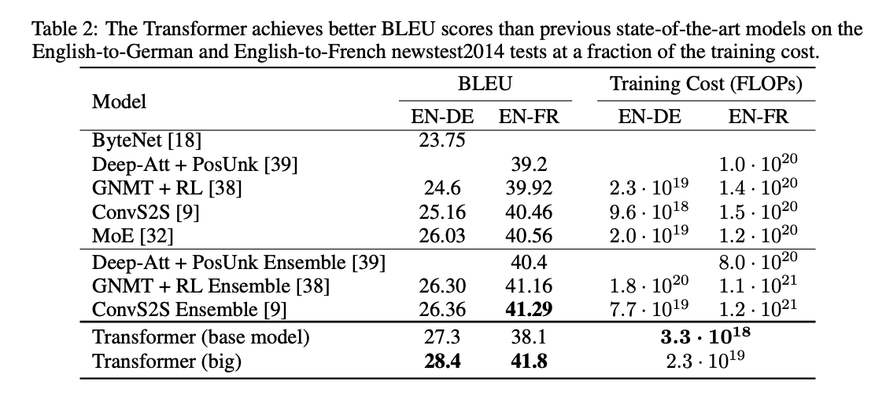

# Core Idea

This paper presents a new simple network architecture: The Transformer. It is based entirely on attention mechanisms and can be considered a sequence-to-sequence model. One of the advantages of the Tranformer over RNNs and LSTMs is that RNNs are slow to train and have either vanishing or exploding gradients over longer sequences. Additionally, RNNs and LSTMs require a sequential flow of data, not allowing for parallel computation. 

# Technical Implementation

The majority of neural sequence models have an Encoder-Decoder structure. The encoder is used to map the input to a new representation. The decoder then generates an output given this new representation. The Transformer architecture follows this by using stacked self-attention and point-wise, fully connected layers for both the encoder and decoder. 

## Encoder

The input is converted to vectors of size d using learned embeddings. 

The encoder is built using 6 identical layers. Each layer has a multi-head self-attention mechanism followed by a fully connected feed-forward network. There are residual connections around each of the two sub-layers, followed by layer normalization. The embedding layer and sub-layers produce outputs of size 512. The feed-forward neural network is used to make the output of the attention head digestible by the following encoder/decoder layer. 

## Decoder

The decoder is built using 6 identical layers. The decoder precedes the same two sub-layers of the encoder with a multi-head attention over the output of the encoder. There are still residual connections and layer normalization at each sub-layer. The architecture also employs masking to prevent positions from attending to subsequent positions to ensure that predictions for the i-th index only depend on indexes less than i. 

## Attention

Attention can be seen as a function mapping a query and a set of key-value pairs to an output. The output is the weighted sum of the values. The weight is calculated by a compatibility function of the query with the corresponding key. 

The attention introduced in this paper is "Scaled Dot-Product Attention". The dot product of the query with all the keys is calculated, then divded by ##sqrt($d_k$)##, followed by a softmax function to obtain the weights of each values. 

One of the advantages of the Transformer architecture is that the input can be passed together in parallel. In an RNN, the embeddings of each word are passed one at a time and are dependent on the output of the previous words. In a Transformer, all words are inputted simulatoneously.  

Attention looks to answer what part of the sentence should be focused on. It answers how relevant each word in the sentence is to every other word in the sentence. Each word has an attention vector that represents the relationship to other words in the sentence. 

## Multi-Headed Attention

Additionally, rather than using a single attention function, this paper proposes a multi-head attention mechanism. The queries, key, and values are projected "h" times with different, learned linear projections. The attention function is then performed in parallel across these proejcted versions of the queries, keys, and values. These values are then concatenated. 

One benefit of multi-headed attention is that it lets the model attend to information from different representation subspaces at different positions. 

Following the attention sub-layers, each layer in the encoder and decoder contains a fully connected feed-forward network. This is applied to each position separately and identically and contains two linear transformations with a ReLU activation in between. 

Additionally, as there is no recursive structure or convolution in the model, ordering must be explicitly injected into the sequence. Positional encodings are added to the input embeddings at the bottom of the encoder and decoder stacks. 

The point of multi-headed attention is that one single attention vector may not accurately capture the relationship between each word and the rest of the sentence, so we must take an average over 8 of these attention vectors. 

# Training

The model was trained on the WMT 2014 English-German dataset. It consists of rougly 4.5 million sentence pairs and has a shared source-target vocabulary of about 37000 tokens. They also trained using a English-French 2014 dataset containing 36M sentences and a 32000 word-piece vocabulary. 

# Performance

# Machine Translation

For the English to German translation task, the Transformer (big) model outperforms the highest scoring current model by 2 BLEU points and the Transformer (base) model by about 1 BLEU point. For the English to French task, the Transformer (base) model decreases in performance from the current state of the art, but the Transformer (big) model improves it by about .5 BLUE points. However, we must note that the training cost for both Transformer models is significantly lower than previous methods. 

# English Constituency Parsing

The researchers trained a 4-layer transformer with dimensions set to 1024 on the WSJ portion of the Penn Treebank. They report higher performance against all previously reported models except for the Recurrent Neural Network Grammar. 

# Variations

The researchers vary the number of attention heads and the dimensions of the attention keys and values. When using a single headed attention, the BLEU score drops by nearly 1 point. When the number of attention heads increases by a lot, the score decreases as well. 

## TL;DR
* The Transformer is the first sequence to sequence model based entirely on attention
* It trains faster than most existing models and has comparable or better performance
* It has a simple architecture containing 4 encoder and 4 decoder layers with 2 and 3 sub-layers respectively
