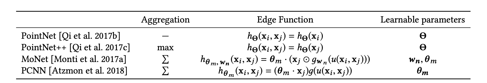
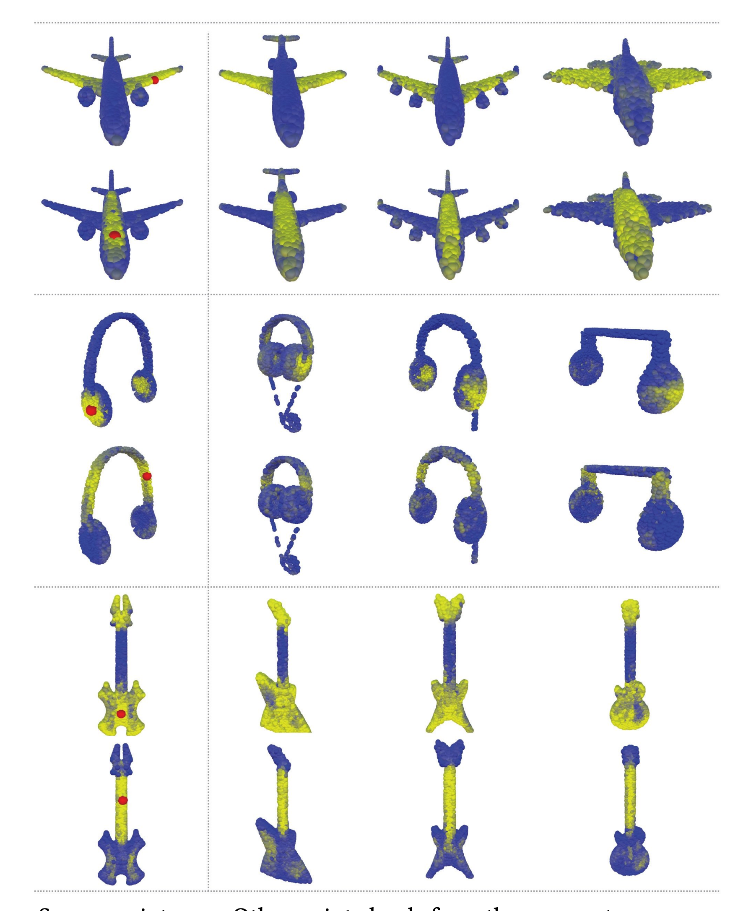

## The Core Idea of Dynamic Graph CNN

- By utilizing edge features of nearby vertices connecting to another vertex, we can apply CNN operations on them computing local and global feature maps for the point cloud that is invariant to permutation, has local structure, and is easy to implement.

## What are edges in a point cloud?

- Graphs are defined by a local neighbourhood of vertices found by using KNN (which points are closest to the current vertex in question)

- Edges are constructed by drawing directed edges to each vertex in the local graph, including edges pointing to the same vertex.
    - This should sound familiar -- it's similar to self-attention from transformers 
  

## How do we calculate the values of these edges (how is it realized technically)

- These edges are used as features for the DGCNN by running the vertices through a fully connected layer (or layers) multiple times

- The feature for a vertex is an aggregation function applied to all the edge features (the convolution operation)

- You can change the non-linearity and the aggregation function in different ways to achieve various effects.

  - Look at how $$e_{ij}$$ is computed, you take both vertices and feed their features (in this case X,Y,Z coordinates) into linear layers that will be convoled over later

// TODO - put the formal definition of EdgeConv here

## Okay... but why is it called "Dynamic Graph"

- Once EdgeConv has ran on the point cloud, you now have a bunch of new values for the point cloud that have been mutated.

- Empirically, the authors found that it is beneficial to recompute the K nearest neighbours after each edge conv.

- This leads to points in the cloud becoming closer due to their feature space similarity not despite their input proximity!

- This recomputation of the K nearest neighbour is a reconstruction of the graph and thus influenced the authors to name their method "Dynamic Graph CNN"

## How is this different from PointNet & PointNet++

- PointNet is a simplification of EdgeConv where you ignore the neighbourhood of the K nearest datapoints and their features

- PointNet++ does not change the proximity of points in the cloud based on feature simularity (there graph is fixed)
  - Further, PointNet++ looks at the neighbourhoods edges then takes the max feature from them
  
## Results of DGCNN 

- Most comparisons are done on classification of point clouds via the architecture seen in the image below.

- With static graphs (similar to PointNet++, input proximity is saved throughout the feature space) DGCNN already outperforms PointNet++

- With a new distance function that looks at global and local structure, DGCNN outperforms all models on ModelNet40 (dramatically with more points!)

- DGCNN is faster than PointNet++ (slower than PointNet)

- DGCNN can also segment objects, although it is not state of the art in its results, it is able to find similarities across various objects

- DGCNN finds similar regions on unseen objects (right) from trained on point clouds (left).

## What are the limitations?

- DGCNN requires consistently dense data to perform well, sparse data will have a large drop off in accuracy

- Because of the requirement on dense data, it can be very memory and computationally expensive

- Again because of the requirement of dense data, DGCNN does not reduce the number of data points per layer like other point cloud algorithms (consistently dense input)

- The hyperparameter K (how large are the neighbourhoods) is fickle, and can lead to impaired performance if too high

## Other Variants

## TL;DR
* EdgeConv takes 1 vertex, then compares it through some metric to a bunch of other vertices, which then go through a nonlinear transform then is aggregated with the other neighbouring vertices.
* Recomputing graph based CNNs can help improve accuracy 
* DGCNN is great for large scale machines with dense datasets 