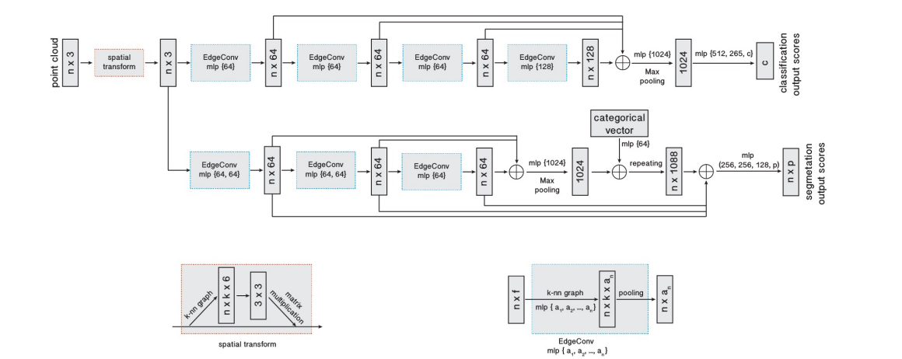
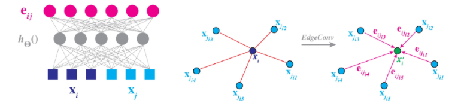
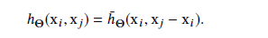
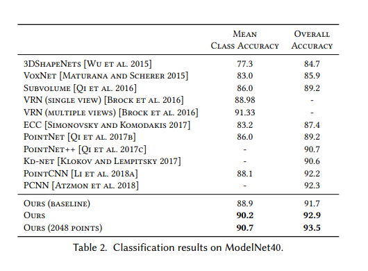
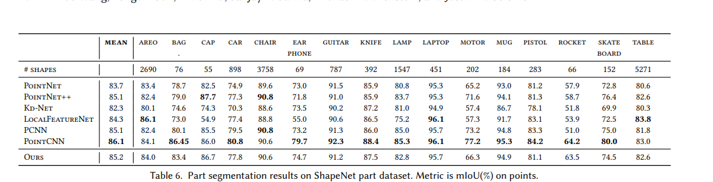
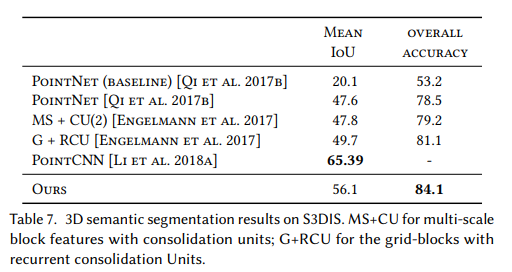

TODO: Summarize the paper:
* What is the core idea?  
In this paper, the authors come up with a new neural network module called EdgeConv that can use local geometric information of point clouds, which is permutational invariant and partially translational invariant. By dynamically updating a graph of relationships, EdgeConv is able to perform semantic segmentation task. EdgeConv can also easily be integrated into other point cloud processing pipelines. The following picture shows the entire model architecture for classification and segmentation, 

* How is it realized (technically)?  

EdgeConv module is essentially one MLP together with two operations called edge feature and aggregation operation. The edge feature $$h_\Theta(x_i,x_j)$$ is a non-linear function with learnable parameters, and the aggregation operation can either be $$\Sigma$$ or $$max$$. There are five different choices of edge features and aggregation operations that have important different influences. These five different choices are shown as follows: 
 The first choice is standard convolution  
 The second choice only has global information, and is used in PointNet  
 $$g$$ is Gaussian kernel and $$u$$ is distance between two points in Euclidean space  
 This method only provides local information  
 This is the best that has both local and global information

* How well does the paper perform?  
EdgeConv has achieved great results in classification, part segmentation, and semantic segmentation. For classification, the authors evaluate their model on the ModelNet40, which not only achieved the state-of-the-art result, but also cost much shorter time to train. For segmentation, their model archieved competitive results to other point cloud processing methods. The following three pictures show how their model performs:

* What interesting variants are explored? 
One very interesting point is that you can regard PointNet, PointNet++, MoNet, and PCNN as special cases with special choices of edge features and aggregation operations. 

## TL;DR
* The EdgeConv module gives both global and local information of point clouds
* EdgeConv can be easily used to other different point clouds processing methods
* using dynamic graph of relationships
