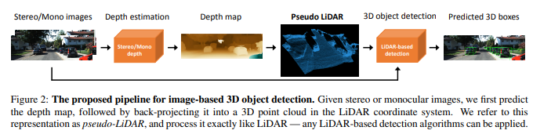
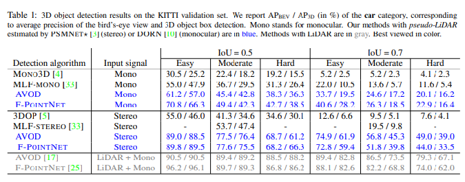
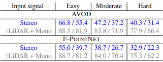

## The Core Idea of this paper?
3D object detection is an important task in autonomous driving.  There are several approaches for 3D object detection.Since the LiDAR technology is expensive,
there are alternative technologies based on cheaper monocular or stereo imagery data, but these have resulted in lower accuracies due to poor image based depth estimation.
This paper discusses that it is not the quality of data but its representation that causes poor accuracy. The core idea of this paper is to do data representation by  converting image-based depth maps to 
pseudo-LiDAR representations - essentially mimicking the LiDAR signal. LiDAR is (Light Detection And Ranging), which provide accurate 3D point clouds of 
the surrounding environment .With such representation there are different LiDAR-based detection algorithms that can be applied.Hence this paper shows that 
a major cause for the performance gap between stereo-based and LiDAR-based 3D object detection is not the quality of the estimated depth but its 
representation. Second, the  pseudo-LiDAR as a new recommended representation of estimated depth for 3D object detection and show that it leads to 
state-of-the-art stereobased 3D object detection, effectively tripling prior art.

## Approach and Technical representation:

Despite the many advantages of image-based 3D object recognition, there remains a glaring gap between the state-of-the-art detection rates of image and 
LiDAR-based approaches. Approach to “close the gap” is therefore to carefully remove the differences between the two data modalities and align the two 
recognition pipelines as much as possible. To achieve this there is a two step approach where first step is to estimate the depth of the pixels from stereo  
imagery and the second step is  back-projecting pixels into a 3D point cloud called pseudo lidar signals.

Depth estimation: The depth estimation is done with a stereo disparity estimation algorithm. The depth map is derived by the following transformation.

									D(u, v) = fU × b /Y (u, v)

Where D is the depth map ,Fu is the horizontal focal length,
B is the horizontal offset baseline and Y is the output disparity map.

It takes a pair of left-right images Il and Ir as input, captured from a pair of cameras with a horizontal offset (i.e., baseline) b, and outputs a disparity 
map Y of the same size as either one of the two input images.The depth estimation algorithm treats the left image, Il , as reference and records in Y the 
horizontal disparity to Ir for each pixel.

Pseudo-LiDAR generation: In this step the 3D location (x,y,z) of each pixel (u,v), is computed by the following formulas:
				
								(depth) z = D(u, v) 
								(width) x = (u − cU ) × z /fU 
								(height) y = (v − cV ) × z /fV ,
								
where (cU , cV ) is the pixel location corresponding to the camera center and fV is the vertical focal length.
By back-projecting all the pixels into 3D coordinates, a 3D point cloud {(x (n) , y(n) , z(n) )} N n=1, where N is the pixel count is achieved. 
This is called pseudo-LiDAR signal.

3D object detection: The LiDAR-based 3D object detectors algorithm is applied to the estimated pseudo-LiDAR points. The two algorithms used are AVOD and 
Frustum PointNet. In Frustum pointnet the pseudo-LiDAR information is represented as 3D point cloud. In AVOD the pseudo-LiDAR information is viewed from a Bird’s Eye 
View (BEV). In particular, the 3D information is converted into a 2D image from the top-down view.

				

## Experiments: 

• Task : To Comapre the results of 3D-object detection using pseudo-LiDAR  and LiDAR .

•Dataset: KiTTi dataset is used which contains 7,481 images for training and 7,518 images for testing.

• Results:: LiDAR and pseudo-LiDAR lead to highly accurate predictions, especially for the nearby objects. The below tables shows the result of experiment.
The gray results is for LiDAR, and blue is for pseudo-LiDAR

## TL;DR
•  A key component in  closing the gap between image- and LiDARbased 3D object detection is  the representation of the 3D information.

•  The pseudo-LiDAR is much better suited for 3D object detection pipelines that are based on deep convolutional networks.

•  The pseudo-LiDAR approach for 3D object detection  outperforms all image-based algorithms.