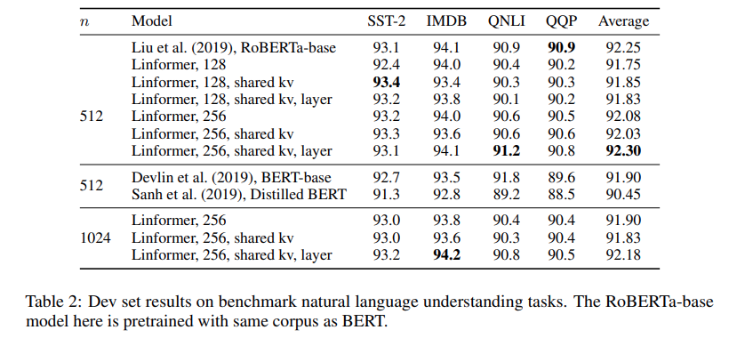

* What is the core idea?

The main contribution of the paper is that it is able to approximate self-attention by a low rank martrix, thus enabling the complexity to reduce from $$O(n^2)$$ to $$O(n)$$. This outperforms the previous state of art of Reformer (Kitaev et al. 2020), which uses $$O(n log(n))$$ complexity.

* How is it realized (technically)?
Recall multi head attention holds the following formulation:

$$Multihead(Q, K, V) = Concat(head_1, head_2, ..., head_h)W^O$$

where each head is:

$$head_i = \text{Softmax}(\frac{QW_i^Q (E_i K W_i^K)^T}{\sqrt{d_k}})VW_i^V = PVW_i^V$$

Q, K, V are $$n \text{ x } d_m$$ matricies. $$P$$ is the contextual mapping matrix

The author proposed the following two ideas:

1. $$P$$ can be approximated by a low rank matrix  $$\widetilde{P} \in R^{n x n}$$ with bounded error 
2. we can get $$P_{low} \in R^{n x k}$$ by SVD decomposition of $$P \in R^{n x n}$$, and with a bound on $$k$$, we can upperbound the error by a small constant factor.

We can establish the above proof by first using the union bound and later the Johnson–Lindenstrauss lemma.

We can the use the above fact to perform **SVD** on $$\widetilde{P}$$ to get the approximated contextual mapping matrix

By choosing a small projection dimension $$k$$, we can reduce the time and space complexity to $$O(nk) \simeq O(n)$$ with small error.

The author then proceed to **bound k** to $$\min{\Theta(9d\log (d)/\epsilon^2)), 5\Theta(\log (n)/\epsilon^2)}$$ to gurantee that the **estimated error caused by the approximation is bounded to a small degree**.

* How well does the paper perform?

In term of efficiency, the linformer is able to achieve a high speed up coeffcient, esspecially when sequence length is high. 

In term of convergence, though the matrix is approximated, the paper is able to demonsrate convergence regardless of the sequence length.

The author also finetuned the model on Roberta on natural language understanding task. The noted that the parameter is dependent mainly on the projection dimension $$K$$ instead of the sequence length to projection dimension ratio $$\frac{n}{k}$$.

## TL;DR
* It is possible to approximate transformer matrixs in $$O(n)$$ time

* The approximate only grants a small error, and is efficient especially in high length sequence data

* Convergence property is not affected by the approximation