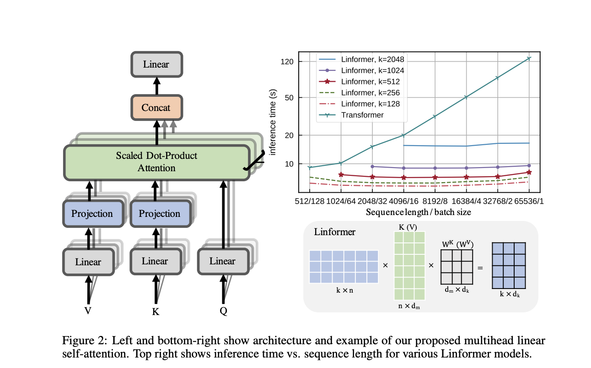

This paper introduces a linear transformer, the **Linformer**, performs on par with standard Transformer models, while being much more memory- and time-efficient. It suggests an approximate way of calculating self-attention in Transformer architectures that has linear space and time complexity in terms of the sequence length, with the resulting performance on benchmark datasets similar to that of the RoBERTa model based on the original Transformers with much less efficient quadratic attention complexity.

### The Problem
Transformers are notoriously resource-intensive because their self-attention mechanism requires a squared number of memory and computations in the length of the input sequence. 

### The Solution
The Linformer Model gets around that by using the fact that often, the actual information in the attention matrix is of lower rank and can be approximated.

### The implementation

In this paper, the authors show both theoretically and empirically that the attention dot product matrix can always be closely approximated by a matrix of much lower rank, which can be obtained by calculating the singular value decomposition (SVD) of the key and value matrices and only using a fixed number of the largest singular values. Since SVD calculation also adds computational complexity, the authors replace it with a linear projection layer (as shown in the picture) that serves to reduce the dimensionality. For simplicity, the trainable projection layer parameters can be shared between attention heads and/or between layers.

### The Result
It is shown that the performance of both the pre-trained and fine-tuned Linformer models is similar to and sometimes exceeding that of RoBERTa, a popular state-of-the-art BERT variant. At the same time, the inference time speed-up and memory savings can be 20–60 fold for longer sequences.

While the suggested approach still required training on 64 Tesla V100 GPUs, it certainly seems more efficient and thus very promising for using the pre-trained models in downstream applications. Also, as the authors point out, the ability to train on longer sequences creates the potential of training Transformer models on images more easily.

## TL;DR
* Linformer is a transformer architecture that has linear space and time complexity.
* The speed up is based on the assumption that the information in the attention matrix is of lower rank and can be approximated.
* Linformer is efficient and produce the same results as RoBerta.
