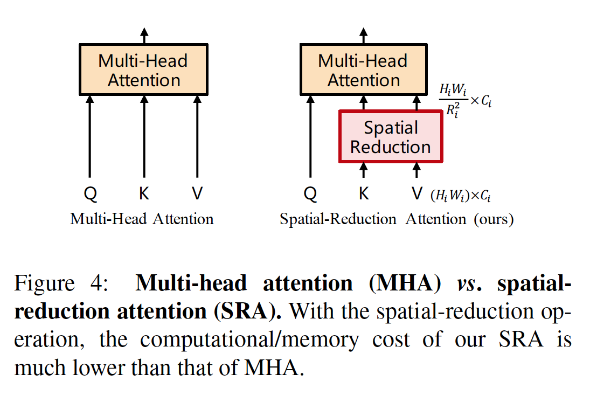
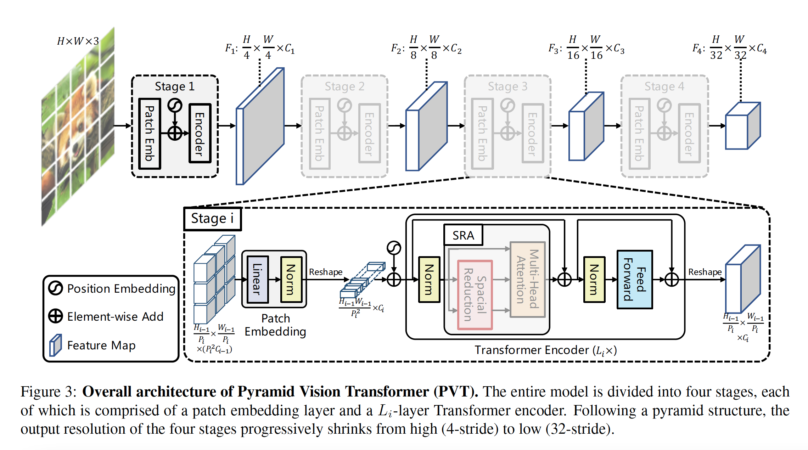
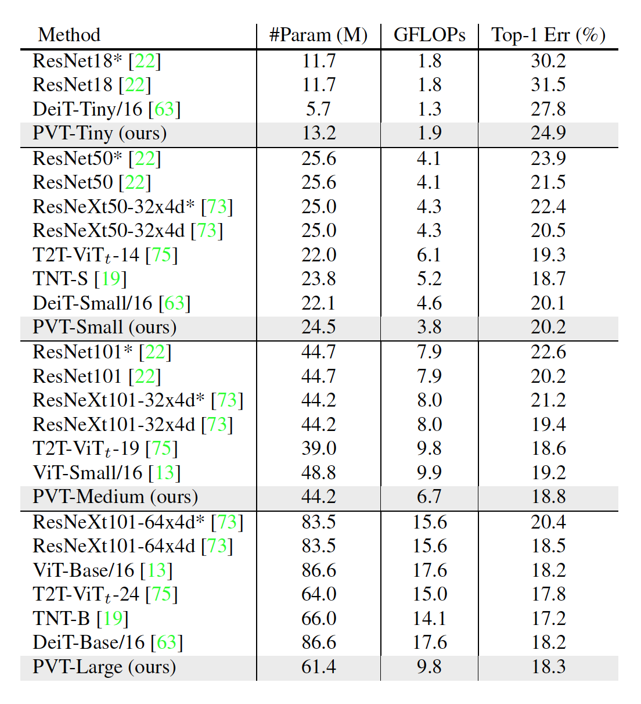
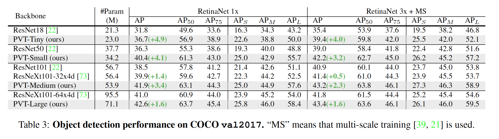
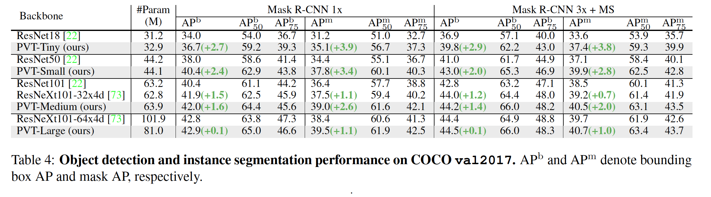
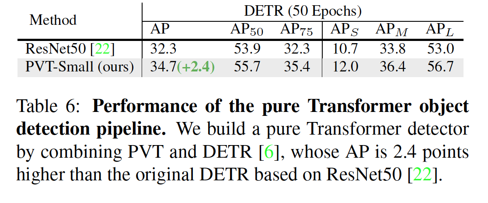

* What is the core idea?

This paper introduces the Pyramid Transformer (PVT), which aims to overcome certain difficulties experienced in the Vision Transformer (ViT). In the world of computer vision, it can be hard to really implement dense prediction tasks. The Pyramid Transformer is argued to be better than the Vision Transformer in that it can be trained on dense partitions of images and eventually still achieve higher output resolution.

In addition, the Pyramid Transformer combines the strengths of Trasnformers and CNNs and essentially replaces CNN backbones. 

And in the results, the Pyramid Transformer showed better performance on object detection, instance and semantic segmentation in comparison to other networks.

* How is it realized (technically)?

There are essentially three important parts to the pyramid transformer.
1. The pyramid transformer takes fine-grained image patches (4x4 pixels per patch), as input. This helps learn high-resolution representation which then in turn helps with dense prediction tasks.

There are four stages that generate feature maps: 

* First divide an image of size $H \times W \times 3$ into $HW/4^2$ patches. 

* Then feed patches to a linear projection to receive embedded patches of size of $HW/4^2 \times C_1$.

* Embedded patches and position embeddings are passed through a Transformer encoder with $L_1$ layers and reshaped to a feature map $F_1$ of size $H/4 \times W/4 \times C_1$.

* Using similar steps, $F_2$, $F_3$, and $F_4$ are generated with stides of 8, 16, and 
32 pixels with respect to the input image.

$\{F_1, F_2, F_3, F_4\}$ then become the feature pyramid and can be applied to downstream task such as image classification, object detection, and semantic segmentation.

2. The pyramid transformer introduces a "progressive shrinking pyramid" to reduce the sequence length of a Transformer the deeper the network goes. This in turn helps with computational cost.

Let $P_i$ be the patch size of the $i$-th stage. When the $i$-th stage starts, the feature map $F_{i-1}$ is evenly divided into $H_{i-1} W_{i-1} / P_{i}^2$ patches. Each patch is the flattened and projected to a $C_i$ dimensional embedding. After this, the shape of the embedded patches are $(H_{i-1} / P_i) \times (W_{i-1} / P_i) \times C_i$. This helps adjust the scale of each feature map and thus make it possible to construct a pyramid for the transformer.

3. The pyramid transformer introduces a spatial-reduction attention layer (SRA) to reduce consumption while trying to learn high-resolution features.

The spatial-reduction attention layer replaces the traditional multi-headed attention layer in the encoder.

* How well does the paper perform?

For the experiments, different scaled models of the PVT were tested: -Tiny, -Small, -Medium, and -Large. These have respectably similar parameters to ResNet18, 50, 101, and 152.

Image classification experiments were performed on ImageNet 2012. The following table shows that PVT was superior to conventional CNN backbones.

Object detection experiments were done on the COCO benchmark. The tables below shows that PVT did better than RetinaNet counter parts.

Finally, there were a few ablation studies performed on the ImageNet and COCO datasets. Some of these studies compared the difference between wider and deeper networks, pre-trained weights, computational overhead, and detection vs segmentation results. 

It was found that having a deeper model was better than a wider one. In addition, a PVTs converged faster and better with pre-trained weights performed better without pre-trained weights. A few experiments suggested that a PVT with multiple stacks of Mult-head attention layers could be more "flexible and expressive". Next, it was shown that PVT was more suitable for medium-resolution input tasks. Finally, in the experiments between detection and segmentation, a PVT without convolutions can be easily used in dense prediction models.

* What interesting variants are explored?

To reach the "limit of no convolution", a transformer pipeline for object detection was built from combining PVT with a transformer-based detection head.
This outperformed ResNet50.

## TL;DR
* PVT is a pure transformer backbone as an alternative to CNN backbones for prediction task.
* Progressive sinking pyramids and spatial reduction layers were introduced to get high-resolution and multi-scale feature maps under less computation/memory resources.
* Experiments show that PVT was indeed better than CNN backboned networks.
