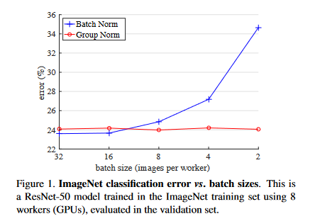
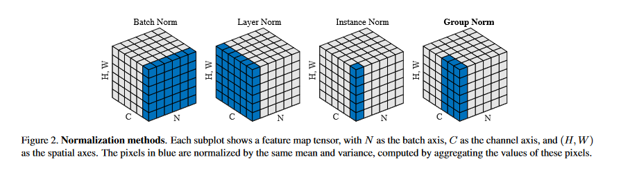
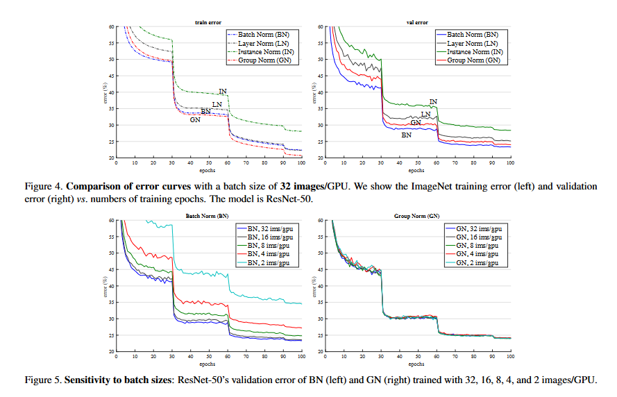
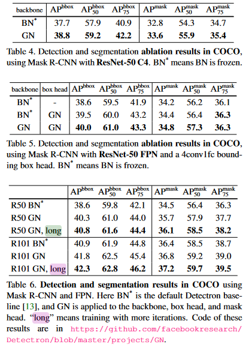

### What is the core idea?

While batch normalization has proven to be an extraordinarily useful technique
in deep learning, neural network models suffer severe penalties to accuracy
when the batch size gets sufficiently small. Group Normalization offers an
alternative to batch normalization that outperforms batch normalization when
batch sizes are small and performs comparably with larger sizes. Furthermore,
group normalization outperforms two alternative forms of normalization: layer
normalization and instance normalization.

### How is it realized (technically)?

Image normalization is usually computed with the formula

$$\hat x_i = \frac{1}{\sigma_i}(x_i - \mu_i)$$

where $\mu_i$ and $\sigma_i$ are computed via

$$
\mu_i = \frac{1}{m}\sum_{k \in S_i} x_k,
\sigma_i = \sqrt{\frac{1}{m}\sum_{k \in S_i} (x_k - \mu_i)^2+ \epsilon}
$$

Batch normalization, instance normalization, layer normalization, and group
normalization only differ in choosing the set $S_i$, the set of pixels that the
mean and standard deviation are computed over. 

* Batch normalization chooses the set of pixels that belong to the same channel
index

* Layer normalization chooses the set of pixels that belong to the same image

* Instance normalization chooses the set of pixels that belong to the same
channel and image

* Group normalization chooses a group of channels in a single image.

All four normalization methods learn the variables $\gamma$ and $\beta$ for
the formula

$$
y_i = \gamma \hat x_i + \beta
$$

while training for use in inference tasks.

### How well does the paper perform?

The authors of the paper ran several experiments over a variety of computer
vision tasks. In general, batch normalization tended to slightly outperform
group normalization with larger batch sizes, but tended to lose out to group
normalization when the batch sizes became extremely small. 

The first experiment in the paper compared the effect the batch size and
different normalization methods had on accuracy for a neural network model
training on the **ImageNet** dataset.

Batch normalization performed the best with a batch size of 32 images per GPU
(8 GPUs were used) outperforming group normalization by 0.5% on the validation
set. However, group normalization achieved a 10.6% lower error rate with a batch
size of 2, showing its effectiveness on lower batch sizes. The effects of group
size on accuracy were also tested in another experiment using ImageNet, the
authors finding that a fixed size of 32 groups and a variable size of 16
channels per group performed the best for their models (applied after
the first convolution).

The authors also experimented with object detection and segmentation on the
**COCO** dataset. Object detection and segmentation tend to involve higher
resolution images, meaning smaller batch sizes tend to be used for these tasks.
With 1 image per GPU for 8 GPUs being used for this task, group normalization
outperformed batch normalization across the board. The authors also performed
an experiment on **COCO** dataset where they trained a Mask R-CNN model from
scratch with group normalization and achieved the highest *from-scratch*
results for **COCO** that the authors had knowledge of when writing the paper.

The final set of experiments in the paper had to do with video classification
using the **Kinetics** dataset. Their experiments covered 8 and 4 clips per GPU
for 32-frame clips and 4 clips per GPU for 64-frame clips. Here, batch
normalization outperformed group normalization for the 32 images per GPU batch
size, but performed worse than group normalization when a batch size of 4 was
used.

## TL;DR
* Group Normalization outperforms Batch Normalization for small batch sizes
* Group Normalization standardizes small groups of channels for each image
* Group Normalization performs worse than Batch Normalization for larger batch sizes.
