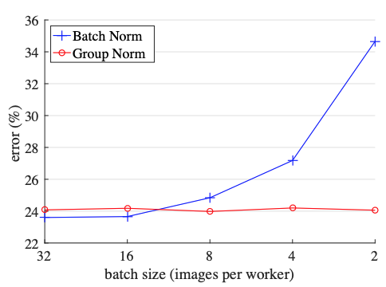
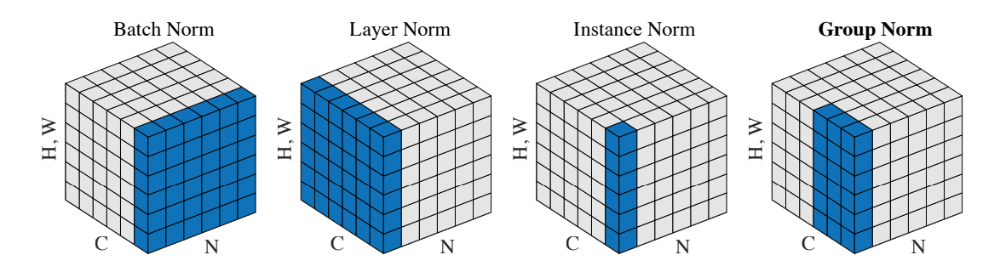
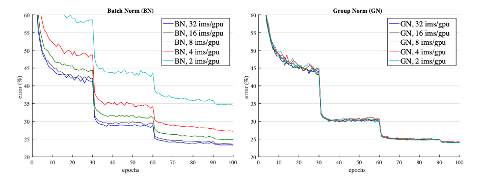
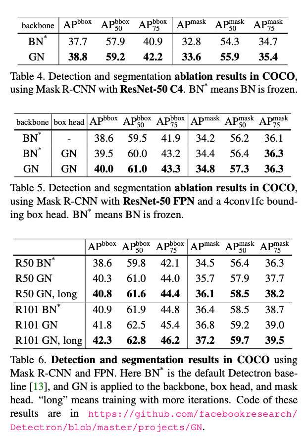
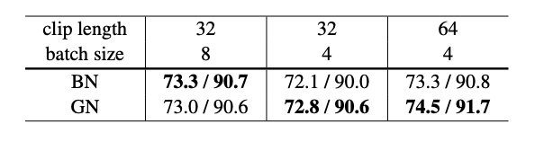
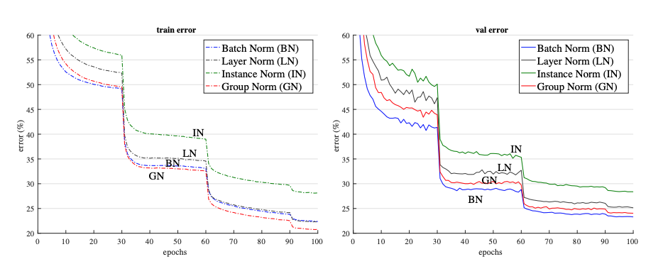

Core Idea:

The batch norm introduced an optimization in which the outputs of the layers were normalized for a particular batch (scaled and recentered). This lead to significant improvement in performance for a lot of deep learning tasks (one of the most important improvements). However with smaller batch sizes, this technique doesn't work as well. This may be the case if it is impossible to have large batch sizes (models such as BERT) and you have to train on a smaller batch size. This paper introduces a group norm which works on smaller batches and has consistent improvements of performance across batch sizes. Group norm breaks down does normalization of the input layer by breaking channels into groups.

Technical Realization:

Batch norms are highly dependent on batches. However, for tasks such as image segmentation, object detection, and video classification, models train on smaller batch sizes as their inputs are so large. In this case batch norm is less useful.

 This paper takes inspiration from techniques such as layer norms and instance norms, which are batch independent. However, Instance Norm goes to far as it doesn't leverage all the information across channels. Therefore the it loses too much statisitcal properties that other techniques employ. In relation to layer norm, group norm does better since the model has the flexibility of learning different distribution for each group and doesn't assume that the statisitcal distribution accross all channels is the same (in case of layer norm). This leads to improvements in representations. Group Normalization does better than all of the techniques in this respect as it is batch independent, and it has a good trade-off between how many channels it normalizes across (exploiting channel dependence while still not assuming all the channels have same distributional characterisitcs).

Performance:

The Group Norm has similar performance to batch norm, however for larger batch sizes it doesn't do as well as batch norm. In the figure above we see that for large batch sizes, batch norm does pretty well, however as the
batch size decreases, Batch Norm's performance deteriorates. On the other hand, group norm does pretty well
across all batches.

Group Norm outperforms Batch Norm on the task of object segmentation as object segmentation networks train with smaller batch sizes. This is because object segmentation demands higher resolution input so batch sizes tend to be much smaller. Here we see that Group Norm outperforms Batch Norm. Note that BN is frozen during finetuning as this gave better results.

Video classification extend features to 3D spatial-temporal dimensions. Therefore, due to memory constraints, larger batch sizes are not used. Here we see outperfomance of group norm over batch norm.

Variants:

Layer Norm and Instance Norm can be thought of as variants of Group Norm. This is because when the entire channel is treated as one group, we can get Layer Norm and if each channel is treated as a group we get Instance Norm. Above we see that on ResNet-18, Group Norm outperforms Layer Norm and Instance Norm when the batch size is set to 32. However, all of them underperform Batch Norm.

## TL;DR
* Batch Norm introduced an optimization in which the outputs of the layers were normalized for a particular batch
* The technique doesn't work as well for smaller batch sizes
* Group Norm which is batch independent does better on tasks with smaller batch sizes
