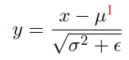
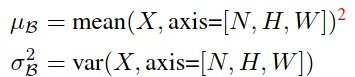
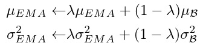
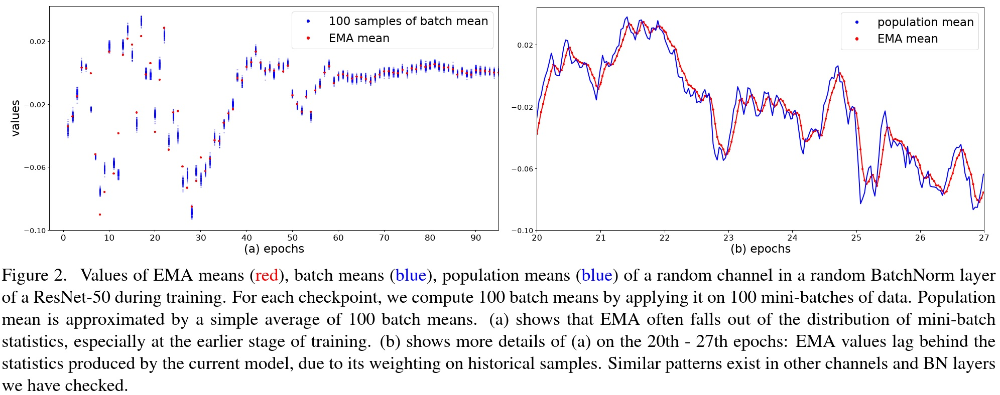
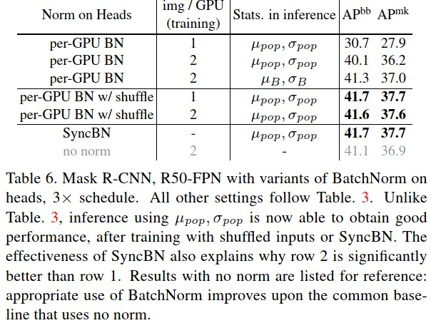

**A short review on BatchNorm**

In the paper, BatchNorm is described as a “necessary evil” in the design of CNNs

- Improving model convergence speed

- Regularizing effect to combat overfitting

Sampling strategies:

* Training: mini-batch samples
* Inference: whole dataset

<u>Design issue</u>: how to compute **μ** and **σ^2**?

- Size
- Data source
- Algorithm to compute the statistics

---

**Issue #1: Compute *μ* and *σ^2* during training**

Discussion between two statistics computation methods - EMA and PreciseBN.

<u>Exponential moving average (EMA)</u>: 

- Updated in every training iteration

- Problems:
  - When λ is large - the statistics are outdated
  - When λ is small - ignore the whole population

<u>PreciseBN</u>:

- Apply the (fixed) model on many mini-batches to collect batch statistics
- Aggregate the per-batch statistics into population statistics

Result:

- PreciseBN is better and also more stable than with EMA (for image classification on ImageNet)
- EMA produces extremely high variance validation results under a larger batch size
- PreciseBN only requires 10^3 ∼ 10^4 samples for the near-optimal result

---

**Issue #2: inconsistent behaviors between training and inference**

The gap between population statistics and mini-batch statistics introduces inconsistency. 

<u>Strategy #1</u>: using mini-batch during inference

- Method: compute population statistics based on mini-batch instead during inference

- Result: train-test inconsistency is reduced

<u>Strategy #2</u>: using population batch during training

- Method: apply FrozenBN in the last few epochs

- Result: train-test inconsistency is reduced when the batch size is small

---

**Issue #3: batch from diverse domains/sources**

BatchNorm can be considered as two separate phases:

1. Features learned by SGD
2. Population statistics trained using the features by EMA or PreciseBN

What if multiple domains involving during training and inference?

Domain gaps occur between the inputs in:

- SGD training
- Population statistics training
- Testing generalization

Let's discuss two scenarios.

<u>Scenarios #1</u>: a model is trained on one domain but tested on others

- Solution: re-compute the statistics during inference

- Result: 
  - Train-test inconsistency is reduced
  - Yet the gap between SGD and population statistics during training still worth more attentions

<u>Scenarios #2</u>:  a model is trained on multiple domains *(in this case we mean feature layers)*. 

- Solution: 
  - 1. compute unique population statistics for each feature level
    2. normalize with the same set of population statistics for all feature levels

- Result:
  - For multi-domains, SGD-statistics-testing consistency is crucial for performance
  - Whether the affine layer is shared or not has little impact

---

**Issue#4: information leakage within a batch**

Unwanted batch-wise information might be exploited since the model learned from a mini-batch rather than an individual sample.

Some example: 

- Mini-batches that have the same class label
- Region of interests (RoIs) from the same image in object detection

Solutions:

- Ghost BatchNorm - normalize over a subset of multiple images from different classes
- SyncBN - normalize across all batch on different GPUs
- Random shuffle the RoIs features among GPUs

Result: both SyncBN and random shuffle can alleviate the leakage issue.

## TL;DR

* Make sure population statistics do not fall behind the mini-batch statistics
* Train-test inconsistency is crucial in BatchNorm
* Avoid bias when sampling mini-batch
