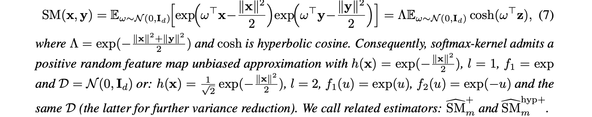
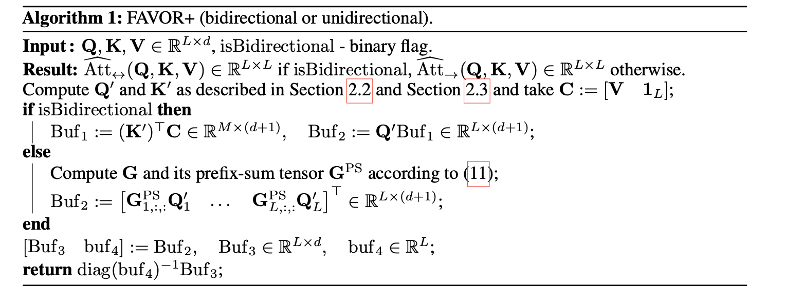
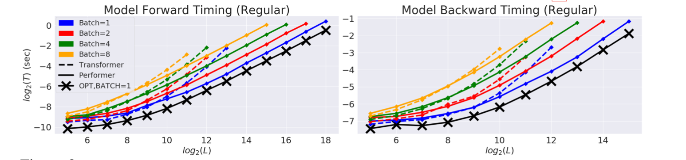
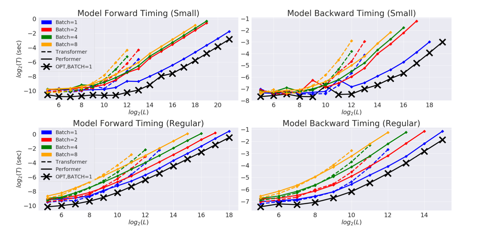
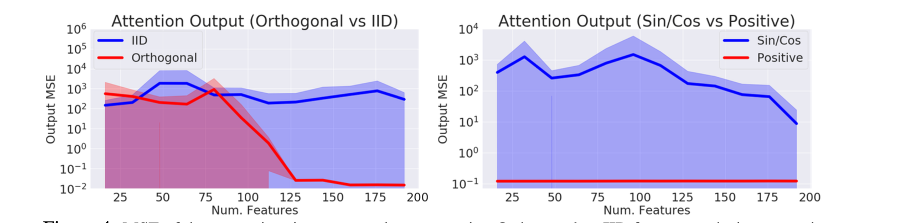
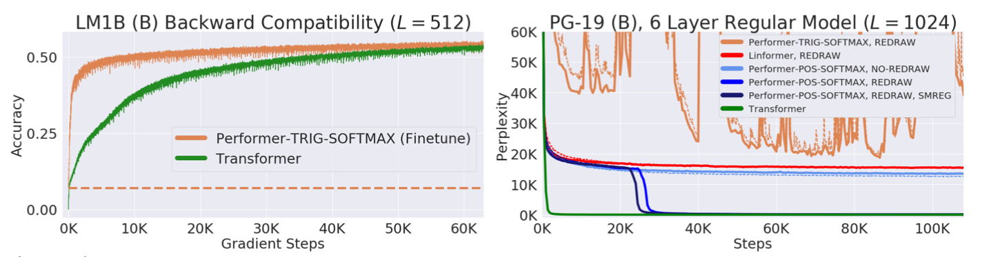
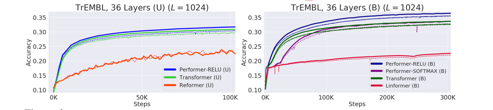
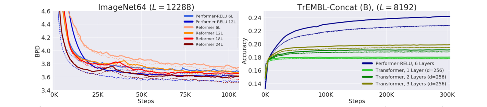

TODO: Summarize the paper:

### What is the core idea?

The authors argues using positive random orthogonal features can estimate softmax showing speed and performance gains over SOTA transformer architecture

### How is it realized (technically)?

[1] Only non-negative kernel scores are useful.



 <!-- x,y \
``` math
SM (x,y) = Eω∼N(0,Id) exp ω x− 2 exp ω y− 2 = ΛEω∼N(0,Id) cosh(ω z), (

where Λ = exp(−∥x∥2+∥y∥2 ) and cosh is hyperbolic cosine. Consequently, softmax-kernel admits a
 2
positive random feature map unbiased approximation with h(x) = exp(− ∥x∥2 ), l = 1, f1 = exp 2
and D = N(0,Id) or: h(x) = √1 exp(−∥x∥2 ), l = 2, f1(u) = exp(u), f2(u) = exp(−u) and the 22
+
􏱂m same D (the latter for further variance reduction). We call related estimators: SM
hyp+
􏱂m
``` -->

[2] Use of orthogonal random features (ORFs)

Well known method to reduce the variance of the estimator  by selecting random features and orthogonal random samples. 

FAVOR+(Performer) = ORFs + PSFs 




### How well does the paper perform?





Baseline comparison  of FAVOR+ (Performer) with normal Transformer models for both unidirectional/causal modeling and bidirectional/masked language modeling tasks

#### Dataset

- PG-19 (Rae et al., 2020) texts from Project Gutenberg contains fixed vocabulary size and made for long-length sequence training.

- BookCorpus (Zhu et al., 2015)  

- Wikipedia dataset used in BERT (Devlin et al., 2018)




Orthogonal features show lower softmax attention approximation error. Also using positive features produced lower errors compared to $sine/cosine$ features.




Showed backward compatibility with pre-trained models benefitting from softmax approximation.



Performer combined with a ReLU showed better training performance on a 36-layer model  on TrEMBL protein sequence dataset (Consortium, 2019). 




Performer showed better training performance on ImageNet64 dataset.

### What interesting variants are explored?

## TL;DR

* Choosing Positive random features are better than standard trigonometric features.

* Transformers requires a huge cost of computation but Performer are more efficient.

<!-- * To highlight the core concepts -->
