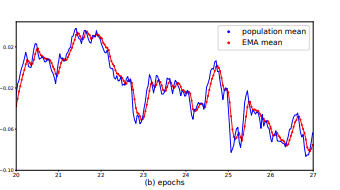
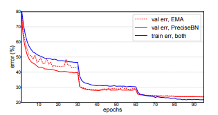
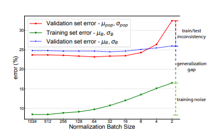
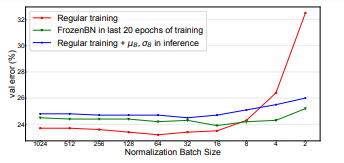
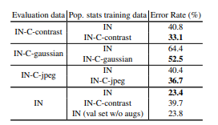

# **Summary - Rethinking "Batch" in BatchNorm, Wu, Johnnson; 2021**

## What is the core idea?

BatchNorm is a commonly used component of neural networks that has greatly increased performance in image classifcation tasks. However, there are certain inherent aspects of BatchNorm that can lead to sub-optimal performance if not addressed correctly. This paper identifies issues primarily around population statistics computation,  training and test set inconsistency, domain shift, and information leakage. The paper also suggests solutions to combat each of these issues to make the most out of BatchNorm in networks.

$$y=\frac{x-\mu}{\sqrt{\sigma^2+\epsilon}}$$

$$\mu = \mu_B, \sigma^2 = \sigma_B^2 \; during\;training$$

$$\mu = \mu_{pop}, \sigma^2 = \sigma_{pop}^2\; during\;testing$$

## How is it realized (technically)?

There were 4 main experiments performed in this paper:

1. Train a ResNet-50 model for 100 epochs with a mini-batch size = 8192. EMA (Exponential Moving Average) is used to calculate population statistics with lambda = 0.9. Randomly checked and compared the population mean and EMA mean of a random channel in a random BatchNorm Layer. They run a second experiment on a ResNet-50 model with PreciseBN as the population statistic computation method. 

$$\mu_{EMA} = \lambda\mu_{EMA} + (1 - \lambda)\mu_{B}$$
$$\sigma_{EMA}^2 = \lambda\sigma_{EMA}^2 + (1 - \lambda)\sigma_{B}^2$$

2. Train a ResNet-50 model with varying normalization batch size from 2 to 1024. Error was inspected under 3 setttings - using mini-batch statistics on training set and validation set, and using population statistics on the validation set. In a second experiment, they replace the last 20 epochs of training with FrozenBN to show its positive impact on performance.

3. Train a ResNet-50 model on ImageNet-C with a normalization batch size of 32. ImageNet-C has corrupted images which was used to induce domain shift. 

4. Used the second stage of an R-CNN object detector that takes region-of-interets for each image and derives prediction for that ROI. BatchNorm is used in R-CNN where regions from all images are merged into one mini-batch. This model was implemented with a pre-trained ResNet-50. They tested information leakage with 2 scenarios: using SyncBN and shuffling ROI among GPUs prior to the second stage. 

## How well does the paper perform?

### **Population Statistic Computation - More Precise and Representative Population Statistics**

The paper found that EMA was not successful in finding representative population or mini-batch statistics. They claim that when lambda is large, EMA statistics are composed mainly of features from previous iterations. On the other hand, when \lambda is small, EMA statistics represent more recent batches and is not indicative of the population. This discrepancy was illustrated by the paper in the below graph:

The paper's suggestion for more precise population statistics was using PreciseBN, which aims to approximate the population statistics using a fixed model state and collecting batch statistics into population statistics. This was different from EMA primarily because PreciseBN uses a model that is unchanging when calculating statistics while EMA is affected by previous states of the model. They found that PreciseBN led to better overall accuracy than EMA as it was able to produce population statistics that were more precise and representative of mini-batch statistics. 

### **Train-Test Set Inconsistency - Disparity between mini-batch and population statistics**

The paper explores classification error for using mini-batch statistics to evaluate on the training set and validation set, as well as, using the population statistics on the validation set. The error rate was very low when using mini-batch statistics on training set due to a very low train-test consistency. The error rate of using mini-batch statistics on the validation set is less than when using the population statistics also due to greater train-test inconsistency when using the population statistics.

The paper proposes scenarios where mini-batch statistics during inference; however, this approach is not desirable ebcause it removes independence across sample predictions. Instead, the paper looks into a variant of BatchNorm that can use population statistics during training - FrozenBN. This approach uses fixed population statistics which used without standard BatchNorm can lead to performance drop. Therefore, it is more commonly used after training a model with regular BatchNorm, such as on the laast 20 epochs. This method reduced validation error when compared to a reguarly trained model. This method also reduced train-test inconsistency due to training on population statistics.

### **Domain Shift - Train and Test Data have different distributions**

The paper conducted this experiment in order to show that significant differences in train and test data can lead to suboptimal results during test time.When training and test sets are from different domains, this is referred to domain shift. Thus, calculating population statistics from datasets in the test domain led to the lowest error rate. This was an effective approach because the train-test inconsistency is lowered and the problem of domain shift is also addressed. However, fixing this issue requires recomputing population statistics which has its own downsides that the paper claims needs deeper analysis and research.

### **Information Leakage - Information from samples in batch affect prediction**

In the final experiment with R-CNN, SyncBN and shuffling of regions-of-interest reduces the information leakage , which results in a more generalized model. SyncBN normalizes regions of interest over all GPUs which diminishes the correlation within in the same normalization batch. Shuffling region of interests across different GPUS also reduces this correlation. The patterns in batches are less likely to be picked up by the model during training. Their results also showed that fixing information leakage can even allow sub-representative population statistics to result in comparable performance.

## What interesting variants are explored?

This paper primarly focuses on variants of BatchNorm that can address its problems mentioned above. PreciseBN, FrozenBN, and SyncBN are interesting variants of BatchNorm that bettered performance and reduced the impact of its shortcomings. 

## TL;DR
* BatchNorm is widely used, but it has subtle shortcomings that can lead to lower performance
* Non-representative population statistics used in BatchNorm cause performance drop due to train-test inconsistency
* Domain shift and information leakage are both issues that if addressed correctly can improve performance
