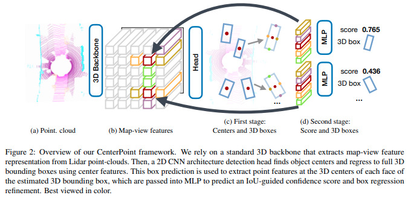
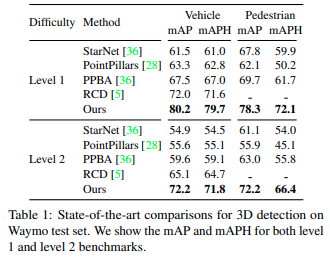
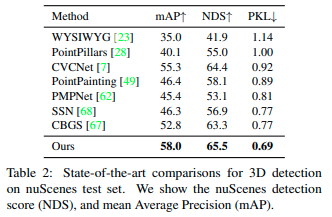
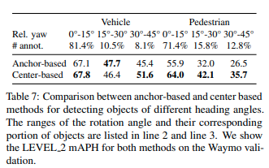

### What is the core idea?
The authors propose CenterPoint, a 3D object-tracking approach which simplifies the algorithm to a greedy closest-point matching. \
The paper aims to represent objects as points, avoiding difficulties on other models, related to the object's orientation, rotation, etc. It outperforms other models by using a 3D point-cloud encoder and some conv layers to produce a bird-eye-view heatmap. The detection is a local peak extraction with refinement. All these features make CenterPoint outperform other modesl while remaining simple, and near real-time.

### How is it realized (technically)?
CenterPoint uses a standard Lidar-based backbone network, (VoxelNet or PointPillars), to build a representation of the input point-cloud. It flattens the point-cloud and maps the center of the object. Then, it builds the 3D features of the object based on the found centerpoint.\
Figure 2 (numbering from the paper), shows the CenterPoint network.\

The authors further propose a Two-Stage CenterPoint. One point-feature from the 3D center of each face of the predicted bounding box is taken. For each point, a featyre us extracted using bilinear interpolation from the backbne map-view output M.\
These features are the passed through an MLP. This second stage predicts a class-agnostic confidence score and box refinement on top of the first stage's results.

All first-stage outputs share a 3x3 convolutional layer, BatchNorm, and ReLU. Each output then uses its own branch of 2 3x3 convolutions, separated by batchnorm and ReLU. The second stage uses a two-layer MLP, batch norm, ReLU and dropout (0.3), followed by two branches of 3 fully-connected layers.

### How well does the paper perform?
The paper tests the models on two popular large datasets: Waymo Open Dataset, and nuScenes Dataset.\
The testing shows a 3-4 mAP increase in 3D detection under different backbones. With some additional overhead (10%), a two-stage refinement inceases mAP by 2 more points.
Tables 1 and 2 show results obtaiend for 3D detection on Waymo test set, and nuScenes test set. In both, and other tests not shown below, CenterPoint performs better than all other models.\

Authors also show that center-based methods for 3D detection, like CenterPoint, outperform anchor-based methods.

### What interesting variants are explored?
Initial ablation study was center-based v. anchor-based methods. To test this, the authors separathed the objects on the database depending on their rotation degree (0-15, 15-30, and 30-45 degree bins), and also on their size (small, medium, large). As mentioned above, center-based performs better, the results are shown on the table below. This highlights the model’s ability to capture the rotation and size invariance when detecting objects, and the advantage of point-based representations of 3D objects.\

Next, a study on one-stage v. two-stage models was performed. Two stage models worked better on larger datasets (Waymo, vs. smaller set nuScenes), with little overhead.

## TL;DR
* CenterPoint represents 3D objects as point-clouds, and uses closest-point matching for predictions.
* Performed better than other published models for 3D object detection.
* Center-based methods perform better than anchor-based ones.
