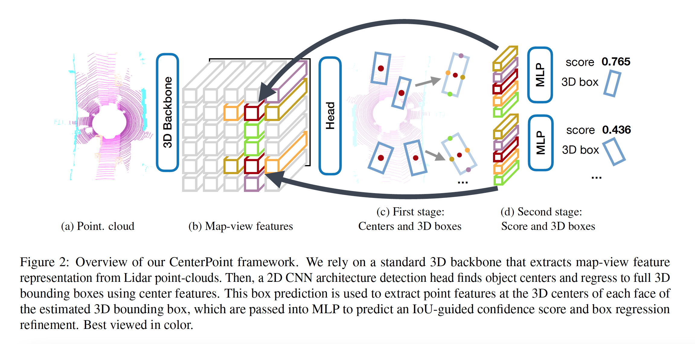
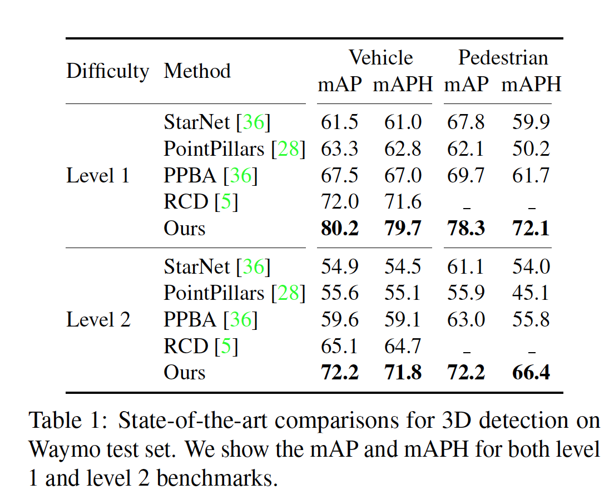
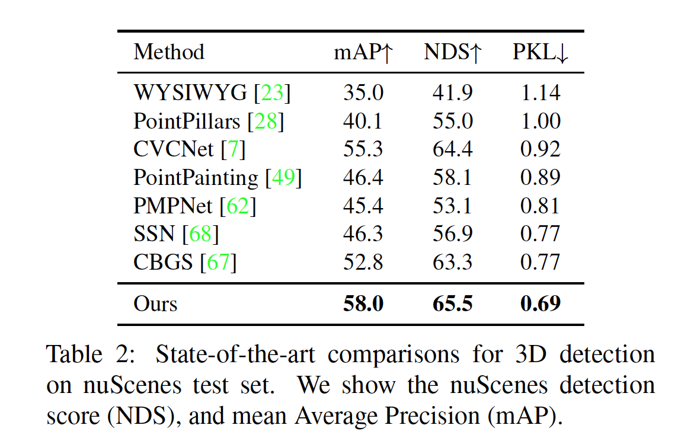
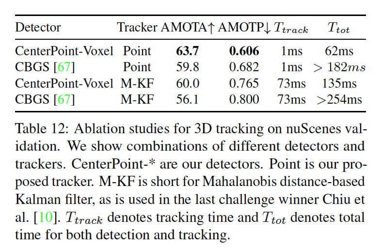

* What is the core idea?

CenterPoint is a framework that represents, detects, and tracks 3D objects as points. It works first by detecting the centers of objects using keypoint detection and then estimates 3D size, 3D orientation, and velocity. CenterPoint has a second stage where it refines those estimates using additional point features. As described by the paper, CenterPoint simplifies 3D object tracking to greedy closest-point matching.

CenterPoint's performance was state-of-the-art on the nuScenes benchmark for both 3D detection and tracking.

* How is it realized (technically)?

CenterPoint uses a Lidar-based backbone to build a representation of an input point-cloud. This helps extract map-view feature representation, and then, a standard image-based keypoint detector is used to find object centers.

During the first phase, the CenterPoint paper mentions 3 types of heads: center headmap heads, regression heads, velocity heads. The center-head's job is to produce a heatmap at the center location of any detected object. 

The regression heads help provide "full state" information of 3D bounding boxes. Regression to log size also helps better handle boxes of different shapes. Then, at inference time, properties are extracted by indexing into the regression head outputs at each object's peak location.

Two-dimensional velocity estimation is learned as another regression output. This is uses to predict the difference in object position between the current and past frame. 

Finally, CenterPoint combines all the heatmap and regression losses and optimizes then before going onto the second phase.

The second phase of CenterPoint extracts additional point-features from the backbone. Extracted point-features are passed through an MLP, and then, confidence scores and box refinements are predicted.

* How well does the paper perform?

Experiments were run on the Waymo Open Dataset and the nuScenes dataset using the CenterPoint-Voxel Model. On the Waymo test set, the CenterPoint model achieves 71.8 level 2 mAPH on vehicle detection and 66.4 level 2 mAPH for pedestrian detection. These results surpase previous performance by 7.1% mAPH for vehicles and 10.6% for pedestrians.

On the nuScenes dataset, CenterPoint outperforms CBGS with multi-scale inputs and multi-model ensemble by 5.2% mAP and 2.2% NDS.

The CenterPoint model outperforms all other submissions under the neural planar metric (PKL), which is a hidden metric.

For 3D tracking, the CenterPoint's tracking does not require a separate motion model and runs in "negligable time". Yet, CenterPoint's 3D tracking achieved higher scores (19.4 and 18.9 MOTA improvement) for vehicle and pedestrian tracking.

* What interesting variants are explored?

One-stage and two-stage CenterPoint were compared as part of the ablation study. Other things that were looked at were Voxel Set abstraction and radial basis function interpolation.

## TL;DR
* CenterPoint is a framework to detect and track 3D objects
* Center point uses two phases of regression and refinement
* Achieved state of the art results.
