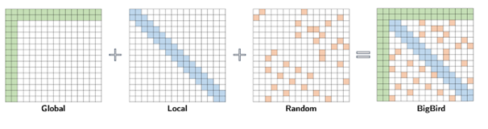
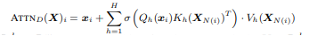
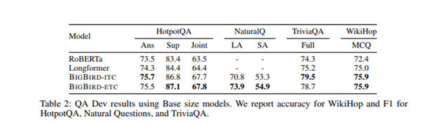

## The Core Idea of this paper?
This paper presented Big Bird Transformers for longer Sequences of input. The Transformer Based models such as BERT are very successful in Natural language processing tasks but the computation and memory requirements are quadratic with the length of input sequence due to full attention mechanism. Hence, it is unable to handle input with larger length. In order to overcome this drawback, Big Bird is introduced that uses sparse attention mechanism that helps to reduce the quadratic dependency to linear. Big Bird also preserves the properties of the quadratic, full attention model.

 BIGBIRD consists of three main part:
 
• A set of g global tokens attending on all parts of the sequence. 

• All tokens attending to a set of w local neighbouring tokens. 

• All tokens attending to a set of r random tokens.

## The BIG BIRD Architecture:

 • The Architecture of big bird is represented as the generalized attention mechanism which is used in every 
   layer of transformer operating on input sequence X = (x1, ..., xn)
   
 • The Architecture of big bird is represented as the generalized attention mechanism which is used in every layer 
    of transformer operating on input sequence X = (x1, ..., xn)
    
 • The problem of reducing the quadratic complexity of self-attention can now be seen as a graph sparsification problem.
  
 •  The positional information of the tokens in a relative way, rather than using their absolute position in the sequence; using an additional training objective beyond the         usual masked language model (MLM) used in models like BERT; and flexible masking of tokens to control which tokens can attend to which other tokens.

## It is Empirically defined as :

where Qh, Kh : R d → R m are query and key functions ,
Vh : R d → R d is a value function,
σ is a scoring and H denotes the number of heads.

## Experiments: Natural Language Processing

• Task 1: The experiment is conducted over QA Task

• Datasets: Natural Questions , HotpotQA-distractor, TriviaQA-wiki, WikiHop

• Model: RobertA, Longformer, Big Bird-ITC, Big Bird-ETC

Results:The accuracy of different model is depicted below

• Task 2: Similarly the expriment was conducted for classification of text on same datasets and has been found that the gains of using BIGBIRD are more significant when we have longer documents and fewer training examples

• Results: It has been analysed that Both BIGBIRD and Longformer perform better than limited length RoBERTa, with BIGBIRD-ETC performing the best. The models were trained on  a reasonable 16GB memory/chip with batch size of 32-6.

## TL;DR
•  BIG BIRD uses  a sparse attention mechanism that is linear in the number of tokens.

•  It is a universal approximator of sequence to sequence functions and is also Turing complete.

•  BIG BIRD gives state-of-the-art performance on a number of NLP tasks such as question answering and long document classification.
